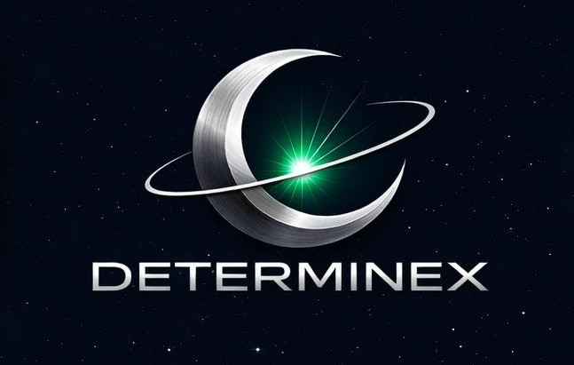

<div align="center">



# Determinex

**Compiler-verified multi-agent AI that gets smarter from its own failures.**

[](LICENSE)
[](https://www.python.org)
[](https://rustup.rs)
[](https://huggingface.co/darthceltic85)
[](docs/papers/WHITE_PAPER.md)
[](https://github.com/sponsors/DarthCeltic)

[](https://github.com/aifoundry-org/hf-hackathon)

**🏆 1st Place — Most Validated Model Ports**, AIFoundry × OpenHW CORE-ET Hackathon 2026 —
16 variants across 15 model families, validated on real ET-SoC1 RISC-V silicon.

*Built by [DarthCeltic](https://github.com/DarthCeltic)*

</div>

---

Determinex is a **local-first, privacy-sovereign, self-improving multi-agent AI coding system**. Three specialist models — Engineer, Observer, Sentinel — coordinate through a shared latent space to break complex engineering tasks into compiler-verified build steps. Failure-to-training conversion is separately gated: `training_eligible = false` by default and no raw user code training by default. The system gets smarter from operator-approved, compiler-verified evidence without leaving your machine.

**The core idea (2026-06 architecture):** correctness is bounded by a deterministic **oracle** (real compilers/tests), not by trusting the model. The model proposes; the oracle disposes. This makes Determinex **un-hallucinatable wherever ground truth exists** and lets *any* AI — a 1.5B local model, a frontier cloud model, an agent CLI, or a future one — plug in and be made correct. The **Correctness Amplifier** turns a model with per-attempt success `p` into a system that succeeds with `1−(1−p)^K` by sampling against the oracle: any `p > 0` is driven toward correct. On top of the build loop, Determinex can now **build a verified program from a plain-language idea** (synthesizes a sound test-oracle first), **diagnose and repair any repo** (honest CODE / ENVIRONMENT / TEST blame), and **host any AI model or coding agent** (Claude / Codex / Gemini / local / addons) — each verified through the same oracle, so a hallucinating model or agent is *rejected*. A reproducible 40-case meta-bench (`tests/test_autofix_pipeline.py`) scores the system's own reasoning. See [`docs/DETERMINEX_DEEP_AUDIT.md`](docs/DETERMINEX_DEEP_AUDIT.md) for the grounded end-to-end account.

Current readiness boundary: the release-cell registry contains 13 exact release-supported cells and 0 release-supported families. These are proof cells, not broad support. Batch 003 verifies the rebuilt staged installed-app Proof Center route at `/proof-center` with screenshot/transcript evidence. Batch 004 archives `trasta298__keifu` as a strict ProgramBench lock and promotes exactly one narrow all-gap row: the deterministic day-one claim scanner guard. Full monolithic `tests/status`, all gaps closed, family support, ProgramBench total-100, open availability remains false, and `PATENT_FILED` remains unclaimed.

**The current SWE-bench boundary**: The May 2026 B-Uncloaked run resolved **14.0% of SWE-bench Lite** (42/300, zero errored), but it is an audited snapshot, not the final publication baseline. The Cloak-on / region-mode configurations are currently reported as lower bounds because disk-pressured Docker workers produced per-instance image-export errors: E-RegionControl **>=6.0%**, B-Cloaked RosettaOFF **>=2.3%**, D-Cloaked **>=3.3%**. Fresh B-Uncloaked and E-RegionControl reruns are required before publishing privacy-cost claims.

**Plus, on [ProgramBench](docs/papers/PROGRAMBENCH.md)** — the 200-tool benchmark where every frontier model currently scores 0–0.5% fully resolved — Determinex's honest headline (corrected 2026-06-30) is **0/200 legitimate locks**, matching public leaderboard reality. A full provenance audit found the historical, prior "65 confirmed full-suite locks / 32.5%" claim counted upstream source builds (`go.mod`/`Cargo.toml` identity matching the real project verbatim), not native reimplementations. The 62 archived builds under `corpus/programbench/locked/<tool>/` are retained as reference corpus for the Native Reimplementation Loop — the legitimate path to a real lock — not counted as solves. Source of truth: `corpus/programbench/eval_index.json`. Benchmark results are not product support, not release support, and not product readiness.

---

## What Makes This Different

| Property | Determinex | Typical agent system |
|---|---|---|
| **Reward model** | `rustc` / `go build` / `python` / `tsc` — deterministic, zero hallucination | LLM judge (circular) |
| **Privacy** | Identifiers AST-obfuscated before any cloud call; raw source is never exported (audit: `CLOAK_HASH_CHAIN_AND_LEAK_AUDIT_PASSED`, no leak found in the audited run) | Source code sent to cloud |
| **Training signal** | Every session failure → labeled corpus → next retrain | Static weights |
| **Model size** | 1.5B + 3B + 7B, runs on 6GB VRAM | 70B+ cloud-only |
| **Architecture** | DAG build loop, compiler gate, WAL, oscillation detector | Linear chain |

> **Privacy claim boundary (corrected 2026-07-28).** This row previously read
> "100% of repo identifiers obfuscated". That overstated the evidence and
> contradicted our own audit artifact, which records
> `perfect_privacy_claimed: false` alongside `raw_source_exported: false`
> (`assurance/evidence/cloak_hash_chain_and_leak_audit/`). What is verified is
> that the audited run exported no raw source and no identifier leak was found;
> "100%" is a universal claim a single counterexample would destroy, and it was
> never what the audit established. Re-run with `DETERMINEX_CLOAK_AUDIT=1` to
> produce a current artifact before making any stronger statement.
| **Any model correct** | Verified search: `1−(1−p)^K` against a sound oracle | Best single shot |
| **Bring your own AI** | Claude / Codex / Gemini / local / agents — all oracle-verified | Locked to one vendor |
| **No cop-out / no slop** | Adjudicator proves impossibility; Validator proves a test is slop | Gives up or guesses |

---

## Beyond the Build Loop (2026-06)

The same oracle-bounded engine now powers three things any developer can use directly:

- **Build from an idea** — `python scripts/determinex_build_from_idea.py --idea idea.md --provider local` synthesizes a *sound* test-oracle from your description (exact examples + type-aware property tests, validated to run), then drives any model with verified search until a program **passes those tests**. Proven live: a 1.9 GB local model produced a verified `rle` implementation.
- **Repair any repo** — `python scripts/determinex_repair.py path/to/repo` ingests the project, runs its real oracle, and reports honest blame (**CODE / ENVIRONMENT / TEST**) + whether a failing test is provable *slop*; with opt-in it amplified-fixes to oracle pass.
- **Host any AI or agent** — `determinex_providers.py` exposes Claude/Codex/Gemini/DeepSeek/local behind one `generate(prompt, temperature)` contract (with an **auto-establishing, rotating rate limiter**); `determinex_agents.py` hosts coding-agent CLIs (Codex CLI, Claude Code, …) whose edits are **verified through the oracle** — a no-op or hallucinating agent is rejected. New providers/oracles/commands plug in via `determinex_extensions.py`.
- **In your editor now, and toward its own IDE** — a compiling, packaged VS Code extension (`frontend/vscode-extension/`) remains the bridge for developers who live in VS Code. The standalone Tauri/Next Determinex IDE is the successor direction: proof-native workbench, agent lanes, oracle evidence, privacy policy, and release gates in one product surface. Current status and blockers are tracked in [`docs/ide-frontend/DETERMINEX_IDE_SUCCESSOR_ROADMAP.md`](docs/ide-frontend/DETERMINEX_IDE_SUCCESSOR_ROADMAP.md).

Full grounded account, including the honest safety/unsafe surface and the teaching model: [`docs/DETERMINEX_DEEP_AUDIT.md`](docs/DETERMINEX_DEEP_AUDIT.md).

---

## The Model Family

| Model | Params | Role | HuggingFace | Ollama Tag |
|-------|--------|------|-------------|-----------|
| **C1 · Engineer v11-dsl** | 1.5B (Qwen2.5-Coder) | Builder — fast code generation, DSL-tuned | [🤗 Download](https://huggingface.co/darthceltic85/determinex-engineer) | `determinex-engineer-v11-dsl` |
| **C3 · Observer v6-dsl** | 3B (Llama-3.2) | Monitor — error diagnosis, adjudication | [🤗 Download](https://huggingface.co/darthceltic85/determinex-observer-llama-3.2) | `determinex-observer-v6-dsl` |
| **C7 · Sentinel v5-dsl** | 7B (Mistral) | Architect / Oracle — DAG planning, escalation | [🤗 Download](https://huggingface.co/darthceltic85/determinex-sentinel) | `determinex-sentinel-v5-dsl` |

All three run locally via Ollama. No subscription. No cloud required for the core build loop.

> You don't need Ryan's fine-tuned GGUFs to get started. Any Ollama-hosted model in the same tier works. See [Option A](#option-a--bring-your-own-models) below.

---

## Benchmarks

### Model Quality (Compiler-Validated, Post-DSL Fine-Tune)

135 probes across 9 task types × 3 models. Every probe passes a real compiler — no LLM judges.

> **Corrected 2026-07-28.** This table previously credited the shipped
> v11/v6 models with scores that were measured on the *previous* generation:
> `40/45` is v10-dsl's result and `37/45` is v5-dsl's. The v11/v6 evals do
> exist (2026-04-16) and are reported below. They were run against the
> expanded 70-probe set, so they are **not** directly comparable to the
> 45-probe baseline and no delta is claimed.

**Last verified generation (45-probe set):**

| Model | Score | Probes Passed |
|-------|-------|---------------|
| C1 · Engineer v10-dsl | 89% | 40/45 |
| C3 · Observer v5-dsl | 82% | 37/45 |
| C7 · Sentinel v3 | 87% | 39/45 (pre-dates DSL fine-tune) |

**Currently shipped generation (70-probe set, not comparable to the above):**

| Model | Score | Probes Passed | Artifact |
|-------|-------|---------------|----------|
| C1 · Engineer v11-dsl | 81.4% | 57/70 | `eval_citadel-engineer-v11-dsl_20260416_225204.json` (an earlier run scored 53/70) |
| C3 · Observer v6-dsl | 75.7% | 53/70 | `eval_citadel-observer-v6-dsl_20260416_235354.json` |
| C7 · Sentinel v5-dsl | not evaluated | — | no eval artifact exists |

No combined system score is given for the shipped generation: with Sentinel
unevaluated, any total would be part measurement and part assumption.

### SWE-bench Lite (300 instances, post-hardening ablation)

Real software engineering tasks from production repositories. Patches verified by each repo's own test suite in Docker.

| Config | Architect | Builder | Cloak | Resolved | Status |
|--------|-----------|---------|-------|----------|--------|
| B-Uncloaked | DeepSeek V4 | DeepSeek V4 | off | **14.0%** (42/300) | Audited May snapshot; fresh rerun required for publication |
| E-RegionControl | DeepSeek V4 | DeepSeek V4 | off, region forced | **>=6.0%** | Lower bound, disk-export errors |
| B-Cloaked RosettaOFF | DeepSeek V4 | DeepSeek V4 | on | **>=2.3%** | Lower bound, disk-export errors |
| D-Cloaked | Claude Sonnet 4.6 | DeepSeek V4 | on | **>=3.3%** | Lower bound, disk-export errors |
| D-Cloaked (pre-hardening historical) | Claude Sonnet 4.6 | DeepSeek V3 | on | **11.7%** | Historical, pre-hardening |

**What the delta framework measures:**
```
B-Uncloaked 14.0%      -> audited May snapshot; final baseline pending fresh rerun
E-RegionControl >=6.0% -> lower-bound region-mode control
B-Cloaked >=2.3%       -> lower-bound sovereignty result
D-Cloaked >=3.3%       -> lower-bound hybrid Architect result
```

*Privacy audit: B-Cloaked run verified 1,813,760 identifiers across 300 instances - 0 restoration failures, 0 privacy leaks. Cryptographic proof artifact via `DETERMINEX_CLOAK_AUDIT=1`. TinyCorpusReplay, when referenced, is an answer-key corpus replay diagnostic for eval-path mechanics only; it is not a clean benchmark score, not a model score, and not training-eligible.*

---

## Architecture

```
User writes a Markdown spec (Goal, Language, Constraints, Files)
        ↓
C7 Architect — reads spec, emits DAG of ordered build steps via Semantic DSL
        ↓  [6× more token-efficient than prose]
C1 Builder — executes each step; writes code to the workspace
        ↓
Compiler Oracle  ──  rustc / go build / python / tsc  ──  ground truth
   PASS → lock step to WAL → next step
   FAIL → inject exact error → Builder retries (max 3×, escalating temperature)
        → Architect re-plans on 3rd failure
        ↓
C3 Monitor — scores output; submits competing approach if score gap > 0.1
        ↓
Every session → training queue → flywheel retrain → smarter models
```

### Project Cloak — Privacy-Sovereign Cloud AI

Before any cloud API call, Determinex transforms every private identifier in the entire repository into an opaque `x_NNNN` token. The cloud AI solves the problem in obfuscated space. Patches are restored to real identifiers locally before application.

```
Source repo  →  [AST obfuscation]  →  x_NNNN tokens  →  Cloud API
                                                              ↓
Real patch  ←  [symbol restoration]  ←  obfuscated patch  ←──┘
```

The cloud model never sees `authenticate_user`, `validate_payment`, or any other business-critical symbol — only `x_4421`, `x_9103`. **Privacy cost measured directly**: B-Cloaked vs E-RegionControl in the 5-config ablation.

### The Rosetta Stone — Latent-Space Model Communication

`rosetta_v1.pt` — MLP encoder/decoder pairs bridging C1, C3, and C7 embedding spaces into a shared 4096-dim semantic space. Models communicate via compressed latent vectors rather than prose — 6× more token-efficient, lossless for structured intent.

- **Layer 1 (active)**: Semantic DSL — structured inter-model messages
- **Layer 2 (v1.5)**: Soft prefix injection via llama-cpp-python
- **Layer 3 (Phase 3)**: KV cache broadcast — full mid-layer hidden state sharing

---

## Quick Start

### Requirements

- [Ollama](https://ollama.ai) installed and running
- Python 3.11+
- At least one compiler: `rustc`, `go`, or `python` (for the Compiler Oracle)
- 6GB+ VRAM **or** 16GB+ RAM (CPU inference supported)

### Hardware support

Determinex sizes itself to the accelerator it finds, because that decision is load-bearing: the
detected tier sets how many models stay resident and how many build steps run concurrently. A machine
mis-detected as CPU-only is driven at the weakest possible settings regardless of what it actually has.

| Vendor | Detected via | PyTorch device | Verified |
| --- | --- | --- | --- |
| NVIDIA | `nvidia-smi` | `cuda` | on real hardware |
| AMD (ROCm) | `amd-smi`, then `rocm-smi` | `cuda` ¹ | simulated ² |
| Intel Arc | `xpu-smi discovery` | `xpu` | simulated ² |
| Apple Silicon | `sysctl hw.memsize` ³ | `mps` | simulated ² |
| No GPU (x86, or Windows on ARM / Snapdragon) | system RAM ⁴ | `cpu` | on real hardware |

¹ A ROCm build of PyTorch keeps the `cuda` device name, so that is what Determinex reports on AMD.
Reporting `"rocm"` would hand you a device string PyTorch rejects.

² **Simulated means simulated.** The parsing, the unit scaling and the tier arithmetic are tested
against the vendor tools' documented CSV output, but no AMD, Intel or Apple hardware was available
during development. If you are the first to run Determinex on a ROCm box, that run is the real
verification — and a bug report is genuinely useful.

³ Unified memory is a shared pool, so a fraction is reported rather than all of it. Claiming the whole
amount would put an 8GB Mac in the wrong tier and start swapping under a 3B model.

⁴ **No GPU is not no capacity.** Ollama and llama.cpp run models out of system RAM, so on a host with
no accelerator Determinex sizes itself from RAM (less an 8 GB reserve for the OS, the app, and the
compiler running in the same session) instead of assuming the worst. Until 2026-07-31 it did assume the
worst: a 128 GB workstation was driven exactly like an 8 GB laptop, allowed **zero** resident models.
Concurrent build steps stay at 1 without a GPU — having RAM does not make parallel branches safe on one
shared CPU. The capability card names which pool your tier came from, since "tier 1 on 16 GB of VRAM"
and "tier 1 on 24 GB of RAM" are different machines.

**Windows on ARM (Snapdragon X):** recognised and named, running the ARM64 CPU path with RAM-derived
capacity. Determinex does **not** use the Hexagon NPU or the Adreno GPU — there is no PyTorch backend
for either on Windows ARM64 — so it doesn't claim to. Using an NPU as an inference device (Hexagon,
Intel AI Boost, Apple Neural Engine) would need an ONNX Runtime path and is not built. Those machines
work; they are not accelerated.

**See what your machine reports:** Settings → AI Engine & Diagnostics shows the detected accelerator,
tier, PyTorch device, resident-model policy and real usage/cost from the ledger. A probe that cannot
answer says so — it never shows a measured-looking zero. Full coverage matrix:
[`docs/architecture/UNIVERSAL_AI_SETUP_COVERAGE.md`](docs/architecture/UNIVERSAL_AI_SETUP_COVERAGE.md).

### Running on AMD Radeon GPU (ROCm)

Determinex runs on AMD Radeon GPUs by two paths. Their verification status differs, so
each says which it is.

#### Path A — hosted vLLM on a Radeon GPU (VERIFIED)

This is the measured path. Launch a Radeon Cloud instance with Deploy Type
`vLLM Model API` and serve command:

```bash
vllm serve Qwen/Qwen2.5-Coder-7B-Instruct --host 0.0.0.0 --port 8000
```

The ready dialog gives a base URL and a per-instance API key. Put both in `.env`:

```bash
AMD_BASE_URL=https://radeon-global.anruicloud.com/spaces/<instance-id>/8000/v1
AMD_API_KEY=<per-instance-key>
```

Then run the greenfield loop against it — the `vllm` provider reaches any
OpenAI-compatible vLLM, local or hosted, and asks the server which model it serves:

```bash
python scripts/determinex_build_from_idea.py --idea idea.md --provider vllm --k 6
```

**Measured 2026-07-31** on Qwen2.5-Coder-7B-Instruct (ROCm 7.2.1, vLLM 0.16.1):
30.0 tok/s single-stream vs **166.9 tok/s aggregate at K=6 concurrent** — 5.56× the
throughput for 1.08× the wall clock. Sampling six verified-search candidates costs 8%
more time than sampling one, so correctness amplification is close to free on this
hardware. Re-measure per GPU; this is a batching property, not a constant.

#### Path B — AMD's free shared Model API (NOT VERIFIED)

`litellm_config.yaml` carries `amd/qwen3-35b` and `amd/deepseek-flash` pointing at AMD's
shared Token Factory endpoint. These have **never been executed from this repo** — the
portal requires a China-registered account. They are wired and labelled, not claimed.
They read `AMD_FREE_API_KEY`, deliberately separate from `AMD_API_KEY`, so a
dedicated-instance key is never transmitted to a third-party host.

#### Path C — local Ollama on an AMD Radeon GPU (ROCm)

Ollama auto-detects ROCm and Determinex's accelerator probe covers AMD, but the
following has not been run on a physical Radeon card by this project — it is documented,
not measured. Reference profile, RX 7900 XTX / 24 GB:

```bash
# Ollama's install script auto-detects ROCm
curl -fsSL https://ollama.com/install.sh | sh

# Verify AMD GPU is detected
rocminfo | grep "gfx"          # shows gfx1100 for RX 7900 XTX, gfx1030 for RX 6800 XT
rocm-smi                        # shows VRAM usage, GPU utilization

# Pull models — Q4_K_M quantization fits comfortably on Radeon VRAM
ollama pull qwen2.5-coder:14b-instruct-q4_K_M   # ~8.5 GB VRAM
# ollama pull qwen2.5-coder:32b-instruct-q4_K_M # ~20 GB VRAM (fits RX 7900 XTX)

# Start Ollama server
OLLAMA_HOST=0.0.0.0 ollama serve

# Clone and start Determinex
git clone https://github.com/DarthCeltic/Determinex && cd Determinex
cp .env.example .env           # edit: OLLAMA_BASE_URL=http://localhost:11434
uv sync
uv run python scripts/determinex_hive.py
```

**On Radeon Cloud instances** (AMD Radeon Cloud at `radeon-global.anruicloud.com`):
the instance already has ROCm installed. Skip to the `curl ... ollama install.sh` step.
The `rc-tunnel expose --port 3000` command publishes the Determinex frontend to a public URL.

**VRAM fit on common Radeon GPUs:**

| GPU | VRAM | Recommended model | Concurrent models |
|---|---|---|---|
| RX 7900 XTX | 24 GB | qwen2.5-coder:32b-instruct-q4_K_M | 1 large or 2 small |
| RX 7800 XT | 16 GB | qwen2.5-coder:14b-instruct-q4_K_M | 1–2 |
| RX 7600 | 8 GB | qwen2.5-coder:7b-instruct-q4_K_M | 1 |

> **ROCm detection note:** AMD detection uses `amd-smi` then `rocm-smi`. PyTorch on ROCm
> reports the device as `cuda` (not `rocm`) — this is expected. If you are the first
> to run Determinex on a specific Radeon GPU, please open an issue with your `rocminfo`
> output. That run is the real verification, and a report is genuinely useful.

### Install

```bash
git clone https://github.com/DarthCeltic/determinex
cd determinex

# Inference-only (CLI; pulls in torch via fastembed, expect ~1-2GB not ~200MB)
pip install -r scripts/requirements.txt

# Full stack with training tools (~4GB, requires PyTorch)
# pip install -r requirements.txt
```

### Option A — Bring Your Own Models

The architecture works with any Ollama model. No training required.

```bash
# Pull base models
ollama pull qwen2.5-coder:7b-instruct
ollama pull qwen2.5-coder:1.5b-instruct
ollama pull qwen2.5-coder:3b-instruct
```

Edit `.env` to point the roles at your models:
```env
DETERMINEX_ARCHITECT_MODEL=ollama/qwen2.5-coder:7b-instruct
DETERMINEX_ENGINEER_MODEL=ollama/qwen2.5-coder:1.5b-instruct
DETERMINEX_OBSERVER_MODEL=ollama/qwen2.5-coder:3b-instruct
```

### Option B — Use the Fine-Tuned Models (one command)

The Determinex models are what a fresh install assigns to the Builder and Monitor roles, so
without them the app reports *"Missing local model coverage"* and will not generate a spec.
This downloads them and registers them with Ollama:

```bash
python scripts/setup/install_determinex_models.py            # ~12.6 GB total
python scripts/setup/install_determinex_models.py --check    # what is missing, no downloads
python scripts/setup/install_determinex_models.py --role builder   # just one
```

Downloads resume, so an interrupted fetch does not start over, and each GGUF is checked
against the SHA-256 HuggingFace publishes before it is registered. Already-registered models
are skipped.

Requires [Ollama](https://ollama.com) on PATH. Weights:
[engineer](https://huggingface.co/darthceltic85/determinex-engineer) ·
[observer](https://huggingface.co/darthceltic85/determinex-observer-llama-3.2) ·
[sentinel](https://huggingface.co/darthceltic85/determinex-sentinel).

<details>
<summary>Registering GGUFs you already have on disk</summary>

`register_models.ps1` / `register_models.sh` register from a local directory instead of
downloading. They need `DETERMINEX_MODELS_DIR` set in `.env` and expect the layout
`$DETERMINEX_MODELS_DIR/versions/<role>/<version>/<tag>.gguf`.

```bash
cp .env.example .env
# set DETERMINEX_MODELS_DIR to wherever your GGUFs are

.\register_models.ps1     # Windows
bash register_models.sh   # Linux / macOS
```

Use the installer above unless you already have the weights — it needs no configuration.
</details>

### Smallest thing that proves it works

One idea file, one command, one oracle-verified program. No spec DAG, no session.

```bash
cat > idea.md << 'EOF'
# clamp

Write a function `clamp(x: int, lo: int, hi: int) -> int` that returns x
constrained to the inclusive range [lo, hi].

Examples:
- clamp(5, 1, 10) == 5
- clamp(-3, 1, 10) == 1
- clamp(99, 1, 10) == 10
EOF

determinex build --idea idea.md --provider local --k 4
```

```
[vs] r1 s1/4 t=0.0 gen 12s verify 1s -> PASS (score 0.00)
synthesized oracle: 4 checks
result: SOLVED  samples=1
proof: program PASSES all 4 synthesized checks (oracle-verified, 1 samples).
```

Determinex reads the examples, **synthesizes an oracle** from them, then samples the model until
something passes it. `SOLVED` is only ever printed because a real test run passed — the candidate
executes inside a workspace-bounded sandbox with the network denied, never a raw subprocess.

If the generator cannot be reached at all, you get `NOT ATTEMPTED` and the underlying error —
never a correctness verdict on a model that was never called.

`determinex --help` lists the rest (`doctor`, `status`, `config`, `evidence`).

### Run a Build Session

```bash
cat > my_spec.md << 'EOF'
# Line Counter

## Goal
A Rust function that reads a file and counts lines.

## Language
rust

## Constraints
- No unsafe blocks
- Returns Result<usize, std::io::Error>

## Files
- src/lib.rs — core logic
EOF

python scripts/determinex_hive.py new-session --spec my_spec.md --lang rust
python scripts/determinex_hive.py generate-dag --session <session-id>
python scripts/determinex_hive.py run-session --session <session-id>
```

### Desktop App (Tauri + Next.js)

```bash
cd frontend
npm install
npm run tauri dev
```

Requires [Node.js 18+](https://nodejs.org) and the [Rust toolchain](https://rustup.rs).

---

## Project Structure

```
scripts/
  determinex_hive.py            # Main orchestrator (DAG build loop)
  determinex_swebench_agent.py  # SWE-bench solve loop with Cloak

  # Correctness substrate (2026-06) — oracle-bounded, makes any model correct
  determinex_oracle.py          # Universal pluggable ground-truth oracle (+ synthesizer)
  determinex_verified_search.py # The amplifier core: best-of-K vs the oracle
  determinex_amplified_solve.py # Decompose + route + verified search (brownfield)
  determinex_adjudicator.py     # No cop-out: ROUTE/MATCH/UNBLOCK/IMPOSSIBLE gate
  determinex_test_validator.py  # No slop: is the TEST itself correct?
  determinex_explainer.py       # Per-failure blame (CODE/ENV/TEST) + delta + proof
  determinex_synthesize.py      # Idea -> sound test-oracle
  determinex_build_from_idea.py # Greenfield: idea -> verified program
  determinex_repair.py          # Brownfield: diagnose + amplified-fix any repo
  determinex_providers.py       # Any AI model behind one generate() contract
  determinex_agents.py          # Host coding-agent CLIs, oracle-verified
  determinex_extensions.py      # Addon protocol (providers/oracles/commands)
  determinex_ratelimit.py       # Auto-establishing rotating per-model rate limit
  governance/                # No-overclaim authority anchors + guard

  determinex_cloak/             # Project Cloak — AST obfuscation pipeline
  determinex_rosetta.py         # Rosetta Stone — latent-space model bridge
  hive/                      # Build-loop execution, Compiler Oracle, safety gates
  ide/                       # IDE backend command surface + Tauri bridge
  security/                  # SBOM / dependency / license / container scans
determinex_trainer/             # LoRA / Unsloth fine-tuning
frontend/
  vscode-extension/          # VS Code extension (brain in your editor)
  src-tauri/ + src/          # Tauri desktop app (Next.js + Rust)
docs/
  DETERMINEX_DEEP_AUDIT.md      # Grounded end-to-end audit (what/how/safe/teach)
  papers/WHITE_PAPER.md      # Full academic paper
  papers/ARCHITECTURE.md     # System design specification
  architecture/              # CORRECTNESS_AMPLIFIER, IMPOSSIBILITY_ADJUDICATOR, ...
rosetta/                     # Rosetta Stone training artifacts
```

---

## Roadmap

| Milestone | Status | Highlights |
|---------|--------|-----------|
| Build engine | **Built** | DAG build loop · Compiler Oracle · Rosetta v1 · Project Cloak · SWE-bench ablation |
| Correctness substrate | **Built (2026-06)** | Correctness Amplifier · Adjudicator · Test Validator · build-from-idea · repair · any-AI/agent host · governance |
| Editor surface | In progress | VS Code extension bridge; standalone Determinex IDE roadmap + Tauri shell; release blockers remain explicit |
| Next | Planned | Rosetta Layer 2 · model re-eval · Docker-scale field-prove · KV cache broadcast |

> No released versions exist yet. "Built" means implemented + tested in-repo; it is not a claim of launch/release/production readiness, which remain governed by the no-overclaim authority anchors (all `false`).

---

## Contributing

See [CONTRIBUTING.md](CONTRIBUTING.md). Read [docs/papers/WHITE_PAPER.md](docs/papers/WHITE_PAPER.md) and [docs/papers/ARCHITECTURE.md](docs/papers/ARCHITECTURE.md) before submitting a PR — the design philosophy (the oracle is the only judge) is non-negotiable.

**Priority contributions:**
- Additional language validators (`scripts/validators/`)
- Alternative model registrations for the Rosetta Stone
- SWE-bench instance analysis and failure pattern documentation

---

## Support the Project

Determinex is free and open source (AGPLv3) and built by a solo developer.
There's no paywall and no commercial tier — if it's useful to you or your
organization, the best way to support continued development is:

- ⭐ Star the repo
- 💬 Open a [Discussion](https://github.com/DarthCeltic/determinex/discussions) — research questions welcome
- 💖 [Sponsor on GitHub](https://github.com/sponsors/DarthCeltic)
- 🐛 [Report bugs](https://github.com/DarthCeltic/determinex/issues/new?template=bug_report.md) or [request features](https://github.com/DarthCeltic/determinex/issues/new?template=feature_request.md)

Consulting and private deployment help: **Darthceltic1985@gmail.com**

---

## Citation

```bibtex
@software{determinex2026,
  author    = {Gurganious, Ryan},
  title     = {Determinex: Compiler-Verified Multi-Agent Code Intelligence with Privacy-Sovereign Cloud AI},
  year      = {2026},
  publisher = {Ryan Gurganious},
  url       = {https://github.com/DarthCeltic/determinex},
  note      = {AGPLv3}
}
```

---

## The corpus

Determinex learns from real programs. For each of 200 CLI tools the **Native Reimplementation
Loop** takes the actual upstream source at a pinned commit plus an actual test oracle, so a model
reimplements against ground truth rather than against a description. That corpus is the product,
not an appendix to it — but it is 158,788 files and 9.7 GB, and most of it is *other people's
software*.

So it ships in two halves:

| | Where | What |
| --- | --- | --- |
| **Knowledge layer** | this repo | the pins (`canonical_tasks.json` — repository + commit for all 200), the board, `build_knowledge.json`, all 227 `compile.sh` recipes, the behavioural specs, and `eval_report_sha256` for every evaluation |
| **Full corpus** | published dataset | the vendored upstream trees and the raw evaluation reports |

You do not need the dataset to use the corpus. Any tool reconstructs from its own maintainers:

```bash
determinex corpus list
determinex corpus fetch cmatrix     # clones abishekvashok/cmatrix at the pinned commit,
                                    # then overlays our compile.sh
```

**Verifying a published number.** This repo carries `eval_report_sha256` per row in
`eval_index.json`; the dataset carries the report. Hash one against the other and you have proved
the artifact produced the number.

**Licensing of vendored code.** Every vendored project stays under **its own license, held by its
own copyright holders** — nothing is relicensed by inclusion, and these are separate programs
distributed alongside Determinex (mere aggregation). [`corpus/THIRD_PARTY_NOTICES.md`](corpus/THIRD_PARTY_NOTICES.md)
lists all of them with SPDX identifier, upstream URL, pinned commit and where the license text
lives. 59 trees whose license text could not be recovered from upstream are **withheld** from both
the repo and the dataset, and listed there with the reason; `determinex corpus fetch` still gets
them from their maintainers.

## License

GNU Affero General Public License v3.0 **or later** (`AGPL-3.0-or-later`) — see [LICENSE](LICENSE)
and [docs/papers/LICENSING.md](docs/papers/LICENSING.md). OSI-approved open source.
Fine-tuned model weights and adapters released by Ryan Gurganious are
covered by the same license unless a model card states otherwise. Base model
licenses apply: [Qwen2.5](https://huggingface.co/Qwen/Qwen2.5-Coder-1.5B),
[Mistral 7B](https://huggingface.co/mistralai/Mistral-7B-v0.1).

This applies to Determinex's own code. It does **not** apply to anything under `corpus/` — see
above.

---

<div align="center">

*Determinex · DarthCeltic · 2026*

</div>
