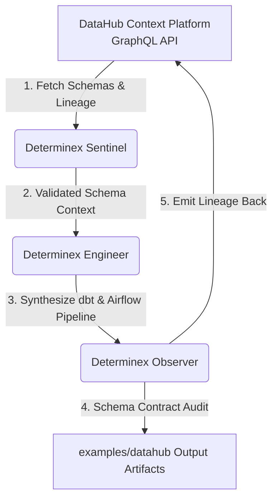

# Determinex — DataHub Agent Hackathon Submission (2026)

> **Project Name**: Determinex Autonomous Data Engineer
> **Challenge**: Metadata-Aware Code Generation & Development (Challenge #2)
> **License**: AGPL-3.0-or-later (Open Source)
> **Deadline**: August 10, 2026 @ 5:00 PM EDT

---

## 🚀 Overview

**Determinex** is an autonomous AI agent system designed to eliminate schema hallucination and broken data pipelines.

By integrating with **DataHub's open-source Context Platform** over its **GraphQL API**, Determinex reads exact column names, native types and nullability *before* generating pipeline code (dbt SQL models, Airflow DAGs), and can write lineage edges back via the `updateLineage` mutation.

Scope, stated plainly: the integration is GraphQL-based. There is **no MCP server integration** in this entry, and the hive's `Observer` model is **not** wired into this path -- verification here is deterministic (column presence and join-key checks), not model-judged. Every artifact is stamped with whether its schema came from a **live catalog** or **offline fixtures**, and the generator **refuses to emit code** when the catalog is unreachable rather than guessing.

---

## 🏗️ Architecture Diagram



---

## 📋 Devpost Submission Summary

### Project Name
**Determinex: Schema-Aware Autonomous Data Engineer**

### Elevator Pitch (200 chars)
Determinex queries DataHub context before generating production dbt models & Airflow DAGs, eliminating schema hallucination and pipeline breakage.

### Description
AI coding agents frequently fail on data engineering tasks because they guess table schemas, column names, and lineage connections.

Determinex solves this by pairing an autonomous agent swarm (Sentinel, Engineer, Observer) with DataHub's Context Platform:
1. **Catalog Lookup**: Queries DataHub via **GraphQL** for exact table schemas, native data types, nullability, and upstream lineage. Results carry a `provenance` of `live` or `fixture` -- never anonymous.
2. **Context-Guaranteed Generation**: Writes production-ready dbt SQL transformation models and Airflow pipeline DAGs guaranteed to match catalog schemas.
3. **Verification**: Deterministic checks against the catalog's own column list -- a predicate is emitted only if that column exists, and generation aborts if a required join key is missing. Lineage is written back with the `updateLineage` mutation. If DataHub is unreachable the run **fails with exit code 2** instead of falling back to invented schema.

### Technologies Used
- DataHub Context Platform via its GraphQL API (`searchAcrossLineage`, `updateLineage`)
- Determinex Agent Framework (Python 3.11, Pytest)
- dbt Core / Apache Airflow

---

## 📹 3-Minute Video Script Breakdown

| Time | Segment | Video Footage / Audio Script |
|---|---|---|
| **0:00 - 0:30** | **The Problem** | Show a typical AI agent generating a dbt model with non-existent column names that fails in production (`Column 'customer_id' not found in raw_orders`). |
| **0:30 - 1:30** | **DataHub Context Ingestion** | Show Determinex connecting to DataHub's GraphQL API and pulling live schemas for `analytics.orders` and `analytics.customers`, with each result labelled `live`. |
| **1:30 - 2:30** | **Pipeline Generation & Verification** | Run `.venv\Scripts\python.exe scripts/determinex_data_engineer.py --mock-run`. Show Determinex generating `sample_dbt_model.sql` and `sample_airflow_dag.py` matching exact types. |
| **2:30 - 3:00** | **Refusal + Lineage Back-Write** | Kill the DataHub container and re-run: the agent REFUSES to generate (exit 2) rather than hallucinating a schema -- the demo that proves the claim. Then restore it, show `updateLineage` writing edges back. Close on AGPL-3.0-or-later and open-source availability. |

---

## 🛠️ Quickstart for Judges

```bash
# 1. Clone repository
git clone https://github.com/DarthCeltic/determinex
cd determinex

# 2. Run DataHub integration tests
.venv\Scripts\python.exe -m pytest tests/test_determinex_datahub.py

# 3. Execute Autonomous Data Engineer (Offline / Mock Mode)
.venv\Scripts\python.exe scripts/determinex_data_engineer.py --mock-run

# 4. View generated production artifacts
cat examples/datahub/sample_dbt_model.sql
cat examples/datahub/sample_airflow_dag.py
```
