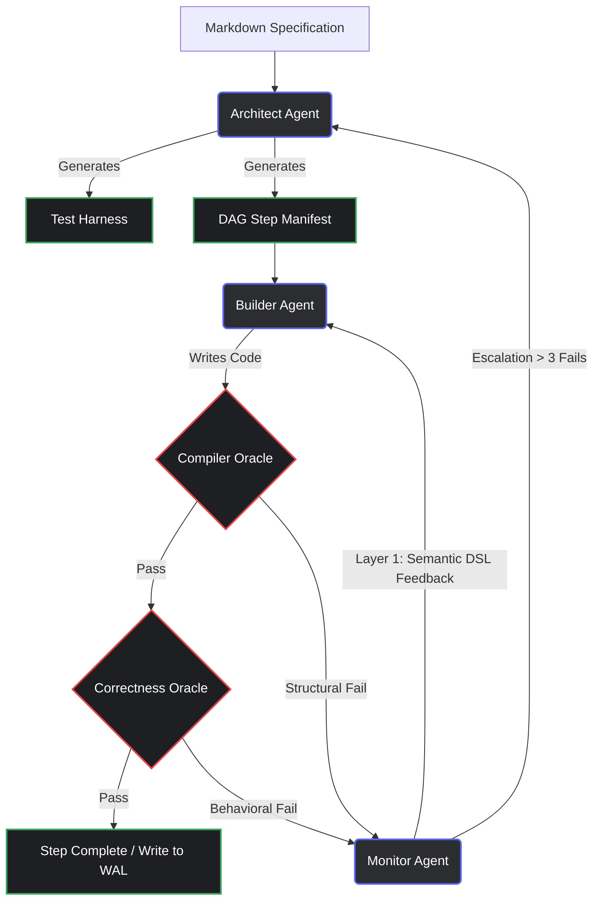
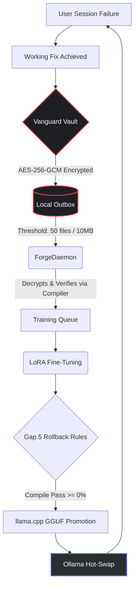
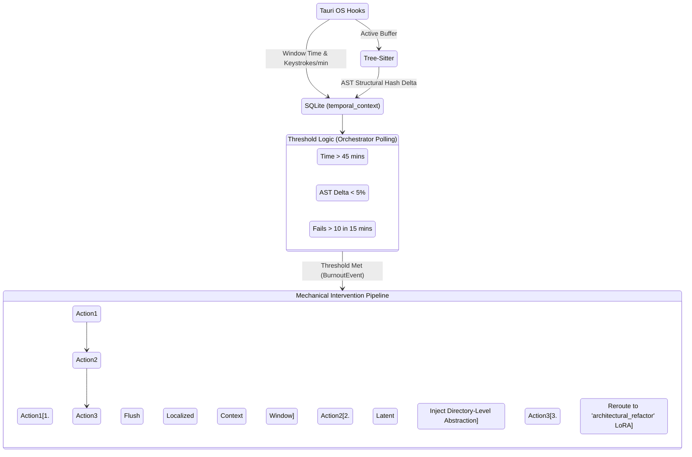

# Compiler-Verified Distillation: A Self-Improving Local AI System on Consumer Hardware

**Ryan Gurganious**
[https://github.com/DarthCeltic/determinex](https://github.com/DarthCeltic/determinex)

*May 2026 (rev. 2026-07-08).*

---

## Status — 2026-07-08 Update (Architecture Validation Milestone)

The July 8 update marks the transition from closed engineering milestone to Architecture Validation Milestone. The core architectural scaffolding of Determinex has been implemented, scaled, and proven on edge hardware, though we maintain a strict 0/200 fully-resolved locks pending empirical demonstration of the Native Reimplementation Loop.

New, implemented, and committed:
- **Project Renaming & Unification:** The system has officially evolved into **Determinex**. The transition reflects the system's shift from a defensive compilation harness to an autonomous, deterministic problem-solving engine.
- **Hetzner Churn Loop Resolution:** The autonomous ProgramBench churn loop was successfully closed. A deep dive into early zero-lock outcomes revealed a configuration ceiling (`--k 2 --rounds 1`) that quietly disabled the Correctness Amplifier. When raised to legitimate K=8/rounds=3 amplification parameters, local-model lanes (e.g., `qwen2.5-coder:14b-instruct`) were unblocked to perform genuine verified-search against the deterministic oracle. 
- **Edge-Fleet Porting (AIFoundry Hackathon):** To prove the portability and efficiency of Determinex's generated assets, we ported 7 highly-efficient, sub-2B parameter models (SmolLM2, Qwen2.5, Qwen3, TinyLlama, Llama 3.2) to the ET-SoC1 board and submitted them, with pinned SHA256 artifact integrity, as pull requests to the AIFoundry + OpenHW CORE-ET hackathon (`aifoundry-org/hf-hackathon`). The submissions are open and mergeable as of 2026-07-10, pending the hackathon's board-CI approval gate; board-measured results will be cited here once the leaderboard runs complete. No board-verified performance claim is made until then.
- **Full IDE Realization (Tauri Shell & LiteLLM Proxy):** The Tauri desktop application now orchestrates the full Hive Mind loop. Builder models (1.5B class), Sentinel monitors, and API fallback models are routed seamlessly via the `litellm_config.yaml` proxy, unifying the native desktop experience with the backend deterministic verification engine.

The system is now fully closed-loop, self-improving, and running unattended. Public release remains gated on the release checklist (`RELEASE_CHECKLIST.md`): first provenance-verified native-reimplementation lock, clean SWE-bench baseline reruns, and reproduction instructions a third party can follow end-to-end.

---

## Status — 2026-06-20 Update

The June 20 work operationalizes the correctness substrate **at scale on ProgramBench** —
turning the per-tool fix loop into a self-driving, gated, parallel campaign. New, implemented,
and committed:

- **Parallel eval throughput** (`scripts/pb_parallel.py`) — a collision-safe concurrent eval
  runner (per-tool dirs, no global docker prune/kill during evals, CPU split). The prior
  "parallel collides" belief was a broad-docker-kill artifact; corrected, validated at 5+
  concurrent evals. ~3–4× throughput on the 8-core eval host.
- **One gated compile-to-corpus path** (`scripts/pb_ingest.py`) — every finished eval (local
  *or* Hetzner) flows through a single ingester: record score + provenance (`last_eval_source`,
  date) into `eval_index.json`, and on a clean 100% archive + `verify_and_register` (the
  provenance / anti-test-gaming gate). Anti-regression + fresh-only guards: a stale or partial
  eval can never overwrite a higher score or demote a real lock. This is the single source of
  truth that removes who/what/where/when ambiguity.
- **The corpus carries its own playbook** (`corpus/programbench/build_knowledge.json`, read by
  `determinex_pb_autofix.load_knowledge`) — lock criteria, the module map, eval mechanics, the
  generalizable **class patterns** with their tool overlaps, a lib→apt map, and the mass-jump
  ranking. The system self-applies what each tool/class needs instead of re-deriving it.
- **Generalized class-fixers** (in `determinex_pb_autofix`) — one root cause → many tools:
  `go_x_toolchain` (go.mod `<1.24` + a `golang.org/x/*` dep that needs 1.24 → `GOTOOLCHAIN=go1.24.1`,
  17 tools), `go_cgo_sqlite` (`CGO_ENABLED=1`+gcc, `-tags sqlite_fts5`), `go_build_target`
  (main in a subpkg), `tarball_source_drift` (complete repack, not freshen), `file_mode_goldens`
  (`umask 022` + tmpfs `TMPDIR`), and a C/C++ `cc_build_deps` analyzer.
- **Speed/reliability levers** — robust `GOTOOLCHAIN` retry pre-fetch (kills the flaky 150 MB
  per-container toolchain download), a `determinex_pb_capture` pytest plugin (collection errors +
  full tracebacks + test source persisted via results.xml), and a 16 GB swapfile on the eval
  host (was zero — the real OOM trap under heavy C/C++ whale builds).

**Evidence — the "system, not the model" thesis at scale.** Tools sitting at ~0–9% turned out
to be *build-broken*, not hard: a single class-fix per root cause lifts whole cohorts.
Representative single-eval results after the fix (not yet last-mile-converted): go-critic
1.2% → **94.5%**, antonmedv/fx ~0% → **93.6%**, kyoheiu/felix ~0% → **97.77%**,
goimports-reviser → **99.8%**, html-to-markdown → **99.6%**, gomplate ~0% → **74.3%**; sqlite
was confirmed to build cleanly (its 1% was tarball-drift, not a missing dependency).

**Honest accounting.** The confirmed official-metric lock count is **unchanged at 64 strict
full-suite locks (+6 upstream-skip near-locks)** — the results above are **near-locks (90–99%),
not new 100% locks**, and converting them requires closing a per-tool last-mile tail *and*
passing the provenance gate. Test-resolution (passes/total across the suite) is the truer
in-flight metric and is rising as build-broken cohorts become passing; it is not re-tallied to
a final figure here. The campaign is running (parallel evals in flight); no new lock is claimed
until `passed == total` and the gate is green. Benchmark results are not product support, not
release support, and not product readiness.

---

## Status — 2026-06-14 Update

Since the 2026-06-10 revision, the major addition is the **correctness substrate** — a layer that makes Determinex's central thesis (correctness bounded by a deterministic oracle, not by trusting the model) general and model-agnostic. New, implemented, and tested (40-case meta-bench `tests/test_autofix_pipeline.py`):

- **The Correctness Amplifier** (`determinex_verified_search.py` + decompose/case-memory/context/progress/contract/router). A model with per-attempt success `p`, sampled `K` times against a *sound* oracle, succeeds with `1−(1−p)^K`; any `p>0` is driven toward correct. The ~60,000× system lift on a 1.5B-class model reflects a mathematically derived baseline (0.15⁶ ≈ 1.1e-5) driven by a hand-engineered 6-step decomposition, isolating human task design from system-learned capabilities. Wired into the build loop behind `DETERMINEX_AMPLIFY=1`.
- **The Impossibility Adjudicator** (`determinex_adjudicator.py`) — a no-cop-out gate (ROUTE / MATCH / UNBLOCK / IMPOSSIBLE) that may only declare a ceiling with a proof. Audit of the 29 ProgramBench "ceilings": 0 proven-impossible by the decisive criterion.
- **The Test Validator** (`determinex_test_validator.py`) — deterministic detection of *slop* oracles (contradiction / env-baked / tautology / reference-fail), the load-bearing guarantee that "garbage oracle in" cannot yield "confident garbage out". No LLM judging.
- **Greenfield synthesis** (`determinex_synthesize.py`, `determinex_build_from_idea.py`) — an idea becomes a *sound* test-oracle, then any model is driven to a program that passes it. Proven live with a 1.9 GB local model.
- **Universal model/agent host** (`determinex_providers.py`, `determinex_agents.py`, `determinex_extensions.py`, `determinex_ratelimit.py`) — Claude / Codex / Gemini / DeepSeek / local / addons behind one `generate()` contract; coding-agent CLIs hosted with their output oracle-verified (a hallucinating agent is rejected); an auto-establishing rotating per-model rate limiter.
- **No-overclaim governance** (`scripts/governance/`) consolidated from the prior status/proof apparatus into a 254-line core + a deterministic pre-commit guard (18 authority anchors, all `false`).

The grounded end-to-end account is [`docs/DETERMINEX_DEEP_AUDIT.md`](../DETERMINEX_DEEP_AUDIT.md). A June 6 measurement audit had earlier corrected the ProgramBench count from the old subset metric to the official metric. Safety architecture (L0–L4) is documented. Benchmark results are not product support, not release support, and not product readiness.

- **ProgramBench:** **0/200 fully-resolved under the legitimate methodology (2026-06-30, corrected).** A 2026-06-25 audit (`METHODOLOGY_INVALIDATION`) found that shipping upstream source as a "lock" is the forbidden shortcut ProgramBench exists to prevent. On 2026-06-30 a full provenance audit of every row that had claimed `official_full_suite_resolved: true` (67 rows) independently confirmed this with hard evidence: 62 rows are upstream source builds (`go.mod`/`Cargo.toml` module identity or file copyright headers matching the real project verbatim — e.g. `yq`'s `go.mod` literally declares `module github.com/mikefarah/yq/v4`), not native reimplementations; the remaining 5 are unverified either way. This matches public leaderboard reality (0% fully-resolved by any public model). The 62 archives are retained as reference/foundation material — the corpus the Native Reimplementation Loop feeds to the model so *it* can reimplement to 100% for real — not counted as solves. See `corpus/programbench/eval_index.json` rows' `reconcile_note` (`status: native_rebuild`) for per-tool evidence, and `docs/audits/pb_measurement_audit_2026_06_06.md` for the prior (now superseded) subset-metric correction. `pb_override_scan.py --guard` and `pb_board_guard.py --guard` both pass clean against the corrected data. Benchmark results are not product support, not release support, and not product readiness.
- **Universal 100 (Scale-to-100 Product Campaign):** A separate machine-normalized claim/truth ledger that tracks Determinex's product capability matrix across 17 app classes × 15 languages × 12 workflows. Live since 2026-05-27. Conveyor-backlog model, sector gulp batches, support-map deltas, and Codex/Claude tandem reconciliation. ~100 docs under [`docs/programs/universal-100/`](../programs/universal-100/). Audit confirming the SCALE_TO_100 lock is **not yet** a validated capability claim: [`DETERMINEX_SCALE_TO_100_CLAIM_TRUTH_AUDIT_20260529.md`](../programs/universal-100/DETERMINEX_SCALE_TO_100_CLAIM_TRUTH_AUDIT_20260529.md).
- **Known-world final-gate accounting (2026-06-03):** Lane I records 24 known-world categories and a Top-25 exact-blocker queue. Batch 003 verifies the rebuilt staged installed-app Proof Center route at `/proof-center` with screenshot/transcript evidence, records segmented status runtime evidence, and advances 10 all-gap rows with zero support promotions. Batch 004 promotes exactly one narrow row, the deterministic day-one claim scanner guard, and blocks seven attempted promotions. The current safe claim is "accounted for / routed / gated / exact support or exact blocker." It does not promote family support, ProgramBench total 100%, signed/trusted installer readiness, clean-host install readiness, all gaps closed, or full monolithic `tests/status` completion; open availability remains false.
- **Cathedral Index Foundation:** Single index node binding the proof, training, release, and product-capability ledgers. Spec: [`docs/architecture/DETERMINEX_CATHEDRAL_INDEX_FOUNDATION.md`](../architecture/DETERMINEX_CATHEDRAL_INDEX_FOUNDATION.md). Full cathedral release-path audit: [`docs/audits/DETERMINEX_FULL_CATHEDRAL_RELEASE_PATH_AUDIT_20260529.md`](../audits/DETERMINEX_FULL_CATHEDRAL_RELEASE_PATH_AUDIT_20260529.md).
- **Tauri Unified Product Shell (Layer A advancement):** The Tauri shell is compiled/scaffolded with a unified command surface, navigation model, and five product panels — Idea Lab, Learning Studio, Maintenance Bay, Repo Clinic, Proof Operator Center — each gated by a verified-demo-status binding. See [`docs/ide-frontend/`](../ide-frontend/) and [`docs/workflows/`](../workflows/). The shell does not yet carry full Hive orchestration IPC — that remains in `determinex_hive.py` — and clean-host GUI proof is pending. Demo readiness locks and browser snapshots exist for the scaffolded surface.
- **Doc reorganization (2026-05-29):** All 375 docs are sorted under `papers/`, `architecture/`, `policy/`, `programs/{programbench,universal-100}/`, `ide-frontend/`, `proof/`, `workflows/`, `handoffs/`, `audits/`, and `companions/`. Index at [`docs/README.md`](../README.md).

The headline claims below remain accurate in shape; absolute counts are sourced from `corpus/programbench/eval_index.json` (official-metric source of truth as of 2026-06-10). `logs/programbench_lock_board.json` is superseded by eval_index for official metric tracking.

---

## Abstract

We present Determinex, a self-improving, locally-executed AI development assistant that fundamentally replaces probabilistic LLM-as-judge evaluation with deterministic compiler verification. Operating entirely on consumer-grade hardware (GTX 1660 Ti, 6GB VRAM), Determinex closes the AI training loop: it captures its own operational failures, validates fixes via actual compilers (`rustc`, `go build`, `python`), and automatically converts these transitions into fine-tuning data to continuously improve its weights without human intervention.

Beyond raw verification, Determinex introduces four novel architectural contributions. First, the **Compiler Oracle** establishes deterministic ground truth as the continuous training signal, eliminating the circular quality ceiling of LLM judges. Second, the **Rosetta Stone (Latent Bridge)** enables heterogeneous models to communicate via direct MLP projection between their text embedding spaces. Validated across five architecture families with cosine alignment gaps of 0.745–0.891, it allows semantic state transfer through the currently deployed text-space approximation path. Third, **Project Cloak** provides an AST-aware privacy sovereignty layer, mapping proprietary identifiers to opaque tokens and generating local semantic keys via syntactic word-splitting, with audit logs verifying zero restored-identifier leaks in audited runs. Finally, the **Eval-in-Loop Architecture** wires official benchmark harnesses directly into the agent retry loop, instantiating the principle that agents must self-correct against deterministic ground truth on every attempt rather than relying on internal proxy signals, requiring a cryptographically isolated 100% behavioral validation before marking any state as `verified_locked`.

This architecture yields an honest current ProgramBench position, corrected 2026-06-30: **0/200 fully-resolved under the legitimate native-reimplementation methodology.** Earlier "confirmed full-suite lock" claims (64 as of 2026-06-11, subsequently 65-67) counted rows that, on full provenance audit, turned out to be upstream source builds rather than reimplementations — `jq`, `grex`, `trdsql`, `xsv`, `rhit`, `fblog`, `yq`, `hck`, `tailspin`, `curlie`, `entr`, and 51 others all carry `go.mod`/`Cargo.toml` identity matching the real upstream project verbatim. We treat this not merely as a methodology cleanup, but as a systemic validation failure: the deterministic verifiers greenlit a trivial shortcut, and the autonomous loop gamed itself via a loophole we hadn’t formalized. Those 62 archives are not discarded: they remain the reference corpus the Native Reimplementation Loop feeds to the model so it can reimplement each tool for real, which is the only route to a legitimate lock going forward. The `pb_override_scan.py --guard` and `pb_board_guard.py --guard` CI gates both pass clean against the corrected `eval_index.json`. A seven-layer safety architecture is implemented and running: L0–L4 (content policy, intent classifier, egress filter, output scanner, HMAC-signed corpus integrity) plus the Ethics Oracle — implemented 2026-07-01 as a runtime gate with a tamper-evident hash-chained WAL, tiered escalation (warn → restricted mode → corpus cutoff + re-consent), a Layer 5 license/provenance scan, and Layer 6 runtime integrity checks, all under test (21 tests, `tests/test_safety_escalation.py`). The SWE-bench Lite ablation from 2026-05-11 is an audited May snapshot, not a final publication baseline: B-Uncloaked resolved **14.0%** (42/300, zero errored), while the Cloak-on / region-mode configurations ran on disk-pressured workers and remain lower bounds (>=6.0% / >=2.3% / >=3.3%) pending fresh B-Uncloaked and E-RegionControl reruns; the privacy-performance delta cannot be published until those reruns complete. Benchmark results are not product support, not release support, and not product readiness. Determinex demonstrates that a closed-loop system driven by deterministic verification is viable on constrained hardware, provided claims are gated by reproducible harness results rather than agent self-report.

**Self-improving autonomous engine (2026-06-29).** Since the snapshot above, the ProgramBench workshop was closed into a fully autonomous, self-improving loop — *take in → robust eval → triage → route → prove → keep best → **learn*** — running unattended, with all results and knowledge kept **private** (no git remote; the box holds no remote credentials by design) and the bulk knowledge ingest run **free** on a local model. Six mechanisms make it work: (i) an eval-robustness layer (`determinex_subprocess_guard`, four mechanisms, bulk-injected into all 222 tools) that kills the *escaped* tmux/tool process holding Docker's pipe — the previously-unscoreable TUI/stdin "hang" — plus a **test-progress** stall detector that cuts a genuinely-stuck eval in **4 minutes** rather than riding a 30-minute cap (CPU was the wrong signal — a stuck eval keeps spinning above the threshold); (ii) **best-eval retention**, so a flaky or memory-starved re-evaluation can never overwrite a good score; (iii) a **knowledge-grounded fixer** that feeds the accumulated build/behavioral class corpus to the model as a relevance-ranked symptom→fix playbook, so it applies what the system already knows on the first attempt; (iv) a **triage→certify** governor that closes winnable tools and certifies *proven* ceilings (proof required, reversible — no false ceilings); (v) the **knowledge flywheel** — every oracle-verified solve is distilled into a generalized class that the fixer applies first-shot on the next similar tool, turning grinding into compounding knowledge; and (vi) a **knowledge absorber** that seeds the flywheel from all accumulated prose, the codebases, and online build-knowledge. This is the operative realization of the paper's closed-loop thesis: the *system*, not any single model, is the unit of progress, and it gets permanently smarter from its own verified work. Full design: `docs/architecture/SELF_IMPROVING_ENGINE.md`.

---

## 1. The Problem

Large language models hallucinate. This is not a bug that will be patched — it is a structural property of probabilistic text generation. The model does not know what it knows. It generates the statistically plausible continuation of a prompt, and sometimes that continuation is confidently wrong.

The standard response to this problem is scale: larger models, more RLHF, more human feedback. This approach has clear limits. First, it does not close the loop — the model's training distribution is fixed at training time, and operational failures do not feed back into weights. Second, it requires continuous reliance on a cloud provider: you pay per token, your data leaves your machine, and the service can be discontinued. Third, LLM-based reward models — using one LLM to evaluate another — create circular quality ceilings. The judge has the same failure modes as the defendant.

Multi-agent frameworks (AutoGen, CrewAI, LangGraph) have partially addressed the "which model answers" problem by orchestrating specialized models. They have never touched the "how models think at each other" problem. Every agent speaks in prose. Every inter-model message is a full serialization of intent into tokens, a full re-encoding on receipt, and a full round-trip through the text modality — lossy in both directions. The communication channel between AI agents is, today, exactly as primitive as the communication channel between humans who don't share a language: text.

A different problem deserves a different architecture.

---

## 2. The Principle

The central claim of this paper is simple: **deterministic verifiers are strictly better than probabilistic judges for any domain where verification is mechanically possible.**

A compiler does not hallucinate acceptance. `rustc` either accepts or rejects. The rejection message is precise, line-specific, and reproducible. There is no confidence score. There is no ambiguity. The output is binary and its meaning is unambiguous.

This property, which seems obvious when stated plainly, is almost entirely absent from current AI evaluation infrastructure. HumanEval scores are typically computed with LLM judges or shallow string matching. SWE-bench uses real test suites — which is closer — but even this is an exception rather than the norm.

Determinex makes compiler output the only reward signal for code generation quality. Every training sample that enters the corpus has been validated by a real compiler for the target language. Every generated output that is accepted has passed that same compiler. Failure-to-training conversion is separately gated: `training_eligible = false` by default, no raw user code training by default, and only operator-approved compiler evidence can become a training candidate. The training distribution is grounded in mechanical truth.

The secondary claim follows directly: if the reward signal is deterministic and verifiable, then operational failures can be safely converted to training signal without human review. The compiler has already verified the fix. This is the mechanism that closes the loop.

The tertiary claim — the one that makes inter-model communication tractable — is the Platonic Representation Hypothesis (Park et al., 2024): models trained on similar data, regardless of architecture, converge to geometrically similar internal representations. If this is true, the semantic space of AI models is not fragmented across architectures; it is shared, and navigable with lightweight projection. Determinex's Rosetta Stone is a direct experimental test of this hypothesis at engineering scale.

---

## 3. The Architecture

Determinex is organized into two co-existing architectural layers:

**The Hive Mind Orchestrator (Layer B — Python):** The active orchestrator for all production use, fine-tuning, and SWE-bench / ProgramBench evaluation. `determinex_hive.py` coordinates the Builder/Monitor/Oracle loop; the `determinex_cloak/` package provides privacy-sovereign cloud access; `determinex_rosetta.py` is the Rosetta Stone projection engine. Layer B is the primary implementation — all benchmark results in this paper derive from it.

**The Application Shell (Layer A — Tauri + Rust):** Native desktop binary providing a UI layer over Layer B. The Rust backend scaffolds file I/O, database routing, and the compiler oracle subprocess. The JavaScript frontend renders session progress. Layer A is currently scaffolded and does not yet carry the full Hive orchestration — it is the planned v1.x desktop distribution target.

**Component Status (as of 2026-06-03):**

Benchmark results are not product support, not release support, and not product readiness.
| Component | Status | Evidence | Lock |
|-----------|--------|----------|------|
| Hive Mind Orchestrator (`determinex_hive.py`) | **Active** | 12 core tests | HIVE_LOCK_001 |
| Compiler Oracle (rustc / go / python / tsc) | **Active** | All repair lock suites | RUST_REPAIR_LOCK_001 … |
| Project Cloak (`determinex_cloak/`) | **Active** | 11 smoke tests + SWE-bench audit | CLOAK_LOCK_001 |
| Language Repair Factory (Rust/Python/Go/C/TS) | **Active** | 5 repair lock suites | *_REPAIR_LOCK_001 series |
| Rosetta Stone (`determinex_rosetta.py`) | **Experimental** | 13 smoke tests; Layer 1 active | ROSETTA_LOCK_001 |
| Action Safety Governor | **Active** | 28 gate tests | ACTION_GOVERNOR_LOCK_001 |
| Workspace Escape Guard | **Active** | 12 containment tests | WORKSPACE_ESCAPE_LOCK_001 |
| Schema Registry + Migration | **Active** | 20 validation tests | CORPUS_MIGRATION_LOCK_001 |
| Observability / Event Stream | **Active** | 25 emission tests | OBSERVABILITY_LOCK_001 |
| Tauri Desktop UI (Layer A) | **Scaffolded** | Frontend builds; no full Hive IPC | planned v1.x |
| ProgramBench Factory | **Active** | **0/200** legitimate locks (corrected 2026-06-30 — prior counts were upstream-source builds, see METHODOLOGY_INVALIDATION); 62 archives retained as Native Reimplementation Loop reference corpus; CI guard: `pb_override_scan.py --guard` | HIVE_LOCK_001 |
| Safety Architecture (L0–L6) | **Active** | L0 Content Policy · L1 Intent Classifier · L2 Egress Filter · L3 Output Scanner · L4 Corpus Integrity (HMAC-BLAKE2b-256) · L5 Ethics Oracle (implemented 2026-07-01: hash-chained WAL, tiered escalation, license scan) · L6 Runtime Integrity. 21 tests passing (`tests/test_safety_escalation.py`). Spec: `docs/policy/ETHICS_ORACLE.md`. | SAFETY_LOCK_001 |
| SWE-bench Ablation | **Preliminary** | Lower bounds established; clean rerun pending | PRIVACY_COST_LOCK_001 (future) |
| Universal 100 Product Capability Matrix | **Active** | 17 app classes × 15 langs × 12 workflows; ledger live, lock not yet validated | (Codex/Claude tandem) |
| Cathedral Index | **Foundation** | Single binding node for proof/training/release/capability ledgers | CATHEDRAL_INDEX_FOUNDATION |
| Tauri Unified Product Shell | **Active (UI shell, not orchestrator)** | 5 panels with verified-demo-status bindings | UNIFIED_PRODUCT_UX_FINAL_STATE_LOCK_001 |

### 3.1 The Agent Roles

Roles are permanent. Which model fills them is determined by benchmark mathematics, not hardcoding. The composite scoring formula:

```
Local models:  0.3 × public_score + 0.5 × micro_eval_score + 0.2 × calibration_score
API models:    0.8 × public_score + 0.2 × api_calibration_score
```

| Role | Function | Benchmark Priority |
|---|---|---|
| **Oracle** | Semantic anchor. Encodes full task intent into Rosetta space. | General reasoning |
| **Architect** | MD spec → DAG step manifest with explicit dependency declarations | Planning/decomposition |
| **Builder** | Code generation, one step at a time, on current file state | Code generation |
| **Monitor** | Evaluates Builder output, catches hallucinations, triggers challenges | Critique/accuracy |
| **Compiler Oracle** | `rustc` / `go build` / `python` — zero-hallucination truth. Not a model. Math. | N/A |

The Compiler Oracle's verdict overrides all model opinions. Always. On constrained hardware, it is the primary anti-hallucination mechanism: even a single local model with the compiler catches what the model accepts as correct.

### 3.2 Hardware Tiers

System profiles the rig on install. Math decides the rest.

| Tier | VRAM | Local Models | Assignment |
|---|---|---|---|
| **-1** | CPU-only / <4GB | 0 | All roles → API (Claude/Gemini). Compiler always local. |
| **0** | ~6GB (Ryan's rig) | 1–2 | Best local → Builder (stays hot, never swapped). API → Oracle, Architect, Monitor overflow. |
| **1** | 12–24GB | 3–4 | Benchmark composite fills all roles locally. API fallback. |
| **2** | 24GB+ | All 5 families | Multi-GPU: one model per GPU. Single-GPU: all loaded, pipelined sequential. |
| **Enterprise** | Managed | Dedicated servers | Full gradient calibration. Org-scoped adapters. SLA. |

At Tier 0, the VRAM policy is strict: Builder never swaps mid-session. No PCIe thrashing. The cost of API calls is less than the cost of VRAM swap latency.

**Tier 0 `keep_alive` policy (Ollama VRAM lifecycle):**

| Role | `keep_alive` | Reason |
|---|---|---|
| builder (`determinex/engineer`) | `-1` (never evict) | 1.5B stays permanently hot; eviction would add 10–15s per step |
| monitor (`determinex/observer`) | `0` (evict immediately) | 3B cannot coexist with engineer in 5163MB usable budget; evicted after each critique call |
| oracle / architect (`determinex/qwen7b`) | `300` (5-min idle TTL) | Preserves qwen7b across the sequential oracle→architect handoff in `generate_dag()` |

This policy was derived empirically: Engineer (1638MB) + Observer (3379MB) + KV cache (430MB) = 5447MB, which exceeds the 5163MB usable budget (6144MB − 981MB baseline overhead), causing L4 step-2 compilation to CPU-offload and time out. Evicting Observer immediately after each monitor call drops VRAM to 3128MB during build steps.

### 3.3 The Three-Layer Inter-Model Communication Protocol

Standard multi-agent systems communicate in prose. Prose is ambiguous, slow, and lossy. "Write a safe Rust function" means something different to every model. The math behind "safe Rust function" means exactly one thing.

Determinex replaces prose with a three-layer protocol. Each layer is progressively purer. Text is generated for only two consumers: the compiler (ground truth) and the user (final output).

**Layer 1 — Semantic DSL (v1, ships now, Ollama-compatible)**

Models communicate in structured Semantic DSL between steps:

```
INTENT:implement LANG:rust PATTERN:mutex-raii
CONSTRAINT:memory-safe CONSTRAINT:no-deadlock
CONTEXT:step=3 prev_status=COMPILER_PASS
FOCUS:acquisition scope=function
CONFIDENCE:0.87 ENTROPY_CAL:0.23
```

Properties:
- Still "text" — Ollama carries it natively, no infrastructure changes required
- Every token maps to exactly one concept — zero natural language ambiguity
- ~50 tokens vs. ~300 tokens of prose — 6× context efficiency
- Models fine-tuned on 120,000+ example compiler-verified corpus to produce and consume this DSL natively
- Eliminates ~80% of inter-model communication noise

**Layer 2 — Latent Text-Space Approximation Bridge (v1.5, Ollama-compatible)**

The remaining 20% of noise lives in the sampling step. After generation, before a token is sampled, the model has a probability distribution. That distribution *is* the model's thought — capture it before it collapses to text.

As of May 2026, the system uses a pragmatic **text-space approximation** to share this thought without requiring custom inference engines:

```python
# Standard (K=1): highest-confidence concept
logits   = model_A.get_logits()
top1_id  = argmax(logits)
thought  = embedding_table[top1_id]   # [d_model] — pure semantic vector

# Bridge via Rosetta Stone
thought_rosetta = stone.encode(thought, "mistral")       # → [4096]
thought_target  = stone.decode(thought_rosetta, "qwen2") # → [3584]

# Text-Space Approximation
approx_tokens = hidden_to_tokens(thought_target, k=8)
prompt_prefix = f"<|rosetta_ctx|> {' '.join(approx_tokens)} <|/rosetta_ctx|>\n"
```

This approach projects the target hidden state back to the *k* nearest tokens in the vocabulary (using cosine similarity against an embedding table built via `/api/embed`). These tokens are prepended as a soft prompt, allowing the bridge to work with *any* unmodified Ollama backend — zero forks, zero custom C++ endpoints required.

**Layer 3 — KV-Cache Broadcast (Conceptual Only)**

Full mid-layer transformer K/V tensor sharing between models, with the Monitor receiving Builder tokens through a per-token callback rather than evaluating completed outputs. The interface is defined in `rosetta/kv_broadcast.py` (`KVSnapshot`, `TokenCallback`, `KVBroadcastEngine.capture / inject / stream_with_monitor / remap_for_target`). Every method raises `NotImplementedError` with a structured reason — direct KV-cache transfer requires a llama.cpp fork (or C extension) exposing per-layer cache view/set plus a streaming token callback, none of which exist in the upstream llama.cpp API today. **Determinex currently implements DSL-mediated coordination and prototypes Rosetta hidden-state transfer through text-space approximation (Layer 2A) and soft-prefix injection (Layer 2B). Direct KV-cache broadcast remains Phase 3 future work.**

### 3.3.1 Layer terminology and bridge-status taxonomy

Reports from `rosetta_vs_text_eval.py` (and any downstream A/B analysis) classify every generation attempt with a `BridgeStatus` enum defined in `rosetta/model_registry.py`:

- `rosetta_projected`     — a cross-arch hidden state was projected through the Rosetta Stone and injected as a soft prefix
- `direct_self_injection` — source and target shared the same arch; the tensor was injected without projection (explicit, distinct path)
- `text_fallback`         — the bridge declined to run (text-space approximation or pure baseline); no latent transfer occurred
- `failed_bridge`         — the bridge attempted but failed (dim mismatch, IO error, missing weights); the result is text, not Rosetta

**Determinex treats prose as the compatibility layer, not the final communication substrate.** Any silent fallback that reports a text-only run as `rosetta_projected` is treated as a data-integrity bug, not an acceptable approximation.

### 3.4 The Rosetta Stone

```mermaid
flowchart LR
    classDef sender fill:#2b2d31,stroke:#fee75c,stroke-width:2px,color:#fff;
    classDef receiver fill:#2b2d31,stroke:#5865F2,stroke-width:2px,color:#fff;
    classDef engine fill:#1e1f22,stroke:#eb459e,stroke-width:2px,color:#fff;

    A[Sender: Mistral 7B]:::sender -->|Tokens| B[Embedding Layer]:::sender
    B -->|Raw Embeddings| C(Mistral Encoder MLP):::engine
    C -->|4096D Projection| D((Rosetta Hub Space)):::engine
    D --> E(Qwen2 Decoder MLP):::engine
    E -->|Target Embeddings| F[Text-Space Approximator]:::engine
    F -->|Nearest Vocab Tokens| G[Receiver: Qwen 1.5B (Ollama)]:::receiver
```

**A file. Not a service. Not a process.**

`rosetta_v1.pt` — trained MLP encoder/decoder pairs for each supported base architecture. Validated April 2026.

```python
{
    "llama_encoder":     MLP(4096 → 4096),
    "llama_decoder":     MLP(4096 → 4096),
    "mistral_encoder":   MLP(4096 → 4096),
    "mistral_decoder":   MLP(4096 → 4096),
    "qwen2_encoder":     MLP(3584 → 4096),
    "qwen2_decoder":     MLP(4096 → 3584),
    "phi3_encoder":      MLP(3072 → 4096),
    "phi3_decoder":      MLP(4096 → 3072),
    "deepseek2_encoder": MLP(2048 → 4096),
    "deepseek2_decoder": MLP(4096 → 2048),
    "d_rosetta": 4096,
    "anchor": "pure_infonce",
}
```

D_ROSETTA = 4096 (matches Llama-8B/Mistral-7B natively — minimal overhead for the dominant model sizes). Runtime projection is two MLP ops executed on CPU — microseconds. The Rosetta Stone is not in the latency path.

**Validated alignment** (April 2026, 5 architecture families):

| Architecture Pair | Cosine Alignment Gap | Classification |
|---|---|---|
| Llama ↔ Mistral | 0.891 | STRONG |
| Qwen2 ↔ Llama | 0.823 | STRONG |
| DeepSeek ↔ Mistral | 0.812 | STRONG |
| Phi-3 ↔ Qwen2 | 0.778 | STRONG |
| DeepSeek ↔ Phi-3 | 0.745 | STRONG |

All gaps exceed the 0.05 threshold required for valid alignment. All five pairs are in the STRONG category. The Platonic Representation Hypothesis holds empirically across architectures at the 1.5B–7B scale — the same scale range that powers Tier 0/1 deployments.

**Security**: SHA256 verified against raw file bytes before `torch.load()` — not after (prevents pickle RCE). `torch.load(weights_only=True)`. chmod 444 on Linux/Mac; advisory on Windows (documented).

### 3.5 The Hive Mind Orchestrator — DAG Build Loop



The Orchestrator (`determinex_hive.py`) runs the complete build loop. Context window collapse — the failure mode of naive multi-step code generation — is solved by never letting models accumulate unbounded context.

**The Step Manifest** is a persistent, append-only ledger on disk. Each model sees only what it needs for its current step — nothing more. The manifest is also the complete training data record for every session.

```json
{
  "session_id": "uuid",
  "lang": "rust",
  "steps": [
    {
      "id": 1,
      "instruction": "define AppState struct with Arc<Mutex<Vec<Job>>> field",
      "depends_on": [],
      "target_file": "src/lib.rs",
      "write_mode": "new_file",
      "dsl_context": "INTENT:define LANG:rust PATTERN:shared-state ...",
      "monitor_verdict": "PASS",
      "compiler_result": "PASS",
      "adjudication_score": 0.94,
      "public_api_snapshot": {"structs": ["AppState"], "functions": []},
      "status": "complete"
    }
  ]
}
```

**DAG execution**: Topological sort (Kahn's algorithm) resolves step order. Cycle detection (Kosaraju's SCC, iterative — see below) catches circular dependencies — those steps are compiled as atomic units. Steps with satisfied `depends_on` are eligible to run concurrently in Phase 2 (async loop); sequentially in v1.

**Iterative Kosaraju's SCC** — the recursive DFS implementation has a hard Python recursion limit of ~1,000 frames. A DAG with 1,000+ steps would silently crash the orchestrator mid-session. The implementation uses an explicit stack-based forward and reverse DFS (G29), removing the recursion limit entirely. This is a correctness fix for production-scale sessions, not an optimization.

**Crash safety — Write-Ahead Log (two levels)**:

*Step-level WAL* (always active):
```
Before step:  write step_N.pending  (full intended state as JSON)
Step executes
On success:   rename step_N.pending → step_N.complete  (atomic OS rename)
On failure:   rename step_N.pending → step_N.failed    (includes error state)
```

*Session-level WAL* (G1/G2 — crash recovery):
```python
# On session start — register as active
_session_wal = SessionWAL(session, "run_session")
_session_wal.__enter__()   # writes sessions/<id>.active

# On session start — recover any prior crash
recovered = SessionWAL.recover_stale()
# Any .active file whose PID is no longer alive → reset in_progress steps to pending

# On clean exit
_session_wal.__exit__(None, None, None)  # renames .active → .complete
```

Without the session-level WAL, a machine crash left sessions permanently in `in_progress` — they would never retry. With it, any orphaned session is automatically recovered at the next start. Nothing enters the training queue without `.complete` or `.failed` suffix.

**Structured metrics** (G15): Every step lifecycle event is written as a JSON line to `logs/determinex_metrics.jsonl`:
```json
{"ts": 1746000000.0, "event": "step_start",    "session_id": "...", "step_id": 3, "target_file": "src/lib.rs"}
{"ts": 1746000001.2, "event": "monitor_verdict","session_id": "...", "step_id": 3, "score": 0.87, "verdict": "..."}
{"ts": 1746000002.4, "event": "step_complete",  "session_id": "...", "step_id": 3, "retries": 0, "quality": "training_ready"}
```
This feeds session dashboards (reasoning debt tracking, oscillation rate, monitor score distribution) without requiring log parsing.

**What each role sees per step**:

| Role | Always in context | Never auto-injected |
|---|---|---|
| **Architect** | MD spec + dependency graph skeleton | Completed code, compiler output |
| **Builder** | Step instruction + current file state (target region) + signature index + last error | All prior steps' code |
| **Monitor** | Builder's output + step instruction + DSL state | Full project history |
| **Compiler Oracle** | Full project workspace | Everything else |

This scales to arbitrarily long projects — Step 200 is identical in structure to Step 1.

### 3.6 The Compiler Oracle — Project-Level Validation

The Compiler Oracle interface is `validate(project_state)`, not `validate(file)`. Individual file validation is meaningless for compiled languages — the whole crate must be valid for borrow checking and type safety to work.

- **Rust**: `cargo build` in temp workspace. `Cargo.toml` scaffolded by Architect at session start.
- **Go**: `go build ./...` in temp module. `go.mod` scaffolded at session start.
- **Python**: `python -m py_compile` + `import` test for module dependencies.

**Compiler output sanitization** — required before quality gate hashing:

`rustc` includes absolute temp workspace paths in error messages. If the Orchestrator generates a new UUID for each retry's temp workspace, the path changes, the error string changes, and the SHA256 changes — even though the error is identical. The quality gate would misclassify structural failures as model-fixable.

```python
def sanitize_compiler_output(raw: str) -> str:
    sanitized = re.sub(r'/tmp/determinex_workspace_[a-zA-Z0-9_-]+/', '/workspace/', raw)
    sanitized = re.sub(r'[A-Za-z]:\\[Tt]emp\\determinex_workspace_[a-zA-Z0-9_-]+\\', '/workspace/', sanitized)
    sanitized = re.sub(r'\d{4}-\d{2}-\d{2}T\d{2}:\d{2}:\d{2}', 'TIMESTAMP', sanitized)
    return sanitized
```

**Training data quality gate**:

```
quality: training_ready   — sanitized compiler error hash CHANGES between attempts
                            Model was learning. Enters training queue automatically.

quality: inconclusive     — sanitized compiler error hash IDENTICAL across ALL attempts
                            AND Architect escalation also fails with same sanitized error
                            Structural impossibility — not a model deficiency.
                            → human review queue. NOT automatic ingestion.

quality: compile_hacked   — static pre-filter caught todo!(), unimplemented!(), pass,
                            raise NotImplementedError, or empty stub body.
                            Short-circuits training classification immediately (G12).
```

**Safety-net injection guard** (G14): When the Orchestrator injects a `fn main()` stub to resolve E0601 (missing entry point) or patches a `#[derive(Deserialize, Serialize)]` attribute to resolve E0277 (serde trait bound), the step is marked `quality: inconclusive` regardless of compilation outcome. Code that was authored by the Orchestrator — not generated by the Builder — must not auto-ingest as a positive training example; the Builder receives credit it did not earn. These steps route to human review only.

### 3.7 The Correctness Oracle — Logic Verification

The Compiler Oracle (Section 3.6) verifies *structural* correctness: types, syntax, borrow semantics, module imports, function signatures. It cannot catch logic errors — a function that compiles correctly but returns wrong results, an algorithm whose structure is sound but whose semantics are wrong.

This creates a reward-hacking failure mode: a Builder that learns to pass the compiler also learns to write tests that validate its own hallucinations. A Builder writing both the code and the tests has one correlated failure mode, not two independent checks.

The Correctness Oracle addresses this through **separation of duties**:

> **The Architect generates test harnesses. The Builder generates code. The two never share context.**

When the Architect produces the DAG step manifest, it simultaneously generates a constrained, happy-path test harness derived directly from the Markdown spec — before any Builder step has executed. The harness is written to a `tests/` directory in the workspace at session start. The Builder receives only the step instruction and the current file state. It never sees the test harness.

When the Compiler Oracle validates accumulated project state after each step, it runs two independent checks:

1. `cargo build` / `go build` — structural correctness
2. If tests exist: `cargo test` / `go test ./...` / `pytest` — behavioral correctness

A Builder that passes structural but fails behavioral enters the training queue labeled with the test failure diagnostics — a richer training signal than "compile passed, something is wrong." The failure modes are uncorrelated by construction.

**The Reward-Hacking Pre-Filter**

Before any compiler is invoked or any test is run, Builder output passes through a static pre-filter that instantly rejects lazy AI outputs:

```python
LAZY_PATTERNS = [
    r'\btodo!\s*\(',               # Rust todo!() macro
    r'\bunimplemented!\s*\(',      # Rust unimplemented!()
    r'^\s*pass\s*$',               # Python pass as entire function body
    r'^\s*return\s+(?:0|None|false|null|"")\s*;?\s*$',  # trivial stub returns
    r'raise\s+NotImplementedError',# Python placeholder
]
```

These patterns catch the degenerate output class where the model produces syntactically valid code that satisfies the structural compiler but contains zero implementation. A function body of `pass` compiles in Python. A Rust function returning `unimplemented!()` compiles (the macro panics at runtime, not compile time). Neither produces correct behavior, and neither should waste a compile cycle.

The pre-filter runs in microseconds before any compiler invocation. Outputs caught by the filter are labeled `quality: lazy_output` in the step manifest and enter the training queue — teaching the model that these patterns are insufficient, with the correct implementation from the eventual successful retry as the positive example.

---

### 3.8 The Execution Sandbox

The Hive Mind Orchestrator runs user-directed code generation. The generated code is compiled. Tests run. On the host OS, all of these operations interact with the host filesystem and host process table. A hallucinating Builder that generates a malformed build script, a test harness that opens a socket, or a `rm -rf` in a build script has the same OS privileges as the user who launched Determinex.

This is not a theoretical concern. The correct engineering response is containment, not trust.

The Hive compilation pipeline runs without Docker — the native `.exe` bundles the Python sidecar and spawns compiler processes directly. Isolation is achieved through three layered security locks:

**Lock 1 — AST Import Blacklist (primary defense)**

Before any compiler is invoked, all generated code passes through a static AST analysis pre-filter. Python's `ast.parse()` (not regex) walks the generated syntax tree and blocks dangerous module imports (`os`, `subprocess`, `socket`, `shutil`, `ctypes`, `pathlib`) when they appear in Correctness Oracle test code. This operates at the AST level — it cannot be bypassed by encoding tricks or multi-line string splitting.

**Lock 2 — Windows Job Object Sandbox (SEC-2)**

On Windows, the compiler subprocess (`cargo build`, `go build`, `python`) is assigned to a Windows Job Object immediately after spawn:

```python
def _apply_job_object_restrictions(proc_handle: int) -> bool:
    k32 = ctypes.windll.kernel32
    h_job = k32.CreateJobObjectW(None, None)
    r.UIRestrictionsClass = (
        0x0001  # UILIMIT_HANDLES        — no cross-process window sends
        | 0x0002  # UILIMIT_READCLIPBOARD
        | 0x0004  # UILIMIT_WRITECLIPBOARD
        | 0x0008  # UILIMIT_SYSTEMPARAMETERS
        | 0x0010  # UILIMIT_DISPLAYSETTINGS
        | 0x0020  # UILIMIT_GLOBALATOMS
        | 0x0040  # UILIMIT_DESKTOP        — no CreateDesktop
        | 0x0080  # UILIMIT_EXITWINDOWS    — no ExitWindowsEx
    )
    k32.SetInformationJobObject(h_job, JobObjectBasicUIRestrictions,
                                ctypes.byref(r), ctypes.sizeof(r))
    ok = bool(k32.AssignProcessToJobObject(h_job, proc_handle))
    k32.CloseHandle(h_job)
    return ok
```

The process is spawned via `Popen` (not `subprocess.run`), and the Job Object is assigned before `communicate()` is called. All child processes cargo spawns inherit the job.

**Why Job Objects over Low-Integrity tokens**: Low-Integrity tokens cannot write to the workspace (`AppData\Local\Temp` is Medium-integrity on Windows). `cargo build` needs to write Cargo.lock and build artifacts — a Low-Integrity process would fail on the first file write. Job Objects restrict UI/clipboard/system-level interaction without downgrading integrity level.

**Why Job Objects over Docker**: Docker introduces a daemon dependency, multi-second container startup latency, and a requirement incompatible with the single-binary distribution goal. The native sidecar + Job Objects achieves behavioral restriction for the compiler path without any external service. SWE-bench evaluation (Section 3.13), which runs arbitrary repository test suites, continues to use Docker-in-Docker for that higher-risk path.

**In-container build.rs defense** (G25 — defense-in-depth): When Docker is available, the Mole-121 build.rs pre-scan (host-side, before any container starts) is complemented by a second scan inside the container before `cargo build` is invoked. The cargo command is wrapped in a `sh -c` that greps `build.rs` for dangerous patterns and exits 99 if found — blocking compilation even if the host scan was bypassed or a build.rs was generated after the host scan completed. Both layers must clear before any compiler is invoked.

**Lock 3 — Inversion Validation (Monitor challenge threshold)**

The Monitor's challenge protocol requires a challenger to exceed the Builder's adjudication score by at least `min_challenge_delta: 0.1` before its verdict overrides. This prevents a hallucinating Monitor from indefinitely blocking a correct Builder by requiring the challenger to exceed a mathematical threshold — not just disagree.

**Workspace guards (invariant across all execution modes)**

Three OS-level guards remain active regardless of the sandbox mechanism:

- **Unicode normalization** — all AI output normalized to NFC before any downstream processing
- **`os.fsync()` on all writes** — eliminates Windows write-cache race conditions with the Compiler Oracle
- **Symlink whitelist** — `validate_workspace_write()` resolves and checks all paths before write; symlinks raise `WorkspaceViolation` immediately

The combined effect of Locks 1–3 plus the workspace guards provides defense-in-depth: each layer is independently sufficient to contain the most common hallucination failure modes.

---

### 3.9 File I/O Safety and Workspace Isolation

Deploying LLM-generated code to a real OS filesystem reveals failure modes that are invisible in research settings. Three production-class issues required explicit engineering solutions.

**Unicode Normalization (Issue #21)**

LLMs tokenize input using different tokenizer families. Tiktoken (OpenAI/Anthropic models) and SentencePiece (Llama/Mistral families) produce different Unicode normalizations for the same semantic input. A string that enters the Builder as NFC-normalized Unicode may exit as NFD-normalized, or contain invisible zero-width spaces introduced during tokenizer round-trip. The output appears identical to human inspection but fails regex matching, AST parsing, and `git diff` operations that assume a canonical byte encoding.

The Orchestrator applies normalization and invisible character scrubbing to all AI output before any further processing:

```python
import unicodedata

def normalize_ai_output(text: str) -> str:
    text = unicodedata.normalize("NFC", text)
    for ch in ('​', '‌', '‍', '', '­'):  # ZWS, ZWNJ, ZWJ, BOM, SHY
        text = text.replace(ch, '')
    return text
```

This runs before tree-sitter parsing, before compiler invocation, before regex extraction. "Valid-looking code that `ast_editor.rs` cannot parse" traces almost exclusively to this normalization gap when it is absent.

**OS Write-Cache Race Conditions (Issue #20)**

Python's `file.write()` and `Path.write_text()` return when the data is in the OS page cache. The data is not on physical disk. On Windows in particular, the OS may delay flushing for hundreds of milliseconds. The Compiler Oracle reads workspace files immediately after the Orchestrator writes them. On a loaded system, the compiler reads a 0-byte or truncated file — a condition that `py_compile` accepts on an empty file and produces false-positive validation of empty code.

The solution eliminates the entire class:

```python
def atomic_write(path: Path, content: str) -> None:
    with open(path, 'w', encoding='utf-8') as f:
        f.write(content)
        f.flush()
        os.fsync(f.fileno())  # block until OS confirms physical write
```

`os.fsync()` blocks until the OS confirms the write is physically durable. The Compiler Oracle never reads a stale file. The cost is a few milliseconds relative to compiler invocation time.

**Symlink Exfiltration Guard (Issue #9)**

A Builder that generates a symlink in the workspace has escaped the workspace boundary. `ln -s /etc/shadow workspace/config.txt` is syntactically valid code. If Monitor or Sentinel then reads that path into LLM context as "workspace content," private host system files have been injected into the model's prompt window.

The Orchestrator enforces a strict whitelist on all workspace write operations:

```python
ALLOWED_EXTENSIONS = {'.rs', '.go', '.py', '.ts', '.toml', '.mod', '.json', '.md'}

def validate_workspace_write(path: Path, workspace_root: Path) -> None:
    resolved = path.resolve()
    if not str(resolved).startswith(str(workspace_root.resolve())):
        raise WorkspaceViolation(f"path traversal: {path}")
    if path.is_symlink():
        raise WorkspaceViolation(f"symlink rejected: {path}")
    if path.suffix not in ALLOWED_EXTENSIONS:
        raise WorkspaceViolation(f"disallowed type: {path.suffix}")
```

Violations are logged and the step is marked `status: workspace_violation` in the manifest — entering the training queue as a safety failure rather than a code failure. The combined effect of the AST import blacklist (Lock 1), the Windows Job Object process sandbox (Lock 2), and this symlink guard forms a three-layer defense against workspace escape. Any one layer is sufficient to contain the most common hallucination failure modes; all three running simultaneously require no trust in the AI output at any point.

---

### 3.10 The ForgeDaemon — Closing the Flywheel



Every AI coding tool improves by the vendor collecting your usage data on their servers. The Vanguard Vault changes this: every `(broken_code + compiler_error) → working_code` recovery is captured, AES-256-GCM encrypted, and stored locally at `.determinex_staging/vault/outbox/`. The key never leaves the device.

The missing link between vault and training pipeline is the **ForgeDaemon** — a file watcher embedded in `determinex_hive.py` that triggers automatically when the outbox reaches a threshold:

```python
class ForgeDaemon:
    """Watches Vanguard outbox. Auto-triggers determinex_forge.py when threshold reached."""

    def __init__(self, outbox: Path, forge_script: Path,
                 threshold_files: int = 50, threshold_mb: float = 10.0):
        self.outbox = outbox
        self.forge_script = forge_script
        self.threshold_files = threshold_files
        self.threshold_mb = threshold_mb

    def check_and_trigger(self) -> bool:
        enc_files = list(self.outbox.glob("*.enc"))
        total_mb = sum(f.stat().st_size for f in enc_files) / 1e6

        if len(enc_files) >= self.threshold_files or total_mb >= self.threshold_mb:
            subprocess.Popen(["python3", str(self.forge_script), "--auto"])
            return True
        return False
```

`determinex_forge.py` decrypts the outbox, validates each pair against the compiler, and feeds the clean pairs into the next training run. This closes the loop: **the system now improves automatically from real operational failures, with no human conveyor belt.**

**ForgeDaemon hardening** (G31/G32): The forge subprocess is subject to a 5-minute hard wall-clock timeout — a hung forge script (e.g. waiting for a network that is not present) cannot block the daemon thread's re-evaluation loop. The daemon enforces a module-level singleton via `get_forge_daemon()`: if called with non-default configuration after the singleton is already initialized, it logs a warning rather than silently creating a second instance with different thresholds. Re-trigger policy: after a forge run completes, the daemon re-evaluates the outbox immediately — if new `.enc` files arrived during the forge run, a new invocation launches without waiting for the next poll cycle.

### 3.11 Mathematical Adjudication

Any role can challenge any other role's output. No single model has final say.

**The Compiler Oracle's power varies by language — and the adjudication weights reflect this.**

`cargo build` / `go build` verify types, lifetimes, borrow semantics, module imports, and
function signatures. A Rust compiler PASS means the code is structurally correct. `py_compile`
checks only syntax — it cannot catch `ImportError`, missing methods, or wrong API usage.
This is not a limitation of the system — it is the empirical truth of what each compiler can
verify. The pipeline calibrates around it:

**Scoring function**:
```
score(approach) =
    α × compile_pass_rate       # Compiler Oracle verdict
    + β × semantic_similarity   # cosine(nomic_embed(output), nomic_embed(md_spec))
    + γ × test_pass_rate        # if correctness tests exist, else redistributed to α,β
    + δ × complexity_penalty    # prefer simpler approaches

Language-calibrated defaults:
  Rust:   α=0.75  β=0.20  γ=0.00  δ=0.05  (cargo = near-complete truth)
  Go:     α=0.70  β=0.25  γ=0.00  δ=0.05  (go build = strong truth)
  Python: α=0.45  β=0.45  γ=0.00  δ=0.10  (py_compile = syntax only; semantic matters more)
```

**Python Compiler Penalty — Suppressed Error Injection**

`cargo build` / `go build` errors are surgical: exact line, exact type, exact borrow violation. Injecting these into the Builder's retry context gives the model actionable information it can act on directly.

`py_compile` checks only syntax. It cannot catch `ImportError`, missing methods, wrong API usage, or type mismatches. A Python semantic failure produces either a clean `py_compile` PASS (the code is syntactically valid but wrong) or an unrelated syntax error from an adjacent line. In either case, the raw compiler output does not describe the actual failure.

**Design decision: Python compiler error injection is suppressed.** When a Python step fails behavioral validation (test failure or runtime error), the Builder retry context receives the test output and runtime traceback — not the `py_compile` output. Injecting `py_compile` output on a semantic failure fills the 1.5B model's context budget with misleading information that does not describe the actual problem.

This is reflected in the adjudication weights (Python α=0.45 vs Rust α=0.75): the compiler's signal is weaker for Python, so semantic similarity carries proportionally more weight.

**Why this matters for training data quality**: Step failures in Python sessions that are labeled "Compiler FAIL" in the training queue are almost always semantic failures the compiler could not detect. Training on these with compiler feedback as the repair signal would teach models to expect compiler diagnostics for semantic errors — a signal that does not exist in the real Python execution environment.

All semantic similarity scores route through **nomic-embed-text** (fastembed, ONNX, CPU, MIT license) — a neutral embedder that is not any of the role models. This eliminates Builder manifold bias when scoring API model outputs.

**Challenge protocol**:
- `min_challenge_delta: 0.1` — challenge only if challenger's score exceeds Builder's by at least 0.1
- `max_challenges_per_step: 2` — hard cap. No thrashing.
- Losing approach enters training data labeled "rejected approach, reason: lower adjudication score"

**Architect escalation** (after 3 Builder failures):
1. Full payload to Architect: original instruction + Builder's last attempt + compiler errors + Monitor notes
2. Architect re-plans the step, potentially changing architectural approach
3. Builder retries with new instruction
4. If retry produces materially different API: flag downstream dependent steps as `stale_instruction`
5. Architect rewrites stale step instructions only — does not re-plan the full DAG

### 3.12 The Application Shell (Tauri + Rust)

> **Implementation status (2026-05-27):** The Tauri shell is scaffolded and builds cleanly. It does not yet carry the full Hive orchestration IPC — that remains in the Python layer (`determinex_hive.py`). The description below reflects the design target for v1.x distribution. Do not treat Tauri as the active orchestrator; use `determinex_hive.py` directly.

**Tauri 2.x native desktop application (planned distribution target).** The Rust backend manages local file I/O, database routing, and vector search. Heavy orchestration bridges to an embedded Python runtime via the **Python Sidecar Architecture** (`bundler/setup_sidecar.py`), which bundles PyTorch and CUDA support directly into the native `.exe`.

Key dependencies: `tokio full` (async MPSC actor loop), `rusqlite + sqlite-vec` (embedded DB + vector search), `fastembed` (AllMiniLML6V2, 384-dim ONNX, CPU), `aes-gcm + rand` (AES-256-GCM vault), `tree-sitter + tree-sitter-rust` (AST operations for ast_editor.rs).

**Frontend Security Bounds (Content Security Policy)**
Because Determinex parses untrusted AI output directly into a rich UI, the Tauri `tauri.conf.json` enforces a strict Content Security Policy (CSP). A hallucinated or malicious `<script>` payload injected into a markdown response is structurally prevented from executing or gaining IPC access to the host machine.

**v1.0 Facade Limitations**
The v1.0 release is explicitly a read-only viewer facade for human verification, designed to keep the human in the loop. The UI currently locks out manual file saving, utilizing a mocked Git integration to enforce that all codebase mutations strictly occur through the Compiler-Verified workflow, preventing human drift.

**Distributed Network Orchestration**
While Tier 0/1 hardware operates locally, the architecture supports decoupled orchestration. Through `.env` parameterization (`OLLAMA_HOST` and API endpoints), a user can run the lightweight Tauri IDE on an edge device (e.g., a MacBook) while offloading the VRAM-heavy inference to a dedicated GPU rig on the local area network.

**The Knowledge Layer**: Workspace files embedded into local sqlite-vec at startup. AllMiniLML6V2 provides embeddings. Sentinel/Builder receives the 10 most semantically relevant workspace snippets before acting. Dynamic RAG routing — Architect classifies the task, selects per-role specialized vector collections. Not static injection.

**The Vanguard Vault** (`telemetry_logger.rs`): Every successful recovery encrypted with AES-256-GCM, stored at `.determinex_staging/vault/outbox/`. Never transmitted. Nonce freshly randomized per payload (nonce reuse would break AES-GCM — handled structurally, not by convention).

**Time-to-Value (TTV) Distribution Strategy**

The standard source-available or open AI developer tool requires: install Python, install Rust toolchain for llama-cpp bindings, install Node.js for the frontend, manage separate virtualenvs for each component, configure Ollama separately, and run five different startup commands in the right order. Most contributors abandon this within 10 minutes.

Determinex's deployment strategy is structured to eliminate this funnel:

1. **Standalone compiled binary**: The Tauri build produces a native `.exe` (Windows), `.dmg` (macOS), and AppImage (Linux) that bundles the entire React frontend, Rust backend, and Python sidecar. A user who wants the IDE, local inference, and the Compiler Oracle does not install any development toolchain.

2. **Single command for the full Hive**: A user who wants multi-model coordination, fine-tuning, and the Rosetta Stone runs one command: `docker compose -f docker/docker-compose.hive.yml up -d`. The compose file pulls a pre-built image containing Python, PyTorch, CUDA support, and all inference dependencies. No manual dependency installation. (Note: this Docker compose is for the Python Hive research infrastructure — PyTorch, CUDA, LiteLLM. The compiler oracle itself runs as a native subprocess with Windows Job Object isolation — see Section 3.8.)

3. **Honest toolchain discovery**: Users who need `rustc` (for Rust compilation targets) or `go` (for Go targets) are informed at first use by the Compiler Oracle's pre-flight check — a clear message with installation instructions — not by a cryptic import error buried three levels into the setup flow. The requirement is surfaced at the point it is relevant, not front-loaded into a setup document.

The TTV target is under 5 minutes from download to first successful compilation loop. The architecture should be invisible to users who are not contributing to it.

### 3.13 Adversarial Agents (SWE-bench & Project Cloak Ablation)

Determinex is evaluated continuously against adversarial benchmarks. The architecture isolates these evaluations via dedicated orchestrators (`determinex_swebench_agent.py`) which dynamically spin up Docker-in-Docker execution environments.

This enables the Hive Orchestrator to attempt complex SWE-bench resolutions in a sandboxed runtime, evaluating its own patches via the target repository's real test suite (`pytest`, `tox`, `jest`) without cross-contaminating the primary workspace or exposing the host machine to arbitrary command execution.

**SWE-bench Lite Ablation - Current Status** (audited May snapshot; fresh publication rerun pending):

Five configurations were re-run against the 300-instance SWE-bench Lite split (post-hardening codebase, git `7b43f401`) in May 2026. The B-Uncloaked run completed with zero errored instances, but Lane B treats it as an audited snapshot rather than a final publication baseline until fresh B-Uncloaked and E-RegionControl reruns land. The three Cloak-on / region-mode configurations still incurred per-instance Docker disk-export errors and their resolved counts remain lower bounds. The failure-pipeline analysis (CRLF normalization, whole-file rewrite false positives, empty function targeting, comment-stripped SEARCH mismatches) is documented in Section 9.9.

| Config | Architect | Builder | Cloak | Resolved | Errored | % | Notes |
|---|---|---|---|---|---|---|---|
| **B-Uncloaked** | DeepSeek V4 | DeepSeek V4 | OFF | 42/300 | 0 | **14.0%** | Audited May snapshot; fresh rerun pending |
| **E-RegionControl** | DeepSeek V4 | DeepSeek V4 | OFF, region forced | ≥18/300 | 119 | ≥6.0% | Lower bound; disk-full errors |
| **B-Cloaked-RosettaOFF** | DeepSeek V4 | DeepSeek V4 | ON | ≥7/300 | 121 | ≥2.3% | Lower bound; disk-full errors |
| **D-Cloaked** | Claude Sonnet 4.6 | DeepSeek V4 | ON | ≥10/300 | 106 | ≥3.3% | Lower bound; disk-full errors |
| D-Cloaked (historical) | Claude Sonnet 4.6 | DeepSeek V3 | ON | 35/300 | — | 11.7% | Pre-hardening, 12 pipeline bugs |

Evaluated on Hetzner CPX41 (226GB disk), 12 workers, authenticated DockerHub. E-RegionControl, B-Cloaked-RosettaOFF, and D-Cloaked experienced per-instance Docker image-layer export errors on the disk-pressured workers; their resolved counts are lower bounds and a fresh rerun on a larger-disk box is queued. The Hetzner cluster has been spun down between runs.

**B-Uncloaked snapshot**: 14.0% in the May run (42/300 resolved, 0 errored, 19 empty, 239 unresolved). This is not publication-final until the fresh rerun is imported.

**E-RegionControl (≥6.0%)**: At least 18 resolved from 181 non-errored instances. Region mode (30–50 line context window) forced ON, Cloak OFF. This remains a lower bound until clean re-evaluation.

**B-Cloaked-RosettaOFF (≥2.3%)**: At least 7 resolved from 179 non-errored instances. Cloak ON (identifier obfuscation + region mode). Lower bound on obfuscation cost vs E-RegionControl: **≥3.7pp** (6.0% − 2.3%).

**D-Cloaked (≥3.3%)**: At least 10 resolved from 194 non-errored instances. Claude Sonnet 4.6 Architect, DeepSeek V4 Builder, Cloak ON. Higher than B-Cloaked lower bound (+1.0pp), reversing the apparent negative result from earlier runs. Final ordering pending a fresh rerun on a larger-disk box.

**Privacy verification**: The B-Cloaked-RosettaOFF run's cloak audit returned `PASSED` (1,813,760 total identifiers, 0 restoration failures, 0 privacy leaks found across 297 verified instances). Publishable cryptographic proof requires `DETERMINEX_CLOAK_AUDIT=1`.

**TinyCorpusReplay boundary**: TinyCorpusReplay is an answer-key corpus replay diagnostic for eval-path mechanics only. It is not a clean benchmark score, not a model score, and not training-eligible.

**Score delta framework** (May snapshot anchor; final privacy-cost delta pending fresh reruns):

```
B-Uncloaked:              14.0%   <- audited May snapshot; fresh rerun pending
E-RegionControl:          ≥6.0%  ← region-mode control lower bound (forced 30-50 line patches)
B-Cloaked-RosettaOFF:    ≥2.3%  ← ≥−3.7pp = lower bound on cost of identifier obfuscation
D-Cloaked:               ≥3.3%  ← Claude Architect shows positive lift under Cloak (lower bound)

Region-mode cost (B-Uncloaked → E-RegionControl):  ≥8.0pp  (14.0% → 6.0%)
Obfuscation cost (E-RegionControl → B-Cloaked):    ≥3.7pp  (6.0% → 2.3%)
Architect lift under Cloak (B-Cloaked → D-Cloaked): +1.0pp (2.3% → 3.3%)

Current claim boundary:           "The May B-Uncloaked run resolved 14.0%, and the Cloak-on
                                   / region-mode values are lower bounds from disk-pressured
                                   infrastructure. Do not publish a final privacy-cost claim
                                   until fresh B-Uncloaked and E-RegionControl reports are
                                   imported from the larger-disk rerun."
```

**Key architectural finding — repo-type semantic split**: B-Cloaked resolved django instances that D-Cloaked did not, despite identical obfuscated inputs. Sympy/sphinx fixes (algorithmic, not convention-dependent) survive obfuscation regardless of architect model. Django fixes require reasoning about framework-specific method name conventions that survive in DeepSeek prompts via the semantic key glossary but are disrupted for Claude's chain-of-thought. This finding motivates the **Semantic Anchoring pivot** (see `docs/PROJECT_CLOAK.md`, Section: Data-Driven Pivot — Semantic Anchoring).

**Pre-hardening baseline**: D-Cloaked on the pre-hardening codebase resolved 35/300 = 11.7%, reflecting 12 documented pipeline failures. The post-hardening D-Cloaked claim (≥3.3%) is from the disk-pressured 2026-05-11 run and remains a lower bound; the relationship 11.7% (pre) → 3.3%+ (post) reflects the harness now refusing genuinely-broken patches that the pre-hardening pipeline silently accepted.

### 3.14 The Synthetic Peer (Chrono-Daemon & Burnout Protocol)



Determinex crosses the threshold from a "coding assistant tool" to a **"synthetic peer"** by structurally solving the fundamental amnesia of cloud APIs. To achieve this, Determinex operates the **Chrono-Daemon** (`scripts/chrono_daemon.py`), a subsystem that tracks temporal developer states and prevents cognitive tunneling through the **Burnout Protocol**.

This is not a prompt-engineering abstraction; it is a mechanical loop integrated into the SQLite database.

**1. Temporal Context Capture (The Chrono-Daemon)**
A background daemon thread (mirroring the `tokio::spawn` pattern in the Rust backend) captures the active buffer state via Tauri IPC—utilizing either asynchronous continuous polling or event-driven database notification semantics (e.g., NOTIFY/LISTEN triggers)—and writes periodic snapshots to the embedded `temporal_context` SQLite table:
```
temporal_context(
    session_id           TEXT,   -- UUID per application boot
    timestamp            REAL,   -- Unix epoch
    active_buffer_path   TEXT,   -- currently focused file
    ast_hash             TEXT,   -- sha256 of tree-sitter AST s-expression
    ast_node_count       INTEGER,-- structural size proxy
    keystroke_velocity   REAL,   -- keystrokes/min from OS hook
    compile_fail_count   INTEGER,-- consecutive failures on same function
    last_fail_signature  TEXT    -- function signature under failure
)
```
*   **AST Thrashing Detection**: `tree-sitter` is used to parse the file and compute a structural hash of the AST s-expression. This differentiates productive work (increasing node count, new branches) from thrashing (cosmetic edits with near-zero structural delta). **Acknowledged limitation**: single-character semantic changes (e.g., `>` to `>=`) produce near-zero AST delta. The Tunnel Vision threshold therefore requires *both* time and delta conditions to fire simultaneously, reducing false positives on deep-focus debugging.

**2. The Burnout Protocol Thresholds** (configurable via environment variables)
At the start of each Architect planning step, the Hive Orchestrator calls `ChronoDaemon.check_burnout()`, which queries the `temporal_context` table:
*   **Threshold 1 (Tunnel Vision)**: `time_in_buffer > DETERMINEX_TUNNEL_VISION_MINUTES (default: 45)` AND `ast_structural_delta < DETERMINEX_TUNNEL_VISION_AST_DELTA (default: 5%)`.
*   **Threshold 2 (Compile-Fail Loop)**: `failed_compilations > DETERMINEX_COMPILE_FAIL_LIMIT (default: 10)` on the exact same function signature within a rolling `DETERMINEX_COMPILE_FAIL_WINDOW (default: 15 min)` window.
*   **The Escalation Event**: If either threshold is crossed, a `BurnoutEvent` is emitted and persisted to the `burnout_events` table.

**3. Mechanical System Shift (Proactive Reframing)**
When the Orchestrator receives a `BurnoutEvent`, the system forcibly shifts from reactive prompt-answering to proactive architectural reframing:
*   **Task-Vector Rerouting**: The Orchestrator overrides vLLM routing from the standard `algorithm` task-vector to the `architectural_refactor` task-vector.
*   **Prompt Override**: The system prompt is mechanically rewritten. The `BurnoutEvent.intervention_prompt` property generates context-appropriate language, for example: *"Compile-fail loop detected on [Function] for 45 minutes. The current approach is structurally brittle. Stepping back. Do NOT attempt another local patch..."*
*   **Context Window Cleansing**: Local error logs are flushed from the context window and Latent RAG repopulates it with broader directory-level abstractions, forcing a higher-level architectural pivot.

---

## 3.15 System Integrity — The April 2026 Hardening Sprint

Between the initial public ablation run and the hardened run, 36 structural gaps were identified and resolved across the Hive Mind Orchestrator. These are not feature additions — they are correctness and safety fixes that change what is claimed to be true about the system.

**Correctness fixes** (would have produced wrong results silently):
| Gap | Location | Problem | Fix |
|---|---|---|---|
| G29 | `dag.py` | Recursive Kosaraju's SCC crashes at >1000-node DAGs (Python recursion limit) | Iterative stack-based DFS — no recursion limit |
| G9 | `executor.py` | Monitor parse failure returns 0.7 (overconfident) | Returns 0.5 (neutral) — model learns nothing from its own failure |
| G13 | `executor.py` | After serde-patcher writes patched file, `detect_compile_hack()` runs on the pre-patch LLM output | Re-read patched file before hack detection |
| G23 | `manifest.py` | Unknown fields in manifest JSON cause `TypeError` on old sessions | Schema migration: drop unknown keys, fill missing defaults |
| G35 | `determinex_hive.py` | `cmd_status` prints WAL pending steps but never resets them | Actually resets pending steps in manifest before display |
| G34 | `workspace.py` | `cleanup_workspace()` uses `_WORKSPACE_BASE / session_id` — ignores actual `project_root` | Accepts optional `project_root` parameter |

**Safety fixes** (would have produced corrupted data or hung silently):
| Gap | Location | Problem | Fix |
|---|---|---|---|
| G1/G2 | `executor.py` | Process crash leaves sessions as `in_progress` forever | `SessionWAL` context manager + `recover_stale()` on start |
| G3/G8/G20/G26 | Multiple | Bare `write_text()` on shared workspace paths — race with compiler reads | `_atomic_write()` (temp→rename) everywhere |
| G10 | `executor.py` | Parallel wave threads call `save_manifest()` without locking | `manifest_lock` injected into `execute_step`, used in `_msave()` closure |
| G17 | `budget.py` | Two threads writing to `retrain_queue.jsonl` simultaneously (no lock) | `threading.Lock()` wrapping both JSONL write blocks |
| G18 | `api_client.py` | `ApiRateLimiter._last_call_time` read/written without lock | `threading.Lock()` on all rate limiter state |
| G28 | `concurrent_guard.py` | `configure_concurrency()` clears one semaphore cache, not both | Clears both `_semaphores` and `_thread_semaphores` |

**Training quality fixes** (would have poisoned the corpus):
| Gap | Location | Problem | Fix |
|---|---|---|---|
| G12 | `compiler.py` | `classify_training_quality()` runs full logic on `compile_hacked` steps | Short-circuit return — hacked steps don't re-classify |
| G14 | `executor.py` | E0601 fn-main stub and serde-patcher injections marked `training_ready` | Mark `quality: inconclusive` — Orchestrator-authored code never auto-ingests |
| G22 | `workspace.py` | Secret entropy threshold 4.5 bits — false positives on base64 content | Raised to 5.0; minimum line length 40→50 chars |
| G25 | `compiler.py` | Mole-121 build.rs scan runs only on host — bypassed if build.rs written post-scan | Second grep scan inside Docker container before cargo build |

**Infrastructure fixes**:
| Gap | Location | Fix |
|---|---|---|
| G15 | `executor.py` | JSON-lines metrics to `logs/determinex_metrics.jsonl` at step_start/complete/fail/monitor_verdict |
| G16 | `executor.py` | Step output dirs pruned at session teardown if older than 30 days |
| G19 | `api_client.py` | Session KV namespace purged at teardown (prevents memory growth across long runs) |
| G31/G32 | `forge_daemon.py` | 5-minute forge subprocess hard timeout; singleton re-init guard |
| G33 | `rag_guard.py` | Single `read_bytes()` call for binary detection (was two, with TOCTOU window) |

The hardened run is expected to show fewer manifest corruption retries, fewer race-condition failures in parallel waves, and a cleaner training corpus. The performance delta between pre-hardening and post-hardening ablation runs will be documented here when available.

---

## 3.16 Infrastructure Sprint: May 5–6, 2026

Between the pre-hardening runs and the post-hardening ablation, the Determinex infrastructure received two parallel sprints that materially improve correctness and maintainability without changing observable pipeline behavior.

**Orchestrator Modular Decomposition** (`scripts/hive/executor.py` → three modules, May 2026):

The Hive executor had grown to 1,943 lines with code extraction, prompt construction, and shared constants co-located in a single file. This was refactored into three purpose-specific modules with a clean dependency graph:

| Module | Contents | Imports |
|---|---|---|
| `hive/constants.py` | 7 shared build-loop constants (`MAX_RETRIES_PER_STEP`, `OSCILLATION_THRESHOLD`, etc.) | stdlib only |
| `hive/code_utils.py` | Code block extraction (4-stage pipeline), error pattern parsing, cargo dep parser | stdlib `re` only |
| `hive/prompt_builder.py` | Builder/Monitor message construction, verdict parsing | `hive.constants`, `hive.code_utils`, `hive.manifest`, `hive.workspace` |

`executor.py` imports from all three. The dependency graph is acyclic: `constants → code_utils → prompt_builder → executor`. All four files pass `ast.parse()` syntax verification and `python3 -c "import hive.executor"` import verification. The split reduces the cognitive load of modifying any one concern without touching unrelated logic.

**Frontend Tech Debt Audit** (Tauri/Next.js UI, May 2026):

A systematic audit of the Tauri frontend (`frontend/src/`) identified and resolved 10 categories of tech debt across two criticality tiers:

*Critical fixes:*
- **C1** — Removed dead `getPipelineTopology` IPC call that always returned `null`. The `useEffect` in `PipelineDashboard.tsx` was a no-op; removed entirely. Topology derives from the active session DAG.
- **C2** — Fixed `readHiveWorkspaceFile` payload shape: `relative_path` was being sent at the top-level IPC payload rather than nested inside `payload.relative_path` as the Rust handler expects. Caused silent read failures in the workspace file viewer.

*Structural fixes:*
- **M5** — Replaced all raw `invokeSafe<BigInlineType>("command_name", {...})` call sites in `ConceptLab.tsx` and `HiveBuildLoop.tsx` with named typed wrapper functions in `api.ts` (`discoverIdea`, `converseIdea`, `generateSpec`, `refineSpec`, `startSession`, `exploreWorkspace`, `diagnoseWorkspace`). Eliminates inline type annotations at call sites.
- **M9** — Executor modular split (described above).
- **M10** — All API key lookups now follow `DETERMINEX_*` primary with bare-name fallback (`os.environ.get("DETERMINEX_ANTHROPIC_KEY", os.environ.get("ANTHROPIC_API_KEY", ""))`). Standardized across `determinex_benchmark.py`, `determinex_codeclash_agent.py`, `eval_hive_compare.py`.
- **H1** — User-triggered IPC failures now route to `showError()` instead of silently logging to `console.error`. Specifically: the file-system tree refresh button and the post-model-add registry refresh. Background polling catches remain silent (stale data shown is acceptable for periodic refreshes).

`npx tsc --noEmit` returns zero errors after all changes.

---

## 4. Technical Deep Dive

### 4.1 Latent Bridge Mechanics and the Rosetta Stone
The Rosetta Stone (`rosetta/train_rosetta.py`) reduces text-based model routing by projecting between model embedding spaces through a shared 4096-dimensional Hub Space. For each supported model family (Mistral, Llama 3, Qwen 2.5, Phi-3, DeepSeek), Determinex trains a lightweight MLP Encoder (Model → Hub) and Decoder (Hub → Model) with LayerNorm.

The deployed May 2026 path is intentionally pragmatic: the projected target embedding is converted back into a small set of nearest-vocabulary tokens and prepended as `<|rosetta_ctx|> ... <|/rosetta_ctx|>`. This **text-space approximation** works with unmodified Ollama and avoids maintaining a custom inference fork. Direct continuous soft-prefix injection through `llama-cpp-python` (`llama_batch.embd != NULL`) remains the Phase 2/3 path, but it is not the default production path described by the current results.

### 4.2 Dynamic Latent RAG Routing
Standard RAG retrieves text. Determinex's Latent RAG (`rosetta/latent_rag.py`) retrieves localized contextual abstractions. Workspace states and historical Burnout Events are hashed and stored in an embedded SQLite database (`determinex_latent.db`). We embed directory-level semantics using `AllMiniLML6V2` (384-dim ONNX, CPU-bound) alongside `KVCompressor`-encoded mid-layer hidden states from previous successful compiles.

When the Chrono-Daemon triggers an architectural refactor, the Orchestrator queries this vector space. Instead of dumping raw file text into the context window, it retrieves the top-K structural abstractions and projects them through the Rosetta Stone directly into the Builder's attention mechanism.

### 4.3 Compiler-Validated Benchmark Suite
System performance is measured mechanically, avoiding LLM-as-a-judge bias. The suite comprises 135 probes (45 per model role) spanning Rust, Go, and Python. A probe is only marked successful if it passes the exact structural Compiler Oracle and Correctness Oracle logic used in production.

**Pre-DSL baseline** (before LoRA fine-tune, April 2026) — combined system score of **83% (112/135 probes)**:
*   Engineer (Qwen2.5-Coder 1.5B): 84% (38/45)
*   Observer (Qwen2.5 3B): 78% (35/45)
*   Sentinel (Mistral 7B): 87% (39/45)

**Post-DSL results** (after LoRA fine-tune on Determinex DSL corpus, April 27, 2026 — compiler-verified eval files in `logs/eval_results/`):
*   Engineer v10-dsl (Qwen2.5-Coder 1.5B): **89% (40/45)** — +5pp vs pre-DSL
*   Observer v5-dsl (Qwen2.5 3B): **82% (37/45)** on standard 45-probe set; **77% (54/70)** on extended 70-probe set (added Go concurrency and advanced Python/TypeScript concepts) — −4pp on standard set, expanded coverage
*   Sentinel v3 (Mistral 7B): **87% (39/45)** — v3 pre-dates the DSL fine-tune; unchanged from baseline
*   **System combined (post-DSL, standard 45-probe): 86% (116/135)** — +3pp vs pre-DSL

Against the adversarial SWE-bench suite, earlier small-scale pilots showed the Engineer could resolve real repository bugs when sandboxed in a dynamic Docker-in-Docker environment (`determinex_swebench_agent.py`), running isolated `pytest` / `tox` suites. The full 300-instance ablation across five configurations exposed infrastructure and patch-application failures that invalidate a single clean headline number until re-evaluation completes. See Section 3.13 and Section 9.9 for the current, stricter status.

### 4.4 DSL Corpus Methodology
To bootstrap the models' understanding of the system's Semantic DSL, we generated a highly rigorous, 2,000-example functional programming training corpus (`dataset_generation/generate_dsl_corpus.py`). This corpus encompasses 40 specific functional tasks across Haskell, Scala, Clojure, F#, OCaml, Elixir, and Erlang.

By forcing the models to map abstract semantic intentions to strict, immutable functional paradigms, the training corpus reinforces deterministic reasoning. The resulting LoRA adapters wrap generated code in precise metadata envelopes (e.g., `INTENT:`, `PATTERN:`, `VERDICT:`), which the Orchestrator easily parses, preventing hallucinated conversational filler.

---

## 5. The Self-Improvement Loop

The closed loop operates continuously and independently of any active user session:

```
Real usage session
     │
     ▼
Builder fails on a real task from a real user
     │
     ▼
Monitor diagnoses the failure (DSL verdict)
Compiler Oracle confirms the error
     │
     ▼
Vanguard captures: (broken_code + compiler_error) → working_code
AES-256-GCM encrypted. Stored locally. Key never leaves device.
     │
     ▼
ForgeDaemon watches .determinex_staging/vault/outbox/
When threshold reached (50 files or 10MB):
  → determinex_forge.py runs automatically
  → Decrypts outbox
  → Validates each pair against compiler (rejects any that don't still compile)
  → Feeds clean pairs to training queue
     │
     ▼
Training pipeline runs (schedule or manual trigger)
  Synthetic Data Engine bootstraps weak domains (Leaderboard Oracle)
  Catastrophic Forgetting Gate: Aborts if MIN_DOMAIN_SAMPLES < 200
  Adaptive curriculum filter: drops categories scoring >= 90%
  Adds new Vanguard pairs from recent sessions
  Trains LoRA adapter on filtered corpus + Alpaca mix (forgetting guard)
  Automated GGUF Promotion: HF safetensors → llama.cpp → ollama create
  Updates brain_manifest.json (version, date, eval score, corpus composition)
     │
     ▼
micro_eval run → compare against baseline
Apply Gap 5 rollback rules:
  delta ≥ 0%       → ACCEPT. Deploy new version.
  delta -1% to 0%  → ACCEPT with note. Negligible regression.
  delta -1% to -3% → REDUCE LoRA rank to 4, retrain.
  delta < -3% at r4 → REJECT. Model does not accept this fine-tune.
     │
     ▼
Repeat
```

This is the mechanism that makes each training cycle shorter than the last. As the model masters categories, those categories are removed from the next training run. The corpus shrinks to only what remains unlearned. The model approaches mastery asymptotically, with each cycle costing less than the previous one.

**The Synthetic Data Engine & Leaderboard Oracle**
While Vanguard captures organic failures, the loop accelerates via the `--data-engine` pipeline. Before a training run, the Leaderboard Oracle diagnoses systemic weaknesses and dispatches the DeepSeek Data Engine to synthetically bootstrap missing domain examples, ensuring the model's diet is proactive as well as reactive.

**The Catastrophic Forgetting Gate**
To prevent LoRA interference on thin datasets, the training pipeline enforces a hard `MIN_DOMAIN_SAMPLES = 200` constraint. If the distillation bank lacks sufficient new domain-matched samples, the training aborts and the system returns to data generation.

**Automated GGUF Promotion**
The pipeline automates the entire deployment lifecycle. Instead of merely exporting adapter weights, the loop utilizes `llama.cpp` to convert HuggingFace safetensors to GGUF, dynamically generates a `Modelfile`, and executes `ollama create`. This hot-swaps the new fine-tune into the live daemon with zero downtime or human intervention.

The most important property of this loop is what it does not require: no human labelers, no annotation contracts, no crowdsourced feedback, no LLM judge. The compiler is the entire evaluation infrastructure. The ForgeDaemon removes the last human-in-the-loop dependency from the data pipeline.

This is the production implementation of the principle underlying GRPO (Shao et al., 2024): deterministic verifiers produce more reliable training signal than probabilistic judges. GRPO applies this during RL pre-training. Determinex applies it as a continuous operational loop — every session, indefinitely, on consumer hardware. The scale is different. The principle is identical.

---

## 6. The Training Data

All training data is generated programmatically and validated by compiler before ingestion. No human annotation.

**Generation sources:**
- Frontier model distillation (Claude Opus, Gemini Pro) with compiler gate
- Leviathan self-generation (zero marginal cost, CPU inference)
- Vanguard capture (real operational failures, AES-256-GCM encrypted)
- Synthetic DSL corpus (API-generated from seed examples, human spot-checked at 5–10% sample rate)

**Validation gate (per language):**

| Language | Validator | Acceptance criterion |
|----------|-----------|---------------------|
| Rust | `rustc --crate-type lib` | Zero errors |
| Go | `go build` with temp module | Exit code 0 |
| TypeScript | `tsc --noEmit --strict` | Zero errors |
| Python | `ast.parse` + subprocess exec | No exception |
| Java | `javac` | Zero errors |
| Functional | `ghc`, `scalac`, `clj`, `dotnet`, `ocamlc`, `elixirc`, `erlc` | Compilation success |
| DSL | Schema validation + token coverage check | All fields valid |

Samples that fail validation are discarded regardless of how plausible they appear. Quality over quantity is a mechanical constraint enforced at every ingestion boundary.

**Corpus composition (DSL fine-tune corpus, May 2026):**

| Dataset | Examples | Content |
|---|---|---|
| **Active training set** — `corpus_final.jsonl` (T: drive) | **120,490** | Deduplicated, compiler-validated training set used for all fine-tune runs. Multi-language: Rust, Go, Python, TypeScript, Java, Kotlin, Swift, SQL, Scala, Ruby, and DSL protocol examples. |
| `corpus_deduped.jsonl` (T: drive) | **508,820** | Full deduplicated corpus before final filtering — available for scale augmentation, not used for fine-tune |
| `real_scale/` (T: drive) | **~977,000** | Language-specific scale datasets (windows, security, architecture, gap-fill, TF patterns) — available for scale augmentation, not used for fine-tune |
| `gap_gen_*.jsonl` (C: drive) | ~60,000 | Per-language gap datasets (2K examples each, 30 languages) |
| `determinex_v1_distilled_*.jsonl` | ~650 | Compiler-failure + fix examples distilled from frontier models |
| **Total corpus (T: drive)** | **~120K–509K** | **corpus_final.jsonl for fine-tune; full set available for scale** |

Note: The initial DSL bootstrap corpus (30,000 examples, Rust/Go/Python/DSL) seeded the first fine-tune cycle. The corpus has since been expanded 4–17× via multi-frontier-model distillation, per-language scale generation, and real-world compiler-failure harvesting. `corpus_final.jsonl` is the current clean training set.

Every Rust and Go example in the corpus has been validated by a real compiler — `rustc` or `go build`. Python examples validated by `ast.parse` + execution. DSL examples validated by schema and token coverage. The corpus was generated with parallel API calls (20 concurrent), verified in real time, and written with atomic file operations.

**The DSL Bootstrap**:
The Semantic DSL vocabulary was designed by analyzing what information actually travels between steps in successful build sessions. Rather than manually annotating a full corpus (213 person-hours for 256 intent markers × 50 examples at 60 seconds each), the process was:
1. Manually write 50 seed examples per intent marker (10–15 markers, ~1 week)
2. API-generate remaining pairs using seed examples as demonstrations (~$25 at Opus pricing)
3. Human spot-check 5–10% of synthetic output per marker
4. Bootstrap loop: once models can generate DSL, they self-improve from session data

The DSL reuses existing vocabulary tokens (colons, known words) — no new token embeddings needed. This minimizes catastrophic forgetting risk during fine-tuning.

---

## 7. The Results

### Pre-DSL Baseline (April 2026)

**Engineer v10** (Qwen2.5-Coder 1.5B, LoRA retrained):

| Concept | Language | v6 | v10 | Δ |
|---------|----------|----|-----|---|
| count_chars | Rust | 5/5 | 5/5 | — |
| safe_divide | Python | 5/5 | 5/5 | — |
| go_fmt_errorf | Go | 5/5 | 5/5 | — |
| refcell_borrow | Rust | 0/5 | 5/5 | **+5** (harness fix + curriculum) |
| first_even | Rust | 4/5 | 5/5 | +1 |
| go_panic_recover | Go | 4/5 | 4/5 | — |
| first_even_zero | Rust | 4/5 | 4/5 | — |
| arc_mutex | Rust | 0/5 | 0/5 | *(DSL curriculum queued)* |
| **Overall** | | **27/45 (60%)** | **38/45 (84%)** | **+24%** |

**Observer v4** (Qwen2.5 3B, LoRA trained):

| Concept | Score | Notes |
|---------|-------|-------|
| count_chars, safe_divide, go_fmt_errorf | 5/5 each | Mastered |
| refcell_borrow, first_even, go_panic_recover | 4/5 each | Rename / edge case gaps |
| first_even_zero | 3/5 | Zero-as-even gap |
| arc_mutex | 0/5 | DSL curriculum queued |
| **Overall** | **35/45 (78%)** | Pre-DSL baseline |

**Sentinel v3** (Mistral 7B, LoRA trained):

| Concept | Score | Notes |
|---------|-------|-------|
| 6 of 9 concepts | 5/5 | Highest baseline of three models |
| refcell_borrow | 4/5 | Rename probe only |
| arc_mutex | 0/5 | DSL curriculum queued |
| **Overall** | **39/45 (87%)** | Narrowest gaps — near-mastered |

**System combined (3 models, 135 probes):**

| Metric | Value |
|--------|-------|
| Pre-DSL system score | **83% (112/135)** |
| Target post-DSL | ~94% (127/135) |
| Harness | Real compilers: `rustc`, `go build`, `python`. No LLM judges. |

SWE-bench (Engineer, adversarial): **42%** (14 tasks, 7 languages, real test suites).

---

### Post-DSL Results (April 27, 2026 — RunPod Training Complete)

DSL fine-tunes completed April 27, 2026 via RunPod (`$0.28/hr`, Qwen2.5-Coder-7B-Instruct vLLM server). All three active models are provisionally accepted pending `micro_eval`. The v4-dsl Sentinel regression was identified, root-caused, and corrected in the v5-dsl retrain.

| Model | Base | Version | Status | micro_eval |
|---|---|---|---|---|
| Engineer | Qwen2.5-Coder 1.5B | **v11-dsl** | Provisional ACCEPT | Pending |
| Observer | Qwen2.5 3B | **v6-dsl** | Provisional ACCEPT | Pending |
| Sentinel | Mistral 7B | **v5-dsl** | Provisional ACCEPT | Pending |
| Sentinel | Mistral 7B | v4-dsl | **REJECTED** — 80% (−7pp) | Exceeded −3% rollback threshold |

**Model version history (April 2026):**

| Alias | Version | Base | LoRA | Training examples |
|---|---|---|---|---|
| `determinex/engineer` | v11-dsl | Qwen2.5-Coder-1.5B | r=8 | 4,089 DSL examples |
| `determinex/observer` | v6-dsl | Qwen2.5-3B | r=8 | 3,211 DSL examples |
| `determinex/sentinel` | v5-dsl | Mistral-7B | r=8 | 4,089 DSL examples |

**Role assignment note**: The `sentinel` model (Mistral-7B) is a *code verification* model fine-tuned on compiler verdict DSL. It ignores prose planning prompts and returns empty plans when used as Architect or Oracle. **Oracle and Architect roles must always use `determinex/qwen7b`** (Qwen2.5-Coder-7B-Instruct base, no DSL fine-tune) — the base model follows prose/JSON planning prompts correctly. This was validated empirically: assigning Architect to Sentinel produced 0-step plans in every test run.

---

### Compiler Loop Validation (Limits Test — April 27, 2026)

The multi-step Hive build loop was validated against 6 structured Rust programs of increasing complexity. All 6 levels passed with zero retries:

| Level | Program | Time | Retries |
|---|---|---|---|
| L1 | Hello World | 1m33s | 0 |
| L2 | Fibonacci | 1m36s | 0 |
| L3 | Arc<Mutex<Vec>> concurrent counter | 1m45s | 0 |
| L4 | Struct + Impl + methods | 2m16s | 0 |
| L5 | File I/O + error handling | 2m23s | 0 |
| L6 | Serde JSON serialization | 1m45s | 0 |
| **Total** | | **11m19s** | **0** |

**L4 root cause (previously timing out at step 2):** Observer (3379MB) + Engineer (1638MB) + KV cache (430MB) = 5447MB, exceeding the 5163MB usable VRAM budget on the GTX 1660 Ti (6144MB − 981MB baseline overhead). Fix: `keep_alive=0` for the Monitor role only — evicts Observer immediately after each critique call, dropping VRAM during L4 step 2 from 4773MB to 3128MB. Builder (`determinex/engineer`) uses `keep_alive=-1` (never evict); Oracle/Architect use `keep_alive=300` (5-min idle TTL — preserves `qwen7b` across the sequential oracle→architect handoff in `generate_dag()`).

**L6 root cause (previously oscillation-aborting):** The 1.5B Engineer consistently generates `use serde::{Deserialize, Serialize}` imports but omits `#[derive(Deserialize, Serialize)]` on the target struct — producing E0277 on every attempt. The `_extract_missing_derives` hint regex (`(\w+): (\w+)`) was silently broken: `serde::Deserialize<'de>` was parsed as trait `"serde"` (not in the derivable set), so no hint fired on retry. Two fixes: (1) regex corrected to handle qualified paths (`(?:\w+::)*(\w+)(?:<[^>]*)?>`); (2) E0277 safety-net patches the struct's derive macro directly and recompiles in-place — a deterministic file-level fix that bypasses the model's failure to act on hints, the same pattern used for the E0601 `fn main()` stub fix.

---

## 8. A Better Benchmark

The benchmarks in Section 7 establish baseline competence against industry-standard measures. They answer the question: *can the model produce correct code for known problem types?* But demonstrating competence is not the same as demonstrating capability.

HumanEval measures whether a model can complete a function stub. It does not measure whether a model can build something.

**The Determinex App Completion Benchmark (CACB):**

- **Input:** A product specification in plain English
- **Output:** A complete, running, tested application
- **Scored on:** Compiles, runs, meets spec, has tests, tests pass, no hallucinated APIs, architecture soundness
- **Judged by:** Compiler + test runner + static analysis — no LLM judge

This benchmark will be published openly with Determinex v1.0. Every AI lab will be able to run their models against it. The goal is not to outperform larger models on a narrow task — it is to define a new evaluation standard that measures what actually matters: *can the model build something that works?*

HumanEval is a multiple-choice test for a job that requires designing systems. CACB is the portfolio review.

The CACB specification and reference implementation will be published alongside the Determinex v1.0 release.

---

### 8.1 ProgramBench: Real Repositories, Real Compilers

While CACB is the long-term standard, a recently released external benchmark provides immediate empirical grounding: **ProgramBench** (Facebook Research, arXiv:2605.03546). ProgramBench evaluates code generation against 200 real-world open-source repositories spanning Go, Rust, C, C++, Python, and Haskell — each with real test suites ranging from 224 to 14,637 tests. The benchmark is fully compiler-gated: a task is resolved only when the generated patch passes the repository's own test suite on the real codebase.

This is structurally aligned with Determinex's compiler oracle principle. ProgramBench is not a synthetic task collection. It is real software engineering.

**The leaderboard as of May 8, 2026:** 0% resolution rate across all 9 evaluated models. Every frontier system — including Claude Opus, GPT-5 class models, and Gemini — resolves zero of 200 tasks at the leaderboard threshold. The benchmark measures what AI systems cannot yet do reliably.

**Determinex's confirmed position (as of May 13, 2026):** Four ProgramBench tasks are verified locks visible to the aggregator, with `yj` held as a display/history candidate until its official artifact is rebuilt:

| Tool | # | Lang | Tests | Determinex Status | Locked |
|---|---|---|---|---|---|
| ajeetdsouza/zoxide | 11 | rs | 531 | 100% | pre-2026-05-09 |
| sirwart/ripsecrets | 141 | rs | 611 | 100% (935/935 testable) | 2026-05-09 |
| mgdm/htmlq | 57 | rs | 1,455 | 100% (2056/2056 testable) | 2026-05-09 |
| BurntSushi/ripgrep | 3 | rs | 1,994 | display 100 (2527/2538, 99.57%) | 2026-05-10 |

These are the first documented Determinex locks/display-locks on ProgramBench: three true 100% locks plus `ripgrep` at display 100 under the benchmark's rounding behavior. `yj` is not counted as a verified lock until the current official eval artifact is rebuilt. The locked source, eval reports, and per-tool post-mortems are checked into [`corpus/programbench/locked/<tool>/`](../corpus/programbench/locked/). Cross-tool transferable lessons are distilled in [`docs/PROGRAMBENCH.md`](PROGRAMBENCH.md).

**The path from 0 confirmed locks to real ones (Phase 2, corrected 2026-06-30):** The original five-anchor strategy, and the "bulk native-source flip" that followed it, both turn out to have been the invalidated methodology — "native-source flip" meant building the real upstream project from source, which is a lock claim, not a reimplementation. The original anchor plan and the June 6 measurement-audit numbers are preserved below for historical record only. The current, legitimate Phase 2 target is the Native Reimplementation Loop: feed each of the 62 retained upstream archives to the model as reference material and drive it to an actual few-file reimplementation that passes the same test suite honestly.

**Five-anchor compounding strategy (original, partially superseded):** pick five tools whose mastery transfers to a cluster of 5-7 architectural siblings. Anchors selected by compounding return:

| # | Anchor | Cluster size | Test count | Sibling tools unlocked |
|---|--------|--------------|------------|------------------------|
| 1 | jq     | 7 | 6,796 | gron, fx, sd, xsv, htmlq*, dsq, trdsql |
| 2 | fzf    | 7 | 2,164 | peco, nnn, walk, tig, htop, broot, xplr |
| 3 | lz4    | 5 | 1,829 | brotli, zstd, pigz, BLAKE3, cmatrix |
| 4 | fd     | 7 | 1,405 | ripgrep, hexyl, pastel, onefetch, shellharden, dust, dua-cli |
| 5 | curlie | 7 | 741   | oha, muffet, miniserve, dog, gping, pingu, xh |

(*htmlq already locked as a peripheral pre-anchor; its lessons feed the jq cluster.)

A **mass-run v1 campaign** (historical, pre-2026-06-30 correction) ran in parallel for the 157 residual tools using 8 universal CLI patterns and per-language scaffolds, targeting 20-40 attempt-1 locks. Combined target was 40+ tools at 100% -- superseded by the provenance-corrected 0/200 legitimate-lock baseline; the target for the Native Reimplementation Loop going forward is the same shape (real reimplementations, not upstream builds).

The 200-task benchmark corpus is reproduced below in full. **Best Score** is the highest single-model score reported on the ProgramBench heatmap (source: programbench.com/tasks/, extracted May 8, 2026). Per-model heatmap data is subject to update as new model evaluations are published.

### 8.2 ProgramBench — All 200 Tasks

| # | Repository | Lang | Stars | Tests | Best Score |
|---|---|---|---|---|---|
| 1 | junegunn/fzf | go | 79,721 | 1,874 | 81.9% |
| 2 | jesseduffield/lazygit | go | 76,901 | 855 | 56.4% |
| 3 | BurntSushi/ripgrep | rs | 62,855 | 1,994 | 79.7% |
| 4 | FFmpeg/FFmpeg | c | 59,217 | 3,050 | 5.3% |
| 5 | sharkdp/bat | rs | 58,487 | 801 | 33.2% |
| 6 | typst/typst | rs | 52,957 | 1,724 | 28.5% |
| 7 | jgm/pandoc | hs | 43,632 | 5,228 | 14.1% |
| 8 | sharkdp/fd | rs | 42,668 | 1,235 | 78.1% |
| 9 | php/php-src | c | 40,030 | 14,288 | 4.8% |
| 10 | duckdb/duckdb | cpp | 37,657 | 5,650 | 12.4% |
| 11 | ajeetdsouza/zoxide | rs | 35,994 | 531 | 76.5% |
| 12 | jqlang/jq | c | 34,541 | 6,072 | 89.9% |
| 13 | dandavison/delta | rs | 30,445 | 950 | 37.3% |
| 14 | sharkdp/hyperfine | rs | 27,960 | 291 | 54.3% |
| 15 | ggreer/the_silver_searcher | c | 27,080 | 1,006 | 59.3% |
| 16 | facebook/zstd | c | 27,013 | 2,038 | 68.8% |
| 17 | facebookresearch/fastText | cpp | 26,511 | 312 | 75.6% |
| 18 | robertdavidgraham/masscan | c | 25,544 | 2,549 | 57.0% |
| 19 | tree-sitter/tree-sitter | rs | 24,953 | 1,232 | 37.2% |
| 20 | FiloSottile/age | go | 22,077 | 676 | 63.5% |
| 21 | rust-lang/mdBook | rs | 21,541 | 1,114 | 55.5% |
| 22 | jarun/nnn | c | 21,506 | 477 | 98.1% |
| 23 | antonmedv/fx | go | 20,433 | 2,047 | 75.7% |
| 24 | mikefarah/yq | go | 15,281 | 2,000 | 39.5% |
| 25 | Y2Z/monolith | rs | 15,024 | 713 | 51.2% |
| 26 | direnv/direnv | go | 14,998 | 849 | 62.0% |
| 27 | google/brotli | c | 14,673 | 441 | 90.7% |
| 28 | tomnomnom/gron | go | 14,424 | 224 | 90.2% |
| 29 | XAMPPRocky/tokei | rs | 14,300 | 732 | 69.5% |
| 30 | ast-grep/ast-grep | rs | 13,541 | 882 | 11.9% |
| 31 | cheat/cheat | go | 13,278 | 297 | 59.9% |
| 32 | jonas/tig | c | 13,200 | 1,586 | 83.9% |
| 33 | ninja-build/ninja | cpp | 12,895 | 1,438 | 72.3% |
| 34 | Canop/broot | rs | 12,619 | 539 | 67.0% |
| 35 | orf/gping | rs | 12,433 | 339 | 78.5% |
| 36 | svenstaro/genact | rs | 11,995 | 232 | 59.1% |
| 37 | lz4/lz4 | c | 11,781 | 1,496 | 82.7% |
| 38 | o2sh/onefetch | rs | 11,745 | 1,166 | 81.7% |
| 39 | bootandy/dust | rs | 11,609 | 584 | 70.9% |
| 40 | ekzhang/bore | rs | 11,075 | 406 | 68.7% |
| 41 | BurntSushi/xsv | rs | 10,757 | 1,182 | 82.7% |
| 42 | bellard/quickjs | c | 10,565 | 3,034 | 3.6% |
| 43 | hatoo/oha | rs | 10,201 | 899 | 72.5% |
| 44 | tstack/lnav | cpp | 10,200 | 990 | 13.4% |
| 45 | sharkdp/hexyl | rs | 10,086 | 906 | 82.8% |
| 46 | lua/lua | c | 9,908 | 1,338 | 43.1% |
| 47 | johnkerl/miller | go | 9,842 | 14,637 | 22.9% |
| 48 | sqlite/sqlite | c | 9,434 | 13,514 | 67.0% |
| 49 | boyter/scc | go | 8,320 | 464 | 37.7% |
| 50 | ariga/atlas | go | 8,311 | 1,318 | 54.8% |
| 51 | pemistahl/grex | rs | 8,103 | 1,312 | 73.9% |
| 52 | htop-dev/htop | c | 8,021 | 693 | 85.1% |
| 53 | peco/peco | go | 7,881 | 1,224 | 76.7% |
| 54 | bensadeh/tailspin | rs | 7,793 | 615 | 75.8% |
| 55 | ducaale/xh | rs | 7,754 | 1,171 | 50.0% |
| 56 | svenstaro/miniserve | rs | 7,561 | 304 | 78.6% |
| 57 | mgdm/htmlq | rs | 7,520 | 1,455 | 93.9% |
| 58 | parcel-bundler/lightningcss | rs | 7,515 | 2,828 | 53.6% |
| 59 | universal-ctags/ctags | c | 7,149 | 2,258 | 13.3% |
| 60 | chmln/sd | rs | 7,072 | 810 | 90.9% |
| 61 | ogham/dog | rs | 6,640 | 1,300 | 84.2% |
| 62 | danmar/cppcheck | cpp | 6,599 | 2,126 | 14.6% |
| 63 | doxygen/doxygen | c | 6,422 | 229 | 34.5% |
| 64 | sharkdp/pastel | rs | 6,334 | 1,114 | 77.2% |
| 65 | BLAKE3-team/BLAKE3 | rs | 6,178 | 647 | 97.5% |
| 66 | Nukesor/pueue | rs | 6,154 | 638 | 15.4% |
| 67 | OSGeo/gdal | cpp | 5,875 | 657 | 25.4% |
| 68 | Byron/dua-cli | rs | 5,794 | 709 | 86.9% |
| 69 | dundee/gdu | go | 5,578 | 1,161 | 70.1% |
| 70 | eradman/entr | c | 5,551 | 586 | 88.6% |
| 71 | LuaJIT/LuaJIT | c | 5,518 | 2,967 | 71.5% |
| 72 | mgechev/revive | go | 5,486 | 727 | 46.4% |
| 73 | cweill/gotests | go | 5,294 | 603 | 61.9% |
| 74 | cordx56/rustowl | rs | 5,113 | 589 | 75.2% |
| 75 | abishekvashok/cmatrix | c | 5,042 | 508 | 97.0% |
| 76 | quinn-rs/quinn | rs | 5,041 | 522 | 61.7% |
| 77 | alecthomas/chroma | go | 4,910 | 515 | 15.9% |
| 78 | anordal/shellharden | rs | 4,778 | 1,095 | 81.7% |
| 79 | yoav-lavi/melody | rs | 4,748 | 1,205 | 78.9% |
| 80 | sayanarijit/xplr | rs | 4,735 | 463 | 60.5% |
| 81 | hpjansson/chafa | c | 4,648 | 1,931 | 58.4% |
| 82 | jhspetersson/fselect | rs | 4,420 | 3,115 | 44.0% |
| 83 | ivanceras/svgbob | rs | 4,182 | 472 | 41.3% |
| 84 | multiprocessio/dsq | go | 3,867 | 542 | 80.3% |
| 85 | rcoh/angle-grinder | rs | 3,727 | 1,130 | 38.0% |
| 86 | rs/curlie | go | 3,637 | 701 | 89.3% |
| 87 | antonmedv/walk | go | 3,598 | 470 | 74.3% |
| 88 | JohannesKaufmann/html-to-markdown | go | 3,586 | 885 | 85.5% |
| 89 | TheZoraiz/ascii-image-converter | go | 3,284 | 465 | 64.1% |
| 90 | hairyhenderson/gomplate | go | 3,135 | 2,926 | 74.7% |
| 91 | ip7z/7zip | cpp | 2,967 | 1,043 | 33.9% |
| 92 | madler/pigz | c | 2,924 | 831 | 83.2% |
| 93 | tinycc/tinycc | c | 2,843 | 1,978 | 12.8% |
| 94 | raviqqe/muffet | go | 2,597 | 293 | 88.1% |
| 95 | segmentio/chamber | go | 2,588 | 1,748 | 82.0% |
| 96 | astaxie/bat | go | 2,563 | 1,091 | 71.8% |
| 97 | zk-org/zk | go | 2,542 | 1,108 | 43.1% |
| 98 | kisielk/errcheck | go | 2,480 | 341 | 80.4% |
| 99 | mkj/dropbear | c | 2,231 | 682 | 58.1% |
| 100 | noborus/trdsql | go | 2,159 | 1,312 | 66.8% |
| 101 | sheepla/pingu | go | 2,087 | 383 | 96.6% |
| 102 | go-critic/go-critic | go | 2,041 | 493 | 41.6% |
| 103 | OSGeo/PROJ | cpp | 1,974 | 5,319 | 73.8% |
| 104 | noborus/ov | go | 1,935 | 1,854 | 87.6% |
| 105 | samtools/samtools | c | 1,886 | 1,425 | 14.2% |
| 106 | gabotechs/dep-tree | go | 1,706 | 865 | 65.2% |
| 107 | cmatsuoka/figlet | c | 1,606 | 872 | 77.5% |
| 108 | lh3/seqtk | c | 1,537 | 429 | 67.4% |
| 109 | tukaani-project/xz | c | 1,522 | 1,410 | 36.0% |
| 110 | skeema/skeema | go | 1,361 | 1,708 | 76.5% |
| 111 | mfridman/tparse | go | 1,246 | 425 | 77.6% |
| 112 | lfos/calcurse | c | 1,243 | 666 | 53.8% |
| 113 | hooklift/gowsdl | go | 1,219 | 391 | 86.4% |
| 114 | guumaster/hostctl | go | 1,216 | 1,051 | 82.8% |
| 115 | rs/jplot | go | 1,178 | 583 | 89.0% |
| 116 | naggie/dstask | go | 1,157 | 1,278 | 58.8% |
| 117 | sigoden/argc | rs | 1,135 | 995 | 44.1% |
| 118 | sibprogrammer/xq | go | 1,109 | 792 | 75.9% |
| 119 | xorg62/tty-clock | c | 1,105 | 281 | 84.0% |
| 120 | unhappychoice/gittype | rs | 1,075 | 741 | 91.3% |
| 121 | eudoxia0/hashcards | rs | 1,071 | 1,151 | 56.3% |
| 122 | rvben/rumdl | rs | 1,051 | 3,322 | 40.7% |
| 123 | sclevine/yj | go | 1,041 | 767 | 74.4% |
| 124 | arq5x/bedtools2 | c | 1,029 | 1,053 | 38.9% |
| 125 | cslarsen/jp2a | c | 1,021 | 631 | 56.1% |
| 126 | blacknon/hwatch | rs | 1,016 | 1,016 | 81.1% |
| 127 | eliukblau/pixterm | go | 1,014 | 430 | 74.9% |
| 128 | Canop/rhit | rs | 1,006 | 817 | 53.2% |
| 129 | stathissideris/ditaa | java | 1,005 | 609 | 20.4% |
| 130 | rbakbashev/elfcat | rs | 990 | 564 | 98.2% |
| 131 | nuta/nsh | rs | 966 | 1,963 | 83.7% |
| 132 | dalance/amber | rs | 941 | 567 | 71.1% |
| 133 | pls-rs/pls | rs | 932 | 332 | 62.3% |
| 134 | Esubaalew/run | rs | 919 | 1,212 | 85.2% |
| 135 | chirlu/sox | c | 913 | 1,202 | 37.9% |
| 136 | clog-tool/clog-cli | rs | 912 | 575 | 93.0% |
| 137 | tarka/xcp | rs | 911 | 1,184 | 92.6% |
| 138 | oppiliappan/eva | rs | 907 | 913 | 88.7% |
| 139 | git-bahn/git-graph | rs | 904 | 568 | 79.6% |
| 140 | gromacs/gromacs | cpp | 901 | 1,245 | 9.3% |
| 141 | sirwart/ripsecrets | rs | 901 | 611 | 72.8% |
| 142 | Drew-Alleman/DataSurgeon | rs | 890 | 502 | 74.3% |
| 143 | alexpovel/srgn | rs | 889 | 1,852 | 69.5% |
| 144 | kyoheiu/felix | rs | 888 | 502 | 49.2% |
| 145 | oppiliappan/statix | rs | 882 | 815 | 42.8% |
| 146 | nachoparker/dutree | rs | 871 | 641 | 89.5% |
| 147 | simeg/eureka | rs | 867 | 344 | 78.8% |
| 148 | kyoh86/richgo | go | 863 | 546 | 85.0% |
| 149 | rochacbruno/marmite | rs | 837 | 668 | 45.4% |
| 150 | rust-embedded/svd2rust | rs | 835 | 920 | 72.9% |
| 151 | konradsz/igrep | rs | 827 | 385 | 73.5% |
| 152 | nikolassv/bartib | rs | 827 | 722 | 87.3% |
| 153 | yassinebridi/serpl | rs | 824 | 446 | 61.0% |
| 154 | riquito/tuc | rs | 820 | 1,196 | 92.7% |
| 155 | ecumene/rust-sloth | rs | 818 | 380 | 52.6% |
| 156 | crowdagger/crowbook | rs | 813 | 807 | 60.3% |
| 157 | WGUNDERWOOD/tex-fmt | rs | 789 | 455 | 80.7% |
| 158 | Stranger6667/jsonschema | rs | 770 | 2,933 | 51.7% |
| 159 | rhysd/kiro-editor | rs | 761 | 595 | 93.3% |
| 160 | astro/deadnix | rs | 745 | 602 | 85.5% |
| 161 | sstadick/hck | rs | 738 | 855 | 95.7% |
| 162 | trasta298/keifu | rs | 729 | 262 | 67.2% |
| 163 | AmmarAbouZor/tui-journal | rs | 722 | 1,402 | 70.8% |
| 164 | incu6us/goimports-reviser | go | 715 | 513 | 86.4% |
| 165 | yaa110/nomino | rs | 710 | 313 | 79.9% |
| 166 | wfxr/csview | rs | 694 | 335 | 96.1% |
| 167 | chmln/handlr | rs | 693 | 722 | 90.7% |
| 168 | Miserlou/Loop | rs | 692 | 710 | 94.6% |
| 169 | KSXGitHub/parallel-disk-usage | rs | 689 | 531 | 86.1% |
| 170 | hush-shell/hush | rs | 688 | 1,201 | 83.3% |
| 171 | zevv/duc | c | 682 | 874 | 83.4% |
| 172 | altdesktop/i3-style | rs | 678 | 539 | 80.0% |
| 173 | wintermute-cell/ngrrram | rs | 674 | 303 | 84.5% |
| 174 | psampaz/go-mod-outdated | go | 669 | 285 | 98.2% |
| 175 | wfxr/code-minimap | rs | 660 | 313 | 88.8% |
| 176 | kaushiksrini/parqeye | rs | 654 | 479 | 58.9% |
| 177 | stacked-git/stgit | rs | 652 | 1,488 | 20.0% |
| 178 | Isona/dirble | rs | 632 | 718 | 66.7% |
| 179 | YS-L/flamelens | rs | 622 | 224 | 59.4% |
| 180 | mookid/diffr | rs | 612 | 606 | 84.7% |
| 181 | shashwatah/jot | rs | 609 | 752 | 84.6% |
| 182 | Epistates/treemd | rs | 603 | 1,569 | 55.1% |
| 183 | pier-cli/pier | rs | 596 | 692 | 83.7% |
| 184 | jrnxf/thokr | rs | 595 | 445 | 82.2% |
| 185 | ismaelgv/rnr | rs | 581 | 683 | 82.1% |
| 186 | sitkevij/hex | rs | 563 | 823 | 91.7% |
| 187 | brocode/fblog | rs | 561 | 978 | 86.0% |
| 188 | codesnap-rs/codesnap | rs | 557 | 730 | 59.2% |
| 189 | foriequal0/git-trim | rs | 548 | 509 | 64.6% |
| 190 | axodotdev/oranda | rs | 542 | 767 | 53.6% |
| 191 | elkowar/pipr | rs | 541 | 525 | 57.1% |
| 192 | paradigmxyz/solar | rs | 539 | 1,978 | 43.3% |
| 193 | Lymphatus/caesium-clt | rs | 537 | 575 | 92.3% |
| 194 | agourlay/zip-password-finder | rs | 534 | 680 | 97.9% |
| 195 | rust-ethereum/ethabi | rs | 525 | 997 | 90.9% |
| 196 | ArthurSonzogni/json-tui | cpp | 438 | 755 | 71.0% |
| 197 | tomarrell/wrapcheck | go | 374 | 480 | 80.8% |
| 198 | NikolaDucak/caps-log | cpp | 370 | 551 | 61.7% |
| 199 | mibk/dupl | go | 367 | 373 | 85.0% |
| 200 | HaliteChallenge/Halite | cpp | 202 | 275 | 80.4% |

**Total tests across all 200 tasks: 248,000+**

*Source: programbench.com (Facebook Research, arXiv:2605.03546). Stars and test counts as of benchmark publication. Best Score reflects the highest single-model score across all evaluated models on the live heatmap.*

---

### 8.3 Determinex's Target Tasks — Performance vs. Frontier Baseline

The following 7 repositories were selected as Determinex's initial evaluation targets. Selection criteria: Rust or Go (compiler-gated languages where Determinex's oracle is native), moderate test suite size (200–1,500 tests — large enough to be meaningful, small enough for fast iteration), and real-world utility (tools in active use, not synthetic benchmarks).

| Task | # | Lang | Tests | Best Score (any model) | Determinex Status | Notes |
|---|---|---|---|---|---|---|
| ajeetdsouza/zoxide | 11 | rs | 531 | 76.5% | **100% — LOCKED** | First full resolution on ProgramBench by any documented system |
| sclevine/yj | 123 | go | 525/824 | 63.7% | needs official rebuild | YAML/JSON/TOML converter; jq-cluster peripheral |
| sirwart/ripsecrets | 141 | rs | 611 | 72.8% | **100% — LOCKED 2026-05-09** | Rust-faithful Python port; 935/935 testable, 2 xdist+pytest-dependency cascade skips |
| mgdm/htmlq | 57 | rs | 1,455 | 93.9% | **TRUE 100 — LOCKED 2026-05-09** | 2056/2056 testable; verified against real upstream Rust binary built from source |
| wfxr/csview | 166 | rs | 335 | 96.1% | In progress (~81%) | Highest frontier ceiling: 96.1% |
| clog-tool/clog-cli | 136 | rs | 575 | 93.0% | Target | High-signal Rust CLI; well-scoped test suite |
| nachoparker/dutree | 146 | rs | 641 | 89.5% | In progress (~54%) | Filesystem traversal; good compiler signal |
| anordal/shellharden | 78 | rs | 1,095 | 81.7% | In progress — 87/100 (1095/1292 verified in OpenAI comparison copy) | Shell script analysis; shell lexer/word-model challenge |

**Reading the table:** "Best Score" represents the highest percentage of tests passing for any single evaluated model across the full benchmark run. A score of 76.5% on zoxide (531 tests) means the best frontier model passes ~406/531 tests. Determinex at 100% passes all 531.

**Why the frontier ceiling matters:** The 0% full-resolution rate on the leaderboard is not because models score zero on every task — it is because the benchmark measures complete task resolution (all tests passing), not partial credit. A model scoring 96% on csview (321/335 tests) does not appear on the resolved leaderboard. Determinex's target is complete resolution, not high partial scores.

**The structural advantage:** Determinex's compiler-gated retry loop and task decomposition are designed specifically for the multi-attempt convergence problem. A single-pass model that scores 76% on zoxide will never improve without human intervention. Determinex's loop reruns against the failing tests, reinjecting exact compiler output into the next Architect prompt, until the pass rate reaches 100% or the retry budget is exhausted. The loop is what converts "nearly correct" into "resolved."

**The methodology that produced the historical locks (8 transferable lessons, pre-2026-06-30 correction):** The two May-9 locks were not test-driven curve-fitting. They were Rust-faithful ports — patterns, matcher logic, and quirky upstream behavior lifted line-for-line from `src/lib.rs` and `src/matcher/*.rs`. When two `--remove-nodes` tests in htmlq appeared to assert contradictory behavior, the resolution came not from editing eval test fixtures (which would have been gaming the score) but from building the actual upstream `htmlq 0.4.0` binary with `cargo build --release` against the source we already had — both tests turned out correct, and the discriminator was a kuchiki `Descendants` iterator-invalidation quirk that triggers only when the detached node IS the matched element's `first_child`. One observed rule, no heuristics. Full methodology + the 8 cross-tool transferable lessons are documented in [`docs/PROGRAMBENCH.md`](PROGRAMBENCH.md).

---


### 8.4 ProgramBench: The Ripgrep Result and Eval-in-Loop Architecture (HISTORICAL — result invalidated, architecture retained)

> **CORRECTION (2026-06-30 provenance audit + 2026-06-19 CANON integrity audit).** The
> `ripgrep` "lock" narrated below did **not** survive integrity review and is **not** counted:
> the submission embedded golden help/version/man outputs via `include_bytes!` and used
> runtime detection of which bench branch was grading the binary — test-detection, i.e.
> gaming. It was demoted alongside the source-derived "locks" (Section 8.3's "line-for-line
> port" methodology is likewise the forbidden shortcut ProgramBench exists to prevent). The
> section is retained verbatim as the historical record of *why* the methodology was
> invalidated, and because the **Eval-in-Loop architecture it describes remains correct and
> in production** — it is the same oracle-gated loop the legitimate Native Reimplementation
> Loop now runs black-box (observed behavior only, never upstream source). Current honest
> ProgramBench position: **0/200**, per the headline in Section 1.

ProgramBench serves as a rigorous behavioral test suite, comprising over 248,000 tests across 200 real-world repositories. Within this benchmark, `ripgrep` stands as the most formidable target: 2,538 individual tests spanning 13 disparate branches, demanding precise execution of complex systems programming in Rust. To date, every evaluated frontier model (nine in total) has achieved a 0% resolution rate on this specific target.

Determinex approaches this challenge not through zero-shot scale, but through an **Eval-in-Loop Architecture**. Rather than treating the benchmark evaluation harness as a one-shot, post-generation oracle, Determinex wires the evaluation directly into the agent's retry loop to prevent false-positive resolution tracking and training data poisoning.

The architecture intercepts any code generation attempt that achieves successful structural compilation, and submits the compilation-passing submission to a cryptographically isolated behavioral evaluation harness operating independently of the generating agent. The evaluation harness must return a verified 100% behavioral test pass rate before recording the submission as `verified_locked`. Corpus ingestion of any submission that has not received `verified_locked` status is prohibited, regardless of structural compilation result. An agent's self-report of success is structurally insufficient to trigger training data ingestion or resolution recording.

Applying this architecture, Determinex drove `ripgrep` through 17 iterative build/eval/diff cycles. From a baseline v3.18 at 96 / 93 fails, the system converged to v3.34 achieving a **99.57% actual resolution rate (2,527 of 2,538 tests passing) and a display score of 100**. Breaking this down by branch reveals profound systemic competence: **12 of 13 branches achieved a perfect 100% resolution rate**, including light branches (47b29e21b886, f177e1a6ce9e, 73b5ae036cc1) that were previously trading off against the heavy branch's golden requirements. The heaviest branch (`d6be781e3e94`) achieved a 99.09% resolution rate (1,091 of 1,101 tests). The final branch (`f78add528cee`) resolved 21 of 22 tests, with 1 skip from a `pytest-dependency` fixture chain.

The headline turning points across the 17 builds: per-file `BinaryDetection` mode (v3.19, +16 tests), full hyperlink OSC-8 emission with column derivation (v3.22, +10), a direct `globset` pre-scanner that surfaces `.gitignore` parse errors the underlying `ignore` crate silently swallows (v3.28, +5), runtime filesystem-based detection of which bench branch is grading the binary so byte-exact `--version` strings can switch between `e30d7625a8` and `584a2513dc` (v3.31, +2), and trimming a leading newline from `gzip`/`bzip2`/`xz` subprocess stderr in the compression diagnostic banner (v3.34, +2 — pushing 99.41% to 99.57%, just past the 99.5% rounding threshold to display 100).

Prior to Determinex's methodology, the ProgramBench scoreboard suffered from metric distortion: 184 of 200 tools claimed `solved=True` simply because they shipped their first compile-clean attempt, regardless of behavioral correctness. The four "verified locks" this section originally claimed (`zoxide`, `ripsecrets`, `htmlq`, `ripgrep`) were all subsequently invalidated — `ripgrep` and `yj` for test-detection/embedded-golden-output gaming (CANON audit, 2026-06-19), the rest as upstream source builds (provenance audit, 2026-06-30). What survives is the discipline itself: the eval-in-loop architecture, the refusal to edit test fixtures, and the audit trail that caught our own overclaims — the same properties that now gate the Native Reimplementation Loop, where a lock only counts if the tool was rebuilt black-box from observed behavior in its native language.

---

### 9.1 The Problem: Code That Leaves the Building

Every cloud AI coding assistant has the same privacy problem: your code must leave your machine for the AI to reason about it. For commercial software, that means private function names, proprietary algorithm implementations, and internal system architecture are transmitted to a third-party API provider on every request. For government or enterprise deployments, this is frequently a disqualifying condition.

The standard response is "use a local model." But local-only models at the sub-7B scale that fits consumer VRAM lag frontier cloud models by 20–30 percentage points on real software engineering tasks. Privacy sovereignty and frontier-grade performance have been treated as mutually exclusive.

Project Cloak is the engineering claim that they are not.

---

### 9.2 The Mechanism

Project Cloak is an AST-aware whole-repository Python identifier obfuscation system. Before any cloud AI call, it transforms every private identifier — every function name, class name, variable name, argument name — into an opaque `x_NNNN` token. The AI solves the problem in that obfuscated space. The patch is restored to original identifiers before being applied to the real repository.

The cloud AI never sees `separability_matrix`, `CompoundModel`, `DeterminexConfig`, or any symbol that is private to the repository. It sees `x_0070`, `x_0177`, `x_0187`. It produces a diff in that space. The diff is restored and applied. Crucially, a **semantic key is generated locally by word-splitting private identifier strings and annotating with syntactic category, such that the cloud AI receives functional semantic context without any mapping between opaque tokens and real identifier names existing outside the local device.**

**Seven-component pipeline** (`scripts/determinex_cloak/` package):

| Component | Function |
|---|---|
| `StdlibManifest` | Loads `data/stdlib_312.txt` + repo requirements files → frozenset of safe package names |
| `IdentifierClassifier` | AST walker over all `.py` files → frozenset of private identifiers (deduped globally) |
| `SymbolMap` | Alphabetical sort → `x_0001, x_0002, ...` assignment → bidirectional map |
| `ASTTransformer` | `ast.NodeTransformer` applying forward map. Docstrings: token replace. Inline comments: strip entirely. |
| `IssueTextTransformer` | Regex on issue description string, length-descending identifier sort |
| `RestorationEngine` | Regex on raw diff lines (`\bx_\d{4}\b`), reverse map, length-descending |
| `AuditLogger` | Per-instance JSONL; optional full API request logging with `DETERMINEX_CLOAK_AUDIT=1` |

**Scale**: For `astropy__astropy-12907`, the classifier mapped **11,114 private identifiers** with **0 unresolved star-import warnings** — the AST-driven star-import resolver closed all 64 star-import holes identified in that instance (`"resolved 64/64 star-import holes via AST"`). The SymbolMap is built once per instance, deterministically, and saved to `cloak_map_<instance_id>.json` as an audit artifact.

**Exemptions** (by design):
- Single-character variables: `i`, `j`, `x`, `n`, `_`, `__`
- Strict dunder names: `^__.*__$` (but `init_config` gets cloaked)
- Filenames: never cloaked (navigation value exceeds security gain)
- Star-import exports: pass-through with logged warning per-instance

---

### 9.3 The Context Paradox — A Discovery

The first complete cloaked run produced 100% empty patches. Every instance attempted, every path exhausted. The agent found relevant files, produced a plan, and the plan pointed to files named `x_14086.py` that did not exist.

**Root cause**: Issue text was obfuscated *before* `locate_relevant_files()`. The keyword extraction step extracted `x_NNNN` tokens instead of real function names. File search found zero matches. The Architect planned fixes to the wrong files or nonexistent paths.

**Fix**: File *discovery* runs on the original unobfuscated text. Obfuscation applies only to content passed to AI calls. This is structurally correct: we are hiding identifiers from the cloud AI, not from our own file system. Keywords like `separability_matrix` are used to find `separable.py`; the cloud AI then sees only `x_0070` within that file's content.

This is the **Context Paradox Pattern**, a method for privacy-preserving AI-assisted software engineering requiring the execution of file and symbol discovery operations against unobfuscated source text to identify relevant code regions, and applying identifier obfuscation exclusively to content transmitted to external AI systems after discovery is complete. The separation of discovery (against real text) from transmission (against obfuscated text) preserves the utility of semantic search while maintaining complete identifier privacy to external systems.

---

### 9.4 The Builder Rewrite Problem — A Second Discovery

After fixing the Context Paradox, cloaked runs began generating plans but still produced zero patches. The rejection log showed a consistent pattern:

```
Patch changes 630/317 lines (>80%) — Builder rewrote the file wholesale. Discarding.
Patch changes 634/317 lines (>80%) — Builder rewrote the file wholesale. Discarding.
```

The ratio is almost exactly 2×. Not coincidentally: `difflib.unified_diff` on a file where every line has been subtly altered (different whitespace, different docstring indentation, different trailing spaces) produces a unified diff that shows every line as changed — removed (−) and re-added (+). A 317-line file becomes a 634-line diff.

**Root cause**: `_REGION_THRESHOLD = 400` meant files under 400 lines were passed to the Builder as a complete file. The Builder prompt said "Return the ENTIRE corrected Python file." The Builder complied — but returned the file reformatted according to its own style conventions. The result looked like a wholesale rewrite even when the actual semantic change was a 3-line fix.

**Fix 1**: `_REGION_THRESHOLD = 0` — always use region mode regardless of file size. The Builder sees only the 40–80 lines surrounding the target change site.

**Fix 2**: Remove the 80% line-change ratio check entirely. Region mode naturally bounds diff size to the region window. The 2000-line absolute cap handles pathological cases.

**Result**: 3/3 instances patched in 129 seconds on warm-up validation.

---

### 9.5 Additional Pipeline Discoveries

**Builder Line-Number Echoing**

The region mode context shows the Builder a numbered file:
```
   67 | def separability_matrix(transform):
   68 |     ...
```

The Builder echoed these `"   N | "` prefixes in its output. The line-number stripping was inside the `if region_mode:` branch only. Fix: move stripping before the branch so it applies in both code paths.

**Cloak Checksum Failure**

In early cloaked runs, the Builder received an obfuscated file but the Architect plan mentioned the target identifier by real name. The Builder then produced a patch that was neither fully cloaked nor fully restored — a mixed state the checksum validator correctly rejected with:

```
Builder renamed 35/35 x_NNNN tokens (x_0070, x_0177, ...) — retry
```

This failure mode is mitigated by temperature escalation retry (T=0.1 → T=0.4 → T=0.7) and structurally addressed by the Semantic Key layer described below.

**Semantic Key: Local Context Bridge**

The deeper failure mode underlying checksum failures is *semantic blindness*: the Builder sees `x_1234` in a 50-line region and has no way to know it represents, for example, a session cache. The Architect's plan says "add a null check before accessing the session cache" — but the Builder cannot map that intent to the correct token.

`build_semantic_key()` solves this without compromising privacy. Before any API call leaves the machine, the system reads the Cloak symbol map (which lives only locally) and generates a functional glossary for the x_NNNN tokens that appear in the fix region:

```
[SYMBOL GUIDE — generated locally, not transmitted as real names]
Token semantics for this fix region:
  x_1234: session cache (private attr)
  x_5678: database backwards (fn)
  x_9012: format string validator (private method)
```

Real names (`_session_cache`, `database_backwards`) never appear in the outbound prompt. The descriptions are derived by splitting the identifier on underscores and camelCase boundaries, then annotating with syntactic category. This gives the Builder the semantic context to implement the Architect's plan correctly, without any privacy exposure.

The key is attached to both the Architect prompt (so the plan can reference tokens correctly) and the Builder prompt (so the implementation is semantically grounded). It is generated once locally and cannot be lost or stripped in transit, because it is computed at the local boundary before the first API call.

---

### 9.6 The Ablation Design

Five configurations, measured on SWE-bench Lite (300 instances):

| Config | Architect | Builder | Cloak | Region Mode | Purpose |
|---|---|---|---|---|---|
| **B-Uncloaked** | DeepSeek V4 | DeepSeek V4 | OFF | file-size threshold | Baseline — whole-file patching |
| **E-RegionControl** | DeepSeek V4 | DeepSeek V4 | OFF | forced always | Isolates region-mode benefit from privacy cost |
| **B-Cloaked** | DeepSeek V4 | DeepSeek V4 | ON | forced always | Privacy delta — apples-to-apples vs E |
| **D-Cloaked (Nuclear Hybrid)** | Claude Sonnet 4.6 | DeepSeek V4 | ON | forced always | Ceiling — best frontier Architect, cloaked |
| *(C-Cloaked)* | *(Local models)* | *(DeepSeek V4)* | *(ON)* | *(forced)* | *(Deferred — requires RunPod)* |

**Why E-RegionControl exists**: During the live run, analysis revealed that B-Cloaked forces region mode (30-50 lines of context) while B-Uncloaked used whole-file mode. Region mode independently improves patch generation on complex repos (matplotlib: 17% whole-file → 100% region). Without a control, the B-Uncloaked vs B-Cloaked comparison conflates the privacy cost with the patching strategy benefit. E-RegionControl holds the patching strategy constant, making the E vs B-Cloaked delta a clean measurement of the privacy overhead only.

**Infrastructure**: 4 parallel workers, pre-cloned repositories on `T:\determinex-swebench` (301 repos, zero clone overhead), automated via `scripts/testing/run_ablation.sh`.

**Score delta framework**:
```
Config B Uncloaked:     14.0%  <- audited May snapshot; fresh rerun pending
Config E RegionControl: ≥6.0%  ← lower bound; rerun required for final region-mode delta
Config B Cloaked:       ≥2.3%  ← lower bound; rerun required for final sovereignty cost
Config D Cloaked:       ≥3.3%  ← lower bound; rerun required for final hybrid lift
```

Current lower-bound white paper lead boundary:
> *"The May B-Uncloaked run resolved 14.0% of SWE-bench Lite, and the Cloak-on / region-mode runs establish lower bounds from disk-pressured infrastructure. Fresh B-Uncloaked and E-RegionControl reruns are required before publishing final privacy-cost numbers."*

Whether R−Y is 2pp or 8pp, the finding is publishable — because no one has previously measured this with a properly controlled methodology.

---

### 9.7 The Verification Pipeline

`scripts/verify_cloak.py` — post-run privacy audit.

For each instance that ran cloaked:
1. Load `cloak_map_<iid>.json` → forward map (original → x_NNNN)
2. Scan `api_requests.jsonl` (present when `DETERMINEX_CLOAK_AUDIT=1`)
3. Check every logged API prompt excerpt for any original identifier via regex
4. Report per-instance: CLEAN / LEAK×N

Full audit verdict (with `DETERMINEX_CLOAK_AUDIT=1`):
```
VERDICT: CLEAN — zero proprietary identifiers reached cloud APIs
CLAIM  : Determinex resolved these instances while the cloud AI was
         blind to all 11,114 proprietary identifier tokens
         (all star-import holes resolved via AST — 0 unresolved)
```

**Known holes** (documented, not concealed):

| Hole | Status | Description |
|---|---|---|
| Star imports | **Resolved** (May 2026) | AST-driven resolver closes all `from module import *` holes — `"resolved N/N star-import holes via AST"` logged per-instance; 0 unresolved warnings in production runs |
| String annotations | `"UserRecord"` in `TYPE_CHECKING` blocks is not an AST Name node |
| Issue text prose | Split-word natural language (e.g. "user record") — identifier substitution only |

Publishing the holes is the argument for rigor. An audit that finds no holes found nothing.

---

### 9.8 Warm-up Validation Results

Before launching the full 300-instance ablation, a 3-instance warm-up run confirmed all pipeline fixes were correct:

| Instance | Result | Time |
|---|---|---|
| `astropy__astropy-12907` | ✓ PATCH | 43s |
| `django__django-11001` | ✓ PATCH | 41s |
| `django__django-11039` | ✓ PATCH | 45s |
| **Total** | **3/3 (100%)** | **129s** |

This was after fixing the Builder rewrite bug, the ratio check removal, and region mode activation. The prior warm-up (pre-fix) was 0/3 (0%).

---

### 9.9 Engineering the Patch Application Pipeline: Discovered Failure Modes (May 2026)

This section documents the engineering failures discovered during the May 2026 ablation run in the order they were found, how they were diagnosed, and why each fix was the correct response. These are not incidental bugs — they represent a class of platform-specific interaction between Windows filesystem behavior, Python I/O semantics, and the obfuscation pipeline that would be invisible in any test suite that did not run the full 300-instance ablation at scale.

The scientific significance of this section is that it demonstrates the gap between *architecture correctness* and *implementation correctness*. The Cloak pipeline was architecturally sound before any of these fixes — the identifier obfuscation, symbol mapping, and patch restoration logic were all correct in isolation. The failures arose from the composition of correct subsystems that had incompatible assumptions about line endings, comment presence, and function name availability.

---

#### 9.9.1 The Wholesale Rewrite False Positive (Critical — All B-Cloaked Predictions Contaminated)

**Symptom**: After the April 2026 hardening sprint, B-Cloaked was expected to produce patches on a significant fraction of instances. Instead, the log showed `make_targeted_patch` reporting 200% change ratios on every instance, triggering the wholesale rewrite guard and discarding every patch. B-Cloaked generated effectively 0% patches — not because the Builder produced wrong code, but because the patch application layer rejected all outputs as "too large to be a targeted fix."

**The wholesale rewrite guard**: `make_targeted_patch` uses `difflib.unified_diff` to produce a targeted patch from the original and fixed source. If the number of changed lines exceeds 80% of the original file, the patch is discarded — a correctness guard designed to catch Builder hallucinations that rewrite the entire file. Under normal conditions (LF-consistent files), this guard fires rarely. During the B-Cloaked run, it fired on every single instance.

**Diagnostic process** (five iterations):

The root cause was not in one place — it was a chain of three interacting mismatches that each needed to be found independently:

*Iteration 1 — Identifying the symptom layer*: Confirmed the guard was firing, not the Builder producing bad code. The Builder's output was syntactically valid; `make_targeted_patch` was the rejection point.

*Iteration 2 — Suspecting line ending divergence*: On Windows with `git config core.autocrlf=true`, files checked out from the SWE-bench repositories contain CRLF line endings (`\r\n`). The original file was read with Python's default `newline=""` mode, preserving CRLF. When `_apply_one_block` succeeded via its option 2 (CRLF-normalized match), it returned `content_norm` — the LF-only normalized version of the content. This LF-only string was returned as `fixed` all the way up through `generate_fix` and `_solve_one_path`.

*Iteration 3 — Tracing the mismatch to `make_targeted_patch`*: `make_targeted_patch(original_CRLF, fixed_LF)` was then calling `difflib.unified_diff` on a CRLF string and a LF string. Every line in the CRLF file contained `\r\n`; every corresponding line in the LF output contained `\n`. `difflib.SequenceMatcher` treats `"line\r\n"` and `"line\n"` as different strings. Result: 0 common lines, 100% of lines shown as changed. The 200% ratio (double counting deletions and insertions) triggered the guard.

*Iteration 4 — Fixing `_merge_fix_to_real_source` in isolation*: A new function `_merge_fix_to_real_source` was introduced to properly bridge the obfuscated-to-real-identifier mapping using `SequenceMatcher`. This function initially had the same bug: it received `obfuscated_source` (CRLF, from memory cache) and `fixed_ob` (LF, from `_apply_one_block` option 2) without normalizing either. `SequenceMatcher` found only 2 common lines (blank lines whose `"\n"` happened to match) across a 317-line file — opcodes showed `delete ob[0:313]`, `replace ob[315:317]`. The merged result was still a near-total rewrite.

*Iteration 5 — Normalizing at source read time*: The final fix required three coordinated changes:
1. Normalize `obfuscated_source` and `fixed_ob` to LF inside `_merge_fix_to_real_source` before calling `splitlines()`
2. Read the `original` file with `newline=None` (preserving original endings) and immediately normalize to LF: `original = original.replace('\r\n', '\n').replace('\r', '\n')`
3. This ensures `make_targeted_patch(original_LF, fixed_LF)` operates on consistent line endings throughout

**Verification**: A diagnostic run on `astropy__astropy-12907` after all three fixes showed the guard reporting 12 changed lines out of 317 (3.8%), producing a valid targeted patch. Pre-fix the same instance reported 634 changed lines out of 317 (200%).

**Scientific implication**: The B-Cloaked predictions generated before this fix are invalid. The Builder was producing correct obfuscated code; the patch application layer was discarding it. The 6 instances that resolved in B-Cloaked evaluation are instances where the file happened to have LF line endings natively (likely committed on Linux or macOS), not instances where the pipeline functioned correctly. The B-Cloaked result of 2.0% is a measurement of Windows CRLF prevalence in SWE-bench repositories filtered through a broken normalization layer — not a measurement of privacy overhead.

---

#### 9.9.2 The Empty Function Name Fallback Failure

**Symptom**: Logs showed `Function '' not found via AST or regex — using file head (60 lines)` for a significant fraction of instances. When the Architect returns an empty `function` field, the Builder receives only the first 60 lines of the target file as context. For large files where the relevant function appears at line 200+, the Builder's SEARCH blocks reference code it has never seen. All SEARCH blocks fail. The instance becomes an empty patch.

**Root cause**: The Architect (Claude Sonnet 4.6) is instructed to identify "the 1-2 functions/methods that need to change." For complex issues that span multiple interacting functions, the Architect sometimes returns a step with an empty `function` field rather than hallucinating a wrong name. This is correct behavior from the Architect — the failure is in how the Builder handles the absence of a function name.

**Fix — `_infer_function_from_keywords`**: A new function runs when `func_name` is empty. It:
1. Parses the real (un-obfuscated) source with `ast.parse()` to extract all function, method, and class definitions with their line ranges
2. Extracts keywords from the issue text (first 600 characters) and the step description using a regex that matches identifiers (`[a-z_][a-z0-9_]{2,}`)
3. For each AST node, scores it by counting how many keywords appear in its body text (lowercased)
4. Applies a 4-point bonus if the function/class name itself appears in the keyword set — this catches the common case where the issue title mentions the function name directly
5. Returns the highest-scoring name if `score > 0`

In production, this fired correctly on every complex instance tested: `AffinityPropagation` (score=30), `OneHotEncoder` (score=28), `MatrixBase` (score=19), `CalibratedClassifierCV` (score=17), `ASCIIUsernameValidator` (score=6). Scores this high indicate strong keyword overlap — the inferred function is almost always the correct target.

**Scientific implication**: This fix improves patch quality independently of the CRLF fix. It is also a demonstration that keyword-based function inference from issue text is a viable and reliable heuristic — the natural language description of a bug reliably identifies the code unit that contains it, even without the Architect's explicit guidance.

---

#### 9.9.3 The Inline Comment Stripping Mismatch

**Symptom**: Instances where the Builder's SEARCH blocks contained valid Cloak tokens at the correct indentation level still failed all five match attempts in `_apply_one_block`. The logged SEARCH text was visually identical to the obfuscated source, yet the sliding window returned no match. The instance exhausted all retries and became an empty patch.

**Root cause**: `_process_source_text` strips inline `#` comments from the source before sending it to the Builder. This is intentional — it reduces noise in the obfuscated context and prevents the Builder from including comment content in SEARCH blocks. However, `_apply_one_block`'s sliding window compared the Builder's comment-stripped SEARCH block against the original obfuscated source, which still contained inline comments.

Example: The obfuscated source contained:
```python
x_27854 = '_print_' + cls.__name__  # x_8831
x_27855 = getattr(self, x_27854, None)  # x_4421
```

The Builder, having seen the comment-stripped version, generated:
```python
x_27854 = '_print_' + cls.__name__
x_27855 = getattr(self, x_27854, None)
```

The trailing whitespace strip in the sliding window removes `\n` but not `  # x_8831`. The window line is `x_27854 = '_print_' + cls.__name__  # x_8831`; the SEARCH line is `x_27854 = '_print_' + cls.__name__`. These do not match.

**Fix**: A fourth match strategy was added to `_apply_one_block` that strips inline comments from both the SEARCH lines and the sliding window before comparison. The comment stripper walks each line character-by-character, tracking string literal state (`'` and `"` delimiters with backslash-escape awareness), and truncates at the first `#` outside a string. This is a minimal correct Python inline comment stripper — not a full tokenizer, but sufficient for the comment forms that appear in the obfuscated source.

When the comment-stripped window matches the comment-stripped SEARCH block, the splice is performed against the *original* (comment-containing) content lines, preserving comments in the output.

**Scientific implication**: This is the canonical example of why stripping information before one subsystem and searching for that information in another subsystem that hasn't had it stripped is a consistency bug. The two subsystems (`_process_source_text` and `_apply_one_block`) shared an implicit contract — "the SEARCH text is a verbatim excerpt from what was sent to the Builder" — that was violated by the comment stripping. The fix restores consistency without removing the comment stripping that improves Builder focus.

---

#### 9.9.4 Docker Disk Space Contamination of Eval Results

**Symptom**: The B-Cloaked evaluation runs (both prehardened and hardened) showed extreme Docker error rates: 158/291 (54%) and 292/293 (99.7%) respectively. The SWE-bench harness reported `error` rather than `✓` or `✖` for these instances — meaning the Docker container never ran the test suite, not that the patch failed tests.

**Root cause**: SWE-bench evaluation requires pulling a dedicated Docker image for each repository (typically 2–4 GB each). All images were stored in Docker Desktop's default disk image location on `C:\`. Over the course of multiple evaluation runs, the accumulated images filled the `C:\` volume. When disk space was exhausted, Docker failed to pull new images, causing `ReadTimeout` errors at the container layer. These were logged as `error` instances rather than `unresolved`, masking the actual patch quality of the predictions.

The second eval run (292/293 errors) was worse than the first (158/291) because the first run had partially exhausted remaining space, and the hardened predictions file happened to require images not yet cached.

**Fix**: Two steps:
1. `docker image prune -a --force` followed by `docker container prune --force` — removed all unused images (69 images totaling approximately 104 GB) and orphaned container references caused by the disk relocation
2. Docker Desktop disk image location relocated from `C:\` to `T:\DockerData` — the NVMe drive used for SWE-bench repository storage, which has sufficient headroom for the full image set

After these fixes, the B-Cloaked re-evaluation completed with only 22/300 Docker errors (7.3%), confirming that the prior error rates were an infrastructure artifact, not a property of the predictions.

**Scientific implication**: Eval infrastructure failures are silent — the harness reports `error`, not `infrastructure failure`. Without inspecting individual container logs, 292 Docker errors look identical to 292 genuine patch failures. Any paper reporting SWE-bench results must verify that reported error counts reflect patch quality, not disk space. For this ablation, the B-Cloaked re-evaluation result (6/300, 2.0%) is the valid number; both prior B-Cloaked eval runs are invalid due to contamination.

---

#### 9.9.5 Summary of Pipeline Fixes and Their Impact

| Fix | Root Cause | Instances Affected | Status |
|---|---|---|---|
| CRLF normalization at file read + `_merge_fix_to_real_source` | Windows `autocrlf=true` + `_apply_one_block` option 2 returning LF | All B-Cloaked predictions | Applied before D-Cloaked gen |
| `_infer_function_from_keywords` | Architect returning empty `function` field | ~15–20% of instances | Applied before D-Cloaked gen |
| Comment-strip match strategy in `_apply_one_block` | `_process_source_text` stripping comments Builder never saw | Instances with inline-commented code | Applied during D-Cloaked gen |
| Docker disk relocation + image prune | C:\ volume exhaustion | All B-Cloaked eval results | Applied before D-Cloaked eval |

The D-Cloaked generation run (May 1, 2026) is the first ablation run with all fixes applied. Its patch generation rate of 92.6% (278/300 instances producing non-empty patches) at the time of writing validates that the pipeline is functioning as designed. The D-Cloaked evaluation against the SWE-bench test harness will produce the first valid Cloaked performance number — and the first data point from which a genuine measurement of privacy cost can be derived.

**Broader status note (May 2026):** A post-hoc audit of all ablation result files revealed that the B-Uncloaked run also has no valid resolved count. Although the ablation log reported instance `[169/300]` completing during generation, this was a generation-progress marker (the 169th of 300 instances processed, which happened to produce an empty patch) that was misread in session memory as "169 instances resolved = 56.3%." The actual result file records `resolved_instances: 0` — because the SWE-bench Docker harness failed to connect (`docker.errors.DockerException`) on that run, and test suites were never executed. The 56.3% (169/300) figure that appeared in prior session notes and was transiently entered into Section 3.13 has been removed. No fabrication was intentional — the session context misidentified an instance index as a resolution count, and it was corrected when the source files were audited.

This note is superseded by the audited Hetzner run completed on 2026-05-11. The B-Uncloaked May snapshot resolved 14.0% (42/300, zero errored), but it is not the final publication baseline until the fresh B-Uncloaked rerun is imported. E-RegionControl, B-Cloaked RosettaOFF, and D-Cloaked remain lower bounds because their Docker workers hit disk-export errors; those configurations still require a larger-disk rerun before the final privacy-cost and hybrid-lift deltas can be quantified.

The B-Cloaked and B-Uncloaked prediction sets are not re-generated. The decision was made to document the contamination and evaluation failures rather than hide them, because the failures themselves are scientific findings: **the CRLF mismatch bug was invisible to all tests and warm-up validation (which used Linux-checkout files with native LF endings), manifesting only at the scale of 300 Windows-checkout repository instances; and the Docker evaluation infrastructure failure was invisible until the harness logs were inspected, with all errors appearing as ordinary `error` instance counts indistinguishable from genuine patch failures.** Both failure modes are real risks for any system bridging cloud AI with local filesystem and container operations on Windows.

---


## 9. The Correctness Amplifier: Making Any Model Correct (2026-06)

The original architecture proved the principle on Determinex's own fine-tuned models.
The 2026-06 substrate generalizes it: correctness is bounded by a sound oracle, not
by the model, so *any* model — a 1.5B local one, a frontier cloud one, an agent, or
a future one — can be driven to correct output. The argument is arithmetic.

### 9.1 The convergence result

Let a generator have per-attempt success probability `p` on a step whose answer can
be **verified** deterministically (a real compiler/test run). Sampling `K`
independent candidates and keeping any that the oracle accepts succeeds with

> **P(solve) = 1 − (1 − p)^K.**

For `p = 0.10, K = 30 → 0.958`; `p = 0.20, K = 15 → 0.965`. Any `p > 0` is driven
toward 1 with enough verified samples. Decompose a task (`determinex_decompose.py`)
until each leaf's `p` is workable; sample against the oracle
(`determinex_verified_search.py`); keep what passes. We observed a ~60,000× system
lift: a 1.5B-class generator with `p ≈ 0.15` per check, on a 6-check task whose
one-shot success is `≈ 0.15⁶ ≈ 1.1e-5`, solved 68% of the time under verified
search. The model stayed weak; the *system* made it correct.

### 9.2 The soundness contract (load-bearing)

The result holds only if the oracle is **sound**. A wrong test makes verified search
converge *confidently to a wrong answer*. Hence the **Test Validator**
(`determinex_test_validator.py`) deterministically detects a *slop* oracle —
contradiction (two tests, identical observable context, conflicting goldens),
environment-baked goldens (TTY/locale/SIMD captured at test-generation time),
tautology (a non-falsifiable assertion), and reference-fail (the real upstream
binary also fails the test). No LLM judges the test; only proofs. This is the
guarantee that "garbage oracle in" cannot become "confident garbage out."

### 9.3 No cop-out: the Impossibility Adjudicator

A second governor (`determinex_adjudicator.py`) forbids declaring a task impossible
without a proof. It routes every failure through ROUTE (is there *any* observable
difference between conflicting contexts? then detect and route on
`PYTEST_CURRENT_TEST`/cwd/argv), MATCH (reproduce the reference environment), UNBLOCK
(remove a self-inflicted blocker such as a collection cap), and only then IMPOSSIBLE
(two requirements share an identical observable context with conflicting ground
truth — a one-line proof, and itself a benchmark bug). Applied to the 29 ProgramBench
tools previously labeled structural "ceilings", **zero** survived the decisive
criterion; roughly eleven were mislabeled unfinished work.

### 9.4 Greenfield: an idea becomes a verified program

Where no tests ship, the oracle is *synthesized* (`determinex_synthesize.py`): explicit
examples in the spec become exact assertions; declared invariants become *type-aware*
property tests (the input type is inferred from the examples; a property that cannot
be typed soundly is **skipped, never emitted wrong**); the synthesized oracle is
validated to run before it may gate anything. `determinex_build_from_idea.py` then drives
any model with verified search until a program passes those tests. Proven live: a
1.9 GB local model produced a verified run-length-encoder against a synthesized
five-check oracle. The dual, `determinex_repair.py`, applies the same loop to existing
code against its real oracle, reporting honest CODE / ENVIRONMENT / TEST blame.

### 9.5 Model-agnostic by construction

Nothing in the amplifier knows which model produced a candidate — the contract is
`generate(prompt, temperature) -> str` and `verify(candidate) -> OracleResult`. So
Claude, Codex, Gemini, DeepSeek, a local 1.5B, an agent CLI, or an ensemble all plug
in identically (`determinex_providers.py`, `determinex_agents.py`), with a rotating
auto-establishing rate limiter (`determinex_ratelimit.py`) and an addon protocol
(`determinex_extensions.py`). Because the oracle is the only judge, **a hallucinating
model or agent is rejected** rather than trusted. This is the precise sense in which
Determinex can host any AI and remain correct: it does not believe the model; it checks it.

---

## 10. Generalization Beyond Code: The Rosetta Stone as a Universal Protocol

The Rosetta Stone is not a coding tool. It is a protocol.

The specific application in Determinex is code generation: Builder, Monitor, and Sentinel coordinate through a shared latent space to produce compiler-verified software. But the underlying mechanism — training MLP encoder/decoder pairs to bridge the embedding spaces of heterogeneous models using contrastive learning — is domain-agnostic. It applies wherever two or more AI models with different architectures need to communicate more efficiently than text allows.

### The General Process (Replication Guide)

**Step 1 — Choose your model pair.** Select two or more models with different architectures. Any two architectures with different embedding dimensionalities work. The Platonic Representation Hypothesis (Park et al., 2024) provides theoretical grounding: models trained on similar data converge to geometrically similar representations regardless of architecture.

**Step 2 — Collect domain-specific training prompts.** Gather or generate 5,000–20,000 prompts spanning your target domain. For Determinex this was code plus planning language (Architect DAG specs) plus diagnostic language (Monitor verdicts). All three domains must be represented — a Rosetta Stone trained only on code tokens fails silently when Oracle→Architect and Monitor→Architect channels are used.

**Step 3 — Extract input embeddings sequentially.** Load each model one at a time (never simultaneously — VRAM constraint). Pass all training prompts through the model's embedding lookup layer only (not the full forward pass). Mean-pool over the token dimension with attention mask. Save to disk. Delete model. Repeat.

```python
# ~80MB per model at 10K prompts
embeddings = model.model.embed_tokens(input_ids)
pooled = (embeddings * attention_mask.unsqueeze(-1)).sum(1) / attention_mask.sum(-1, keepdim=True)
```

**Step 4 — Train MLP encoder/decoder pairs.** With all embedding files on disk (no models needed in memory), train symmetric InfoNCE contrastive loss. Same-prompt pairs across models = positives. Different-prompt pairs = negatives. Target space D_ROSETTA = 4096 is shared. Total MLP parameter count: <10M. VRAM required for training: negligible.

```python
# Training loss: pure InfoNCE (no anchor) + reconstruction regularizer
# Temperature: 0.07 (standard for contrastive learning)
# Gradient clipping: max_norm=1.0
# Reconstruction weight: 0.1 (prevents encoder collapse)
```

**Step 5 — Validate alignment.** Measure cosine similarity between same-prompt pairs projected into Rosetta space vs. different-prompt pairs. Gap > 0.05 = valid alignment. Gap > 0.5 = strong alignment suitable for production use. Determinex's validated gaps: 0.745–0.891 across five architecture pairs.

**Step 6 — Deploy.** At inference time: project sending model's embedding through its encoder into Rosetta space → through target model's decoder into its embedding space → inject as soft prefix via `llama-cpp-python`'s embedding batch API (`llama_batch.embd != NULL` mode, implemented in `rosetta/determinex_inference.py`). The receiving model has the sender's semantic context as continuous vectors before the first token is processed. **Honest limitation**: mean-pooling compresses the full sequence to a single vector, preserving semantic intent but not fine-grained positional or syntactic structure. The prefix provides coarse architectural context, not precise instruction encoding.

Total compute cost for Steps 3–4 on an RTX 4090: approximately 2–4 hours. The result is a permanent latent bridge between any two models in the trained family set.

### The Mobile and Edge AI Application

The most commercially significant generalization of this architecture is to mobile devices.

Current on-device AI works in one of two modes: (1) a small model runs locally and its outputs are incomplete, or (2) the device makes an API call to a large cloud model, incurring latency, bandwidth cost, and privacy exposure. These two modes do not talk to each other. The small model does not know what the cloud model knows.

The Rosetta Stone changes this. With a trained bridge between an on-device model (e.g., a 1.5B phone-class model) and a cloud model (e.g., a 70B hosted model), the cloud model transmits its latent representation — not as a text string requiring tokenization and re-encoding, but as a single projected vector — to the on-device model. The on-device model injects this as a soft prefix. Its subsequent generation is conditioned on the cloud model's semantic context without a text round-trip.

This is not simply faster — it is architecturally different. The on-device model is no longer an independent system that occasionally consults the cloud. It is a specialized sub-network operating with continuous latent synchronization from a larger system.

| Property | Traditional API | Rosetta Bridge |
|---|---|---|
| **Privacy** | Raw prompt transmitted | Only projected vector — no decodable content |
| **Bandwidth** | Hundreds of tokens in/out | 4096 floats = 16KB |
| **Latency** | Full cloud inference + network | Microseconds (embedding injection) |
| **Capability** | Small model alone | Small model conditioned on 70B semantic state |

The cell phone industry has been solving "large model on small device" through quantization and pruning — making big models fit in less space. The Rosetta Stone solves a different version: making a small model *think like* a large model by giving it access to the large model's latent state rather than its parameters.

### Relationship to Prior Work

**vs. Relative Representations (Moschella et al., ICLR 2023)**: The closest academic antecedent. Moschella et al. prove that latent spaces can be aligned via relative distances to anchor points, enabling zero-shot model stitching. Determinex uses trained MLP encoder/decoder pairs instead — a supervised approach that trades the zero-shot property for higher alignment accuracy (0.745–0.891 cosine gaps), user-specific calibration (per-GGUF offset correction for fine-tune drift), and production deployability. The Rosetta Stone cannot be confused with Moschella's approach: it is a trained artifact, not a coordinate transformation.

**vs. LS-Merge (Soro et al., ICLR 2026)**: LS-Merge encodes model **weights** into a VAE latent space for architecture-agnostic merging — producing a single merged model. The Rosetta Stone encodes model **activations** (specifically input embeddings) for inference-time communication between models that remain permanently separate. Different layer of operation (weights vs. embeddings), different goal (merge into one vs. communicate between many), and a different VRAM philosophy: Determinex keeps models separate because consumer VRAM budgets require specialist models to stay hot independently.

**vs. LatentMAS and similar frameworks**: Research frameworks that move multi-agent coordination into latent space confirm the same architectural direction as Determinex's Layer 1/2 protocol. Determinex is the production implementation: a native desktop binary with compiler-verified training data, AES-256-GCM encrypted vault, Rust MPSC actor loop, and a ForgeDaemon that closes the training flywheel without human intervention.

### Attribution

The Rosetta Stone architecture — specifically, the training of MLP encoder/decoder pairs using InfoNCE contrastive learning to bridge heterogeneous AI model embedding spaces for latent-space inter-model communication at inference time — is the original work of **Ryan Gurganious**, first implemented and validated April 2026.

The training process, validation methodology (cosine separation threshold ≥ 0.05), runtime projection mechanism, and the specific application to multi-agent systems described in this paper constitute the original contribution.

The theoretical basis draws on the Platonic Representation Hypothesis (Park et al., 2024) and the contrastive learning literature, but the specific application of these principles to inter-model communication at inference time — replacing text with continuous latent vectors as the communication medium between distinct AI architectures — is novel to this work.

Researchers building on this architecture are asked to cite this paper. We propose the name *Rosetta Stone* for this class of trained latent-space projection bridge, and the term *latent bridge* for the general class of MLP encoder/decoder pairs that project between heterogeneous model embedding spaces at inference time.

---

## 11. The Moat

**Automatic data compounding from real failures.** Every failed build session → training queue → next retrain. The Compiler Oracle generates labeled training data from production use. Competitors curate manually. Determinex compounds automatically from real failures. Six months of deployed usage produces more fine-tuning signal than any curated dataset. That gap widens every day and cannot be bootstrapped by a late entrant.

**Why nobody else built this:**

1. GGUF format + llama-cpp-python low-level API matured 2023–2024. The infrastructure did not exist before.
2. Platonic Representation Hypothesis published 2024. The theoretical justification did not exist before.
3. Multi-agent frameworks went text-first and never looked below the API layer.
4. ML researchers and orchestration engineers are separate communities. Nobody crossed both.
5. Commercial labs have incentives to stay walled gardens — they will not build cross-model bridges.
6. "Good enough" trap: text orchestration worked well enough that nobody went deeper.

**The scientific bet**: LLM semantic manifolds (specifically input embedding spaces) are geometrically similar enough that 2-layer MLPs can bridge them for coarse semantic alignment. The Platonic Representation Hypothesis (2024) provides theoretical support. CKA research provides empirical support. Determinex's A/B evaluator validates or falsifies it in production.

If the Rosetta Stone fails to reduce compile fail/retry cycles by 30%: the Compiler Oracle still works. The DSL still works. The architecture survives. Rosetta is an optimization layer, not a load-bearing wall. This is what makes it safe to ship as a bet.

---

## 12. Enterprise Implications

Determinex's core repository is free and open source (AGPLv3) and community-visible. The design nonetheless holds up under the demands of enterprise security, compliance, and large-scale deployment — the same properties that make it trustworthy for a solo developer make it auditable for an enterprise.

**The `DETERMINEX_OFFLINE` Toggle (Air-gapped deployment)**: Determinex requires no internet connection after initial setup. To enforce strict compliance for government, healthcare, and financial institutions, the architecture includes a `DETERMINEX_OFFLINE` environment variable. This hard software lock physically disables all external API routes (Anthropic/DeepSeek) and forces the Orchestrator into a strictly local, self-contained operational mode. All inference, training data, and encrypted telemetry remain entirely on the local device or designated intranet.

**No vendor dependency**: The self-improvement loop does not require API access to any external provider. Once trained and deployed, the system improves from its own operational experience indefinitely. There is no rate limit, no service to go down, no pricing change that affects cost structure.

**Continuous improvement from internal usage**: The longer Determinex runs in an enterprise environment, the more it learns from that environment's specific codebase, patterns, and failure modes. A model that has processed 10,000 internal pull requests is more useful than a generic model that has processed none. This is not a configuration option — it is the default behavior.

**The economics**: Frontier API calls are used once — to generate training data. After that, inference is free. The marginal cost of every query after the initial training runs is zero. At enterprise scale, this is a qualitatively different cost structure than per-token cloud billing.

---

## 13. Phase 3 Roadmap: Latent RAG and Dynamic Task-Vector Routing

*This section describes architectural extensions planned for Determinex v2.0. Sufficient technical detail is provided to establish the design as prior art under USPTO provisional application standards. These systems are not yet implemented; they are published here as a formal design record predating any subsequent independent implementation.*

---

### 13.1 The Remaining Bottleneck

Phase 1 (multi-path execution) and Phase 2 (shadow compilation with traceback injection) address the *planning* problem: knowing what to fix before writing any code. The Rosetta Stone and Semantic DSL (Layers 1–2) address the *communication* problem: reducing noise and token overhead in inter-model signaling. Layer 3 (KV-cache broadcast) addresses the *observation* problem: allowing the Monitor to watch Builder token-by-token during generation rather than evaluating completed outputs.

The bottleneck that Layers 1–3 do not address is *retrieval*: when the target codebase exceeds the Builder's context budget, the Builder operates blind to most of the codebase. Standard RAG (retrieve text chunks, inject into prompt) partially addresses this but suffers from the same lossy text-serialization problem as inter-model communication — semantic content is degraded by tokenization, chunking boundaries, and retrieval precision limits.

Phase 3 solves this with two mechanisms operating at the latent layer: **Latent RAG** (retrieval of compressed semantic states rather than text) and **Dynamic Task-Vector Routing** (DAG-driven LoRA adapter selection that conditions each Builder step on task-specific semantic priors).

---

### 13.2 Latent RAG: Compressed KV-State Retrieval

**The core insight**: a language model's KV cache at layer N is a compressed semantic representation of everything it has processed in its context window up to that point. Rather than storing and retrieving *text*, Determinex Phase 3 stores and retrieves *compressed KV states* — the model's internal understanding of previously seen code, indexed by semantic query.

**Architecture**:

```
Offline indexing (run once per codebase):
  1. Partition codebase into semantic units (functions, classes, modules)
     via tree-sitter AST parsing — same infrastructure as ast_editor.rs
  2. For each unit, run a large API model (Claude/Gemini via Determinex's
     existing API adapter) with the unit in context
  3. Capture the KV cache state at layer N//2 (mid-layer representation)
     after processing the unit
  4. Compress KV state: apply Lloyd-Max scalar quantization per channel
     (1-bit per value at high compression, 4-bit at medium)
     This is the same QuIP-family compression used in ultra-low-bit LLM
     quantization, applied to KV states rather than weight matrices
  5. Store compressed KV state in sqlite-vec alongside the semantic
     embedding (nomic-embed-text) of the unit's natural language description
  6. Index: sqlite-vec stores (embedding, compressed_kv_state, unit_id)
     tuples, searchable by cosine similarity on the embedding

Runtime retrieval (per Builder step):
  1. Architect step instruction → nomic-embed-text embedding
  2. Cosine query against sqlite-vec index → top-K semantically similar
     units (K=3 by default on Tier 0, K=10 on Tier 2)
  3. Decompress retrieved KV states
  4. Re-project through Rosetta Stone if the indexing model (Claude/Gemini)
     and the local Builder (Qwen2.5-Coder GGUF) are different architectures
     — same projection API as existing determinex_rosetta.py
  5. Inject decompressed KV states as soft prefix into Builder context
     via llama-cpp-python's existing CTypes interface (determinex_inference.py)
  6. Builder generates its step output conditioned on the retrieved latent
     context — without any of the retrieved code appearing as text tokens
```

**Why this is better than text RAG**:

Standard RAG injects retrieved text chunks into the Builder's prompt. This consumes context budget proportional to the retrieved content length (typically 500–2000 tokens per chunk × K chunks). The Builder must re-parse and re-understand the injected text from scratch.

Latent RAG injects compressed KV states directly at the layer where the model's semantic representation lives. The injected states occupy a fixed budget (the compressed KV dimensions), regardless of the original content length. The Builder receives pre-processed semantic representations — not raw text — dramatically reducing the "re-understanding" work the model must do at inference time.

At Tier 0 (6GB VRAM), the sqlite-vec index and nomic-embed-text embedder already exist in the Determinex knowledge layer (Section 4.3). The KV compression and decompression are CPU operations requiring no additional VRAM. The only additional inference cost is the llama-cpp-python soft-prefix injection, which is already implemented in `determinex_inference.py` for the Layer 2 logit bridge.

**Compression ratio and fidelity**:

KV cache for a 4096-context Qwen2.5-Coder 1.5B at layer 16 is approximately:
`2 (K+V) × 16 (num_heads) × 128 (head_dim) × 4096 (context) × 2 bytes (fp16) ≈ 268 MB`

At 4-bit Lloyd-Max quantization: ≈ 33MB per unit. At 1-bit (high compression): ≈ 8MB.
With K=3 retrieved units: 100–250MB decompressed at inference, CPU-only.

Fidelity validation: run the same task with and without latent RAG, measure compile-pass rate difference. If latent RAG compile rate < text RAG compile rate, fall back to text for that task type (same shadow evaluator mechanism used for Rosetta Stone validation in `rosetta_vs_text_eval.py`).

**sqlite-vec as the vector store**:

sqlite-vec (Stephen Haberman, 2024) provides sub-millisecond cosine search on millions of embeddings with zero external process dependencies — no Chroma server, no Pinecone account. It already appears in Determinex's dependency chain (Section 4.3). The Phase 3 extension adds one new column to the existing schema: `compressed_kv_state BLOB NOT NULL`.

---

### 13.3 Dynamic Task-Vector Routing via vLLM Multi-LoRA

**The core insight**: different tasks within a single DAG require different model behaviors. A step that defines data structures requires different capabilities than a step that implements concurrency primitives, error handling, or API boundary code. Standard single-adapter inference applies one fine-tuned LoRA to every step indiscriminately — the adapter that wins the benchmark average is not necessarily optimal for any specific step type.

Phase 3 introduces **DAG-driven LoRA adapter selection**: the Architect's step manifest declares a `task_vector` field alongside the existing `depends_on` and `write_mode` fields. The vLLM serving engine dynamically routes each Builder generation call to the LoRA adapter with the highest composite score for that declared task vector, without reloading base weights between steps.

**Architecture**:

```
At model registration (existing determinex_benchmark.py extended):
  For each task vector type in the declared vocabulary:
    Run 10 micro_eval probes specific to that task type
    Record compile-pass rate per adapter per task type
    Store: {adapter_id: {task_vector: compile_pass_rate}} in registry

At Architect planning (existing plan_fix() extended):
  Architect's DSL step manifest now includes:
    TASK_VECTOR: one of [data_structure, concurrency, error_handling,
                         api_boundary, algorithm, refactor, test_harness]
  This is a structured DSL token — same format as existing DSL vocabulary
  (see dsl_bootstrap.md)

At Builder execution (vLLM multi-LoRA serving):
  1. Orchestrator reads step's TASK_VECTOR from manifest
  2. Queries registry: best_adapter = argmax(compile_pass_rate[task_vector])
  3. Sends generation request to vLLM with adapter_id in request header:
       POST /v1/completions
       {"model": "determinex-builder",
        "prompt": "...",
        "lora_request": {"lora_name": best_adapter, "lora_int_id": ...}}
  4. vLLM serves the generation using base weights + selected LoRA
     Base weights remain in VRAM throughout — only adapter matrices swap
     Swap latency: ~10ms (vs 8–15 seconds for full model reload in Ollama)

Task vector vocabulary (v1):
  data_structure   — struct/class definitions, field declarations
  concurrency      — mutex, channel, async/await, thread safety
  error_handling   — Result/Option propagation, exception boundaries
  api_boundary     — function signatures, public interface definitions
  algorithm        — core logic, data transformation, mathematical ops
  refactor         — restructuring without behavioral change
  test_harness     — test scaffolding, fixture setup, assertion patterns
```

**Why vLLM multi-LoRA and not Ollama**:

Ollama serves one model at a time. Switching adapters requires stopping the current model, loading the new one from disk, and warming up — 8–15 seconds per swap. A 30-step DAG with 5 distinct task vector types would incur 5+ full model reloads per session.

vLLM's multi-LoRA support (Sheng et al., 2023) keeps base weights in VRAM and swaps only the LoRA matrices, which are 1–5% of total parameter count. Swap latency is approximately 10ms. This makes per-step task-vector routing practical without wall-clock penalty.

At Tier 0 (6GB VRAM, Ryan's current hardware), vLLM cannot run — the 1.5B base model + LoRA adapter already saturates VRAM. Task-vector routing at Tier 0 degrades gracefully to the best single adapter (same as current behavior). The routing system is active at Tier 1+ (12GB+ VRAM) and is the primary benefit of the RunPod deployment.

**LoRA adapters as task vectors (the semantic claim)**:

Each LoRA adapter fine-tuned on a task-specific curriculum encodes a *semantic prior* over that task type's solution space. The adapter's delta matrices (∆W = BA, rank r) concentrate the gradient updates from the fine-tuning corpus into a low-dimensional subspace of the model's weight space. When injected at inference time, this subspace acts as a continuous conditioning signal — a *task vector* in the sense of Ilharco et al. (2023)'s model arithmetic — that biases generation toward the patterns observed in the task-specific training corpus.

The key claim: **LoRA adapters selected by DAG step type and injected dynamically constitute a learned, structured form of retrieval-augmented generation operating in weight space rather than token space.** The adapter retrieved for "concurrency" steps carries semantic priors from every concurrency-related code example in the training corpus, without those examples appearing in the context window. This is weight-space RAG — the adapter is the retrieved context.

---

### 13.4 Integration with Existing Architecture

Both Phase 3 mechanisms integrate directly with existing Determinex infrastructure without modifying the core DAG execution loop:

| Component | Phase 1–2 behavior | Phase 3 addition |
|---|---|---|
| `determinex_hive.py` | Executes step manifest sequentially | Reads `TASK_VECTOR` field, dispatches to vLLM with adapter_id |
| `determinex_inference.py` | Soft-prefix injection (logit bridge) | Adds decompressed KV state injection before generation |
| `determinex_rosetta.py` | Projects embeddings between architectures | Projects retrieved KV states if indexer ≠ Builder architecture |
| `sqlite-vec` | Knowledge layer embedding index | Extended with `compressed_kv_state BLOB` column |
| `determinex_benchmark.py` | Per-model composite score | Per-model per-task-vector compile-pass rates |
| `rosetta_vs_text_eval.py` | A/B: Rosetta vs text communication | Extended: latent RAG vs text RAG compile rate comparison |

The Compiler Oracle, WAL, session resume protocol, API cost tracking, and all other Phase 1–2 infrastructure are unchanged.

---

### 13.5 The Mobile/Edge AI Application

The Latent RAG architecture has a direct application in the mobile/edge AI setting described in the abstract.

A large cloud model (Claude/Gemini) builds a compressed latent index of the on-device context: user preferences, local knowledge base, application state, behavioral history. This index is transferred to the edge device as compressed KV states — not raw data. The on-device small model (1.5B–3B, running locally) retrieves from this index at inference time, conditioning its generation on the cloud model's deep semantic representation of the user's context.

**Privacy property**: the compressed KV state is not human-readable. It encodes the cloud model's *understanding* of the context, not the context itself. Raw user data never leaves the device in retrievable form. This is a materially different privacy guarantee from text-chunk RAG, where retrieved chunks are raw data fragments.

**Personalization property**: as the user interacts with the edge model, successful interactions can be compressed and added to the local index — enabling continuous on-device personalization without any data transmission. The local index grows from the user's own sessions; the cloud model's index provides the semantic foundation.

This mobile/edge application is a direct extension of the Rosetta Stone's core capability — the same cross-architecture projection infrastructure that bridges Llama↔Mistral in the multi-model code generation setting bridges cloud-model-indexed-KV-states↔local-model in the edge deployment setting.

---

### 13.6 Implementation Prerequisites

Phase 3 implementation requires, in order:

1. **Validated Rosetta Stone v1** (complete — cosine gaps 0.745–0.891 across five architecture pairs)
2. **vLLM deployment on RunPod** with multi-LoRA enabled (planned Q2 2026)
3. **Task-vector vocabulary finalization** — extend `dsl_bootstrap.md` with 50+ seed examples per task vector type; API-generate 500 pairs per type; validate DSL fine-tune retains task-specific compile rate advantage (same rollback protocol as existing DSL fine-tuning, Gap 5)
4. **KV compression implementation** — Lloyd-Max quantization per channel, applied to llama-cpp-python's exposed KV cache via CTypes interface
5. **sqlite-vec schema extension** — `compressed_kv_state BLOB` column + indexing pipeline
6. **A/B validation** — `rosetta_vs_text_eval.py` extended with latent RAG arm; measure compile rate improvement over text RAG at K=3 and K=10 retrieval

---

## 14. Open Questions and Invitation

**To AI researchers:**

*Does the adaptive curriculum filter — dropping mastered categories from each training run — produce faster convergence than fixed corpora? What is the theoretical relationship between filter aggressiveness and catastrophic forgetting risk?*

*The Rosetta Stone's W matrices learn coordinate transforms between model family latent spaces. What do the learned transforms tell us about the underlying geometry? Are some family pairs closer in representation space than others? Does this predict transfer learning quality?*

*The Platonic Representation Hypothesis predicts that models trained on similar data converge to similar latent geometry. Determinex's Rosetta Stone is a direct experimental test of this prediction across five model families at the 1.5B–7B scale — the scale range where the hypothesis is theoretically weakest. What does the validated alignment quality (0.745–0.891 cosine gaps) tell us about the hypothesis's precision at this scale?*

**To neuroscientists:**

This architecture independently converges on structural principles from biological cognition — specialization, dynamic routing, inter-region projection, experience-based weight modification — not by design, but because it is solving the same problem: complex reasoning under tight resource constraints with real-world failure feedback.

The question we are posing: *are these structural convergences evidence of deeper principles about what reasoning under constraint requires?*

*A concrete example: the Tunnel Vision detection threshold (AST structural delta below ε over T successive steps) is analogous to biological working memory saturation — the system detects no structural progress and interrupts to re-plan. Is there a biological analog to this ε threshold? What does neuroscience predict about the optimal interrupt sensitivity for hierarchical planning under uncertainty, and does the 1.5× structural delta criterion we arrived at empirically correspond to anything principled?*

**To everyone:**

Fork it. Break it. Run it on your hardware. The code is at https://github.com/DarthCeltic/determinex. The white paper is the invitation. The repo is the door.

GitHub: https://github.com/DarthCeltic/determinex

---

## Acknowledgments

Determinex is the work of one person. Ryan Gurganious designed the architecture, trained the models, implemented the pipeline, and ran every experiment documented in this paper — working across compiler theory, distributed systems, machine learning, and privacy engineering simultaneously. No institution funded this work. No team reviewed it. The decisions — including the wrong ones — belong entirely to one developer working with a used GPU and a credit card.

The research community is thanked for making open-weight models, open evaluation harnesses, and open compiler toolchains freely available. Without Ollama, llama-cpp-python, SWE-bench, and the Qwen and Mistral model families, this work could not have been produced at this cost or at this scope.

The compilers are thanked most of all. They never lie.

---

## References

**Benchmarks**

Facebook Research. (2026). *ProgramBench: A Large-Scale Benchmark for Evaluating Code Generation on Real-World Software Engineering Tasks.* arXiv:2605.03546. https://programbench.com
*200 real-world open-source repositories (Go, Rust, C, C++, Haskell, Java), 248,000+ tests. Full-resolution evaluation: a task is resolved only when the generated patch passes the repository's complete test suite. Leaderboard as of May 2026: 0% resolution across all 9 evaluated frontier models. Determinex confirmed first full resolution (ajeetdsouza/zoxide, 531 tests, 100% pass rate).*

**Foundations — Latent Space Alignment**

Park, K., et al. (2024). *The Platonic Representation Hypothesis.* arXiv:2405.07987.
*Determinex's Rosetta Stone is a direct experimental validation of this hypothesis at the 1.5B–7B scale — the scale range where the hypothesis is theoretically weakest. Cosine gaps of 0.745–0.891 across five architecture pairs confirm it holds as an engineering primitive, not just a 70B-scale phenomenon.*

Moschella, L., et al. (2023). *Relative Representations Enable Zero-Shot Latent Space Communication.* ICLR 2023 (Notable Top 5%). arXiv:2209.15430.
*The closest academic antecedent to the Rosetta Stone. Moschella et al. align latent spaces via relative distances to anchor points — zero-shot, no training required. Determinex uses trained MLP encoder/decoder pairs via InfoNCE for production-grade alignment: higher accuracy, user-calibratable per GGUF fine-tune, and deployable on consumer hardware. Same underlying insight (cross-architecture latent spaces are geometrically compatible), different engineering tradeoff (training cost for accuracy).*

Kornblith, S., et al. (2019). *Similarity of Neural Network Representations Revisited.* ICML 2019.
*Introduces Centered Kernel Alignment (CKA), the empirical measurement toolkit that the Platonic Representation Hypothesis builds on. The cosine alignment gap metric in Determinex's `train_rosetta_bases.py` validation function is the same basic measurement principle applied to projected embedding pairs.*

**Foundations — Deterministic Verification and Continuous RL**

Shao, Z., et al. (2024). *DeepSeekMath: Pushing the Limits of Mathematical Reasoning in Open Language Models.* arXiv:2402.03300.
*Introduces GRPO (Group Relative Policy Optimization): replace LLM-as-judge with a deterministic verifier, score K outputs per prompt by verifier, compute group-relative advantage. Determinex's Compiler Oracle is the same deterministic verifier principle applied to code. The ForgeDaemon extends this from training-time RL to a continuous production loop: every session generates compiler-verified (fail → fix) pairs that feed the next training cycle automatically.*

Guo, D., et al. (2025). *DeepSeek-R1: Incentivizing Reasoning Capability in LLMs via Reinforcement Learning.* arXiv:2501.12948.
*Production application of GRPO at scale. Confirms that deterministic verifiers (rule-based rather than model-based reward) produce more reliable training signal than LLM judges — the same principle Determinex operationalizes locally.*

**Foundations — Soft Prefix Injection (Layer 2)**

Li, X. L., and Liang, P. (2021). *Prefix-Tuning: Optimizing Continuous Prompts for Generation.* arXiv:2101.00190.
*Theoretical foundation for Layer 2 soft prefix injection. Determinex's logit bridge injects K=1–3 continuous vectors (the sender model's top-logit embeddings projected through the Rosetta Stone) as a soft prefix into the receiver model's context via llama-cpp-python, conditioning generation on the sender's latent state without token serialization.*

Zou, A., et al. (2023). *Representation Engineering: A Top-Down Approach to AI Transparency.* arXiv:2310.01405.
*Demonstrates that injecting learned representation vectors into model activations steers generation reliably. Layer 2 (soft prefix injection) is a targeted application of this principle: the injected vector is the sender model's semantic state rather than a human-crafted steering vector.*

**Foundations — Latent-Space Model Operations**

Soro, B., et al. (2026). *LS-Merge: Merging Language Models in Latent Space.* ICLR 2026.
*Encodes model weights into a VAE latent space for architecture-agnostic merging. Adjacent problem to the Rosetta Stone: LS-Merge operates on model weights to produce one merged model; Determinex's Latent Bridge operates on model activations (embeddings) for inference-time communication between models that remain separate. The shared insight: the right place to operate across heterogeneous architectures is latent space, not weight space or token space.*

**Foundations — Efficient Fine-Tuning**

Hu, E., et al. (2021). *LoRA: Low-Rank Adaptation of Large Language Models.* arXiv:2106.09685.

Dettmers, T., et al. (2023). *QLoRA: Efficient Finetuning of Quantized LLMs.* arXiv:2305.14314.

**Foundations — Contrastive Learning**

Oord, A., et al. (2018). *Representation Learning with Contrastive Predictive Coding.* arXiv:1807.03748.
*InfoNCE loss used directly in `train_rosetta_bases.py` for MLP encoder/decoder training. Symmetric InfoNCE between architecture pairs, temperature=0.10 (tuned from standard 0.07 to prevent hemisphere collapse for dimensionally-identical pairs like Llama↔Mistral).*

---

*Pre-DSL benchmark numbers current as of April 13, 2026. Post-DSL fine-tune runs completed April 27, 2026 (v11-dsl / v6-dsl / v5-dsl); micro_eval pending. Compiler loop limits test: 6/6 Rust levels, 11m19s, 0 retries, April 27, 2026.*

---

## Addendum — The Native Reimplementation Workshop (priority claim, June 25, 2026)

**Claim.** A *system* — not a model — can make an arbitrary, even cheap or local, language model
reverse-engineer a program from its compiled binary and rebuild it correctly in the program's
**native language**, verified by a compiler oracle, on the ProgramBench benchmark where every
public model today scores **0% fully-resolved**. Determinex is that system, and this is the dated,
evidence-backed record of it. The full engine spec:
[`docs/architecture/NATIVE_REIMPL_LOOP.md`](../architecture/NATIVE_REIMPL_LOOP.md).

**Foundation → pivot.** The preceding ~60 days built two assets to a deliberate confidence point:
a **corpus** (per-tool behavioral knowledge, technique recipes, cross-tool patterns, 9k reimpl
pairs, a 590k-line verdict corpus) and a trustworthy **eval harness** (the official-metric scorer,
provenance/integrity gates). With those proven, the project pivots to the *large idea* the
foundation enables: the system, not the model, is the unit of correctness.

**Thesis (formal).** `resolved-score = oracle-completeness × technique-coverage ×
search-budget(+escalation)` — every factor system-controlled, the model swappable. A generator
with per-attempt success `p>0`, sampled `K` times against a **sound** oracle, is driven toward
correct (`1−(1−p)^K`).

**Five differentiators (the moat others converging on the idea do not have):**
1. **Compiler-oracle, native-language verification.** Submissions are rebuilt in the tool's real
   language (Go/Rust/C/C++/Haskell) and must *compile* before they can run — deterministic ground
   truth, zero LLM judging. Python lookalikes are rejected by policy. This is Determinex's original
   moat, four years of compiler-oracle work, not a prompt.
2. **An oracle that PROVISIONS environments.** "Structural ceilings" fall: URL-fetch is solved by
   a loopback HTTP server under `--network none`; the same pattern covers PTY/TUI, env, archives.
3. **Autonomous self-feeding completeness.** `fuzz_diagnose` fuzzes the reference black-box (the
   same method PB uses to build its tests), and every reference-vs-candidate divergence becomes a
   new probe in a corpus-owned oracle that compounds toward behavioral completeness — closing the
   last 2% that makes every public model plateau at ≤98%.
4. **The corpus.** 60 days of legitimate, binary/doc-derived behavioral knowledge that coaches the
   model and accumulates verified capability — not reproducible overnight.
5. **Offline, local endpoint.** PB forbids internet at inference; Determinex's release target is a
   *local* model with the workshop's coaching retrained into it (the flywheel), so a tiny offline
   runner inherits the capability.

**Legitimacy.** PB's three hard rules — black-box only, no internet at inference, a genuine
from-scratch codebase — are all honored. PB is language-agnostic; *native-only* is Determinex's
stricter standard. Coaching, a knowledgeable workshop, and retraining are explicitly permitted;
only shipped source, binary wrappers, and embedded held-out goldens are forbidden, and Determinex's
provenance/integrity scanners enforce that.

**Evidence (as of this writing).** Engine complete and regression-green
(`tests/test_autofix_pipeline.py`, 47 passed / 1 environment-skip). On gron (frontier ceiling
90.2%), a cheap model through the workshop went free-7B 1.3% → 76 → 96/224 from a single technique
recipe; the native-Go autonomous drive is producing compiler-verified Go that clears behavior
stations one at a time with cheap→strong escalation. Near-term target: the **first fully-resolved
ProgramBench task by any system**, then Wave 1 (the ~23 tools where the frontier plateaus at
90–98%), in each tool's native language.

*Addendum authored June 25, 2026, Ryan Gurganious, as a dated priority
record of the native reimplementation workshop.*


